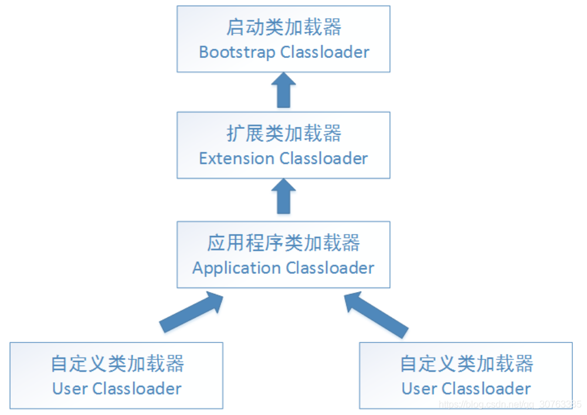

## 理解反射

1. 类加载完成后，在堆中就产生了一个 Class类型 的对象（我们使用 class 定义的类，就是 Class类型的 一个实例），这个对象包含了 类 的完整结构信息。这个对象就像一面镜子，通过这个对象可以看到类的结构。故 形象的称为 反射。

2. 反射机制允许程序在执行期间借助 Reflection API 获得任何 类 的内部信息（属性、构造器、成员方法），并能够操作对象的属性及方法。

3. Java中一切皆对象。在反射机制中，这句话就有充分的体现。通过 new 关键字创建的实例，我们称之为对象。同样，我们在编码阶段定义的一切，比如：类、属性、构造器、方法 等等，本质上也都是 **某个类型** 的实例，这样的类型常用的有4个：
    1. **Class**  表示 类 的类型，类加载后在堆中的对象就是一个 Class实例
    1. **Method**  表示 方法 的类型，方法 就是一个 Method实例
    1. **Field**  表示 属性 的类型，所有属性都是一个 Field实例
    1. **Constructor**  表示 构造器 的类型，类中的构造器就是 Constructor实例

4. 反射在程序加载阶段就体现出来

    


## 类加载

### 类加载的分类

1. **静态加载**

    编译时加载相关的类。在编译时就完成对类合法性的校验，不满足则报错，具有很强的依赖性

2. **动态加载**

    在运行时，才加载需要的类。在运行时代码逻辑不经过的地方就不会被校验，降低了依赖性


### 类加载的时机

1. 创建对象时（new）
2. 当子类被调用时，父类会被加载
3. 调用类中的静态成员时
4. 通过反射使用类（动态加载）


### 类加载的过程

1. **类加载过程**

    

2. **类加载各阶段完成的任务**

    

    - **加载阶段 （Loading）**

        JVM在该阶段主要是将字节码从不同的数据源（class文件/jar包/网络）转换为二进制字节流加载到内存中，并生成一个代表该类的 java.lang.Class 对象。这个过程由 ApplicationClassLoader 类加载器完成。

    - **连接阶段（Linking）**
        - 验证
            1. 目的是为了确保class文件中的字节流包含的信息符合当前虚拟机的要求，并且不会危害虚拟机自身的安全
            2. 验证内容包括：文件格式验证（是否以魔数开头 0x cafe babe 开头）、元数据验证、字节码验证、符号引用验证
            3. 可以考虑使用 -Xverify:none 参数来关闭大部分的类验证措施，缩短虚拟机类加载的时间
        - 准备
            1. JVM 在该阶段对静态变量分配内存并进行默认初始化（为属性赋予数据类型的默认值，比如 0、0L、null、false 等）。
            2. 如果是 实例属性 ，在本阶段不分配内存
            3. 如果是 静态属性，要分配内存，且完成默认初始化
            4. 如果是 静态常量，要分配内存，并完成赋值。因为 常量必须在创建时完成赋值，后续将不再改变
        - 解析
            1. 虚拟机将常量池内的符号引用替换为直接引用的过程
    - **初始化阶段（initialization）**
        1. 到初始化阶段，才真正开始执行类中定义的java程序代码，此阶段是执行 `<clinit>()` 方法的过程
        2. `<clinit>()` 方法是由JVM按语句在源文件中出现的顺序，依次自动收集类中的所有 静态变量 的赋值动作 和 静态代码块中的语句，然后进行合并，合并完之后再执行。在此时，静态属性完成了赋值动作
        3. JVM会保证一个类的 `<clinit>()` 方法 在多线程环境中被正确的加锁、同步，如果多个线程同时去初始化一个类，那么只会有一个线程可以去执行  `<clinit>()` 方法，其他线程将阻塞等待，直到活动线程执行  `<clinit>()` 方法 完毕

    

### 双亲委派机制

在类加载的 Loading 阶段，JVM 将编译后的 .class 文件读入内存的方法区中，并由 **类加载器（ClassLoader）** 在 堆中 创建一个代表某个类 java.lang.Class 对象。

创建 Class 对象这里就涉及到一个概念，双亲委派机制。

**类加载器分类:**

1. 根类加载器(BootStrapClassLoader)， 主要负责加载jre/lib/rt.jar相关的字节码文件的。
2. 扩展类加载器(ExtensionClassLoader)， 主要负载加载 jre/lib/ext/*.jar 这些jar包的。 该类加载器在JDK1.9的时候更名为: PlatformClassLoader， 其父类加载器为: null。
3. 应用程序类加载器(ApplicationClassLoader)， 主要负责加载用户自定义的类以及classpath环境变量所配置的jar包的。 该类加载器在JDK1.9的时候更名为: SystemClassLoader， 其父类加载器为: ExtensionClassLoader。
4. 自定义类加载器(UserClassLoader)， 负责加载程序员指定的特殊目录下的字节码文件的。大多数情况下，自定义类加载器只需要继承ClassLoader这个抽象类，重写findClass()和loadClass()两个方法即可。


**双亲委派机制：**

就是如果一个类加载器(用来加载 class 文件)收到了类加载的请求，首先不会自己尝试去加载这个类，而是将请求委派给`父类加载器`去完成。只有当父类加载器无返完成这个加载请求，子加载起才会尝试自己去完成加载。




## 学习反射

### 小试牛刀

从前面可知，反射机制的执行需要在获得类的 Class 对象后，才能陆续展开。获取 类的 Class对象 常用的有两种方式。

```java
// 1. 根据导包路径获取
Class cls = Class.forName("导包路径");

// 2. 通过类获取
Class cls = 类名.class;
```


这里使用代码演示一下四种反射类型的基本使用。

```java
// Cat 类，供反射使用
package com.zhangjian.反射;

public class Cat {
    private String name;
    public String breed = "chinaCat";

    public Cat(){
        this.name = "白猫";
    }

    public Cat(String name) {
        this.name = name;
    }

    public void cry(){
        System.out.println(name + " 喵喵叫~~~");
    }

    public String run(int distance){
        return name + " 跑了 " + distance  + " 米";
    }
}
```

```java
package com.zhangjian.反射;

import java.io.FileReader;
import java.io.IOException;
import java.lang.reflect.Constructor;
import java.lang.reflect.Field;
import java.lang.reflect.InvocationTargetException;
import java.lang.reflect.Method;
import java.util.Properties;

public class Reflection {
    public static void main(String[] args) throws IOException, ClassNotFoundException, NoSuchMethodException, InvocationTargetException, InstantiationException, IllegalAccessException, NoSuchFieldException {
        // 加载配置文件，获取配置信息
        Properties properties = new Properties();
        properties.load(new FileReader("src/com/zhangjian/反射/reflection.properties"));

        String className = properties.getProperty("class");
        String attr1Name = properties.getProperty("attr1");
        String attr2Name = properties.getProperty("attr2");
        String method1Name = properties.getProperty("method1");
        String method2Name = properties.getProperty("method2");

        // 1 获取类的Class对象
        Class<?> aClass = Class.forName(className);

        System.out.println(aClass); // 显示该class是哪个类的Class对象
        System.out.println(aClass.getClass()); // Class对象的运行类型 自然是 Class
        System.out.println(aClass.getName()); // Class对象名称
        System.out.println(aClass.getPackage()); // 类的包名

        // 2 获取 Constructor对象 。getConstructor 中接收构造器参数 对应的 Class对象，以返回对应的 Constructor对象
        Constructor<?> constructor = aClass.getConstructor(); // 获取无参构造器
        Constructor<?> constructor1 = aClass.getConstructor(String.class); // 获取构造器参数是 String 的构造器

        // 2.1 使用构造器创建实例
        Object instance = constructor1.newInstance("阿花"); // 使用有参构造器创建实例 等同于 new Cat("阿花")
        System.out.println(instance.getClass());

        // 3 获取 Field对象
        Field breed = aClass.getField(attr2Name); // getField 只能获取 public 的Field对象
        Field name = aClass.getDeclaredField(attr1Name); // getDeclaredField 可以获得所有访问修饰符的 Filed对象

        // 3.1 使用创建的实例输出属性信息
        System.out.println(breed.get(instance)); // 表示从对象中获去该属性的值
        // System.out.println(name.get(instance));  // 同样，对象中的私有属性不能直接访问

        // 3.2 更新属性值
        breed.set(instance, "中华田园猫");
        System.out.println(breed.get(instance));

        // 4 获取 Method对象
        Method method1 = aClass.getMethod(method1Name);
        Method method2 = aClass.getMethod(method2Name, int.class); // 获取带形参的方法时，方法名后面还要传入参数类型的 Class对象

        // 4.1 调用方法
        method1.invoke(instance); // 调用无参
        System.out.println(method2.invoke(instance, 800));; // 调用 有参方法时，实参列表依次用逗号隔开传入即可

    }
}
```


### 优点缺点

1. 优点：可以动态的创建和使用对象（是框架底层的核心），方便灵活

2. 缺点：使用反射时，代码要先经过解释器，再执行。执行效率会有影响

    > 使用反射时，可以调用 反射对象 的 setAccessible 方法，设置为 true。
    >
    > true：表示在使用对象时取消访问检查，可以略微提高发射的效率，且会越过访问修饰符的访问限制
    >
    > false：表示在使用对象时要执行访问检查，访问修饰符生效


### Class类

#### 类关系图


#### 注意事项

1. Class 本身也是一个类，因此也继承 Object类

2. Class 对象不是 new 出来的，而是在类加载时由 类加载器 创建的

3. 对于某个类的 Class对象，在内存中只有一份

4. 每个类的实例都会记得自己是由哪个 Class对象 所生成的

    > ```java
    > Cat cat = new Cat();
    > 
    > // 1. 实例通过 getClass 获取 Class对象
    > // 2. 类 通过 属性 class 获取
    > System.out.println(cat.getClass()); // 类实例的运行类型，就是 类的 Class对象
    > System.out.println(Cat.class);
    > System.out.println(cat.getClass().getClass()); // Class对象 的 运行类型 自然就是 Class
    > ```

5. 通过 Class对象 可以完整的得到一个类的结构

6. Class 对象 是存放在堆中的

7. 类的字节码二进制文件，是放在方法区的。这些二进制数据也被称为 元数据，包括 类的类型、类名、方法、属性名、访问权限等

8. Java中，以下类型具有 Class对象

    1. 外部类、成员内部类、静态内部类、局部内部类、匿名内部类
    2. 接口（interface）
    3. 数组 （array）
    4. 枚举 （enum）
    5. 注解 （annotation）
    6. 基本数据类型
    7. void


#### 获取Class类对象

Class类对象获取方法主要有4种，另外有两种特殊类型的 Class对象获取方法

1. **Class.forNam(全类名)**

    当已知了一个类的全类名，那么就可以使用 Class类 的静态方法 forName() 方法，获取 类的Class对象

    ```java
    String clsPath = "com.zhangjian.反射.Cat";
    
    Class<?> aClass = Class.forName(clsPath);
    System.out.println(aClass);
    ```

2. **类名.class**

    当已知了一个具体的类，那么就可以直接通过类名，调用当前类的属性 class 来获取 Class对象。这种方式最为安全可靠，且性能也最高

    ```java
    Class<Cat> catClass = Cat.class;
    System.out.println(catClass);
    ```

3. **对象名.getClass()**

    当已知了某个类的实例，那么就可以直接调用该实例的 getClass() 方法来获取 Class对象

    ```java
    Cat cat = new Cat();
    Class<? extends Cat> aClass1 = cat.getClass();
    System.out.println(aClass1);
    ```

4. **ClassLoader**

    则种方式有点走弯路，但确实也可以获得对应类的Class对象

    ```java
    String clsPath = "com.zhangjian.反射.Cat";
    
    Cat cat = new Cat();
    ClassLoader loader = cat.getClass().getClassLoader();
    Class<?> aClass1 = loader.loadClass(clsPath);
    System.out.println(aClass1);
    ```

5. **基本数据类型通过 `.class` 获取**

    ```java
    System.out.println(int.class); // int
    System.out.println(short.class); // short
    System.out.println(byte.class); // byte
    System.out.println(long.class); // long
    System.out.println(double.class); // double
    System.out.println(float.class); // float
    System.out.println(char.class); // char
    System.out.println(boolean.class); // boolean
    ```

6. **基本数据类型的包装类通过 `.TYPE` 获取**

    包装类可以使用 `.TYPE` 来获取 对应基本数据类型的Class对象，通过这种方式获取到的是与基本数据类型相同的 Class对象。

    ```java
    System.out.println(Integer.TYPE); // int
    System.out.println(Short.TYPE); // short
    System.out.println(Byte.TYPE); // byte
    System.out.println(Long.TYPE); // long
    System.out.println(Double.TYPE); // double
    System.out.println(Float.TYPE); // float
    System.out.println(Character.TYPE); // char
    System.out.println(Boolean.TYPE); // boolean
    ```

    同时，包装类仍然可以直接调用class属性，获取 包装类的Class对象

    ```java
    System.out.println(Integer.class); // Integer
    System.out.println(Short.class); // Short
    System.out.println(Byte.class); // Byte
    System.out.println(Long.class); // Long
    System.out.println(Double.class); // Double
    System.out.println(Float.class); // Float
    System.out.println(Character.class); // Character
    System.out.println(Boolean.class); // Boolean
    ```

    

### 获取类结构信息

**java.lang.Class**

> 常用方法中，带 Declared字段的方法，通常可以获取到类中的私有成员

1. getName: 获取全类名
2. getSimpleName: 获取简单类名，没有包路径，只有类名
3. getFields: 获取所有public修饰的属性，包含本类以及父类的
4. getDeclaredFields: 获取本类中所有属性
5. getMethods: 获取所有public修饰的方法，包含本类以及父类的
6. getDeclaredMethods:  获取本类中所有方法
7. getConstructors：获取所有public修饰的构造器，构造器不包含父类的
8. getDeclaredConstructors: 获取本类中所有构造器
9. getPackage: 以Package形式返回 包信息
10. getSuperClass: 以Class形式返回 父类信息
11. getlnterfaces: 以 Class[] 形式返回接口信息
12. getAnnotations: 以 Annotation[] 形式返回注解信息


**java.lang.reflect.Field**

1. getModifiers: 以 int 形式返回修饰符

    > 每种修饰符对应一个 int 值，存在多个修饰符，则由对应的 int 值 相加后，再返回。对应关系如下：
    >
    > 1. 默认修饰符 0
    > 2. public 1
    > 3. private 2
    > 4. protected 4
    > 5. static 8
    > 6. final 16

2. getType: 以Class形式返回属性的数据类型

3. getName：返回属性名


**java.lang.reflect.Method**

1. getModifiers: 以 int 形式返回修饰符。返回数值和 Field类相同
2. getReturnType：以Class形式获取方法返回类型
3. getName: 返回方法名
4. getParameterType：以Class[]形式返回 形参列表的数据类型


**java.lang.reflect.Constructor**

1. getModifiers: 以 int 形式返回修饰符
2. getName: 返回构造器名（全类名）
3. getParameterTypes：以Class[]形式返回 形参列表的数据类型


### 反射爆破

反射类都具有一个 setAccessible 方法，使得其他类可以通过反射访问目标类的私有属性。值得一提的是，对于类中的静态成员，使用时不需要依赖特定的实例对象。

```java
package com.zhangjian.反射;

import java.io.IOException;
import java.lang.reflect.Constructor;
import java.lang.reflect.Field;
import java.lang.reflect.InvocationTargetException;
import java.lang.reflect.Method;

public class Reflection {
    public static void main(String[] args) throws IOException, ClassNotFoundException, NoSuchMethodException, InvocationTargetException, InstantiationException, IllegalAccessException, NoSuchFieldException {

        // 1 获取类的Class对象
        Class<?> cls = Class.forName("com.zhangjian.反射.Cat");

        // 2 获取 private Constructor对象
        Constructor<?> constructor = cls.getDeclaredConstructor(String.class, int.class);

        // 2.1 爆破后才能访问私有构造器
        constructor.setAccessible(true);
        Object o = constructor.newInstance("阿花", 3);
        System.out.println(o);

        // 3 获取 private Field对象
        Field age = cls.getDeclaredField("age");
        Field breed = cls.getDeclaredField("breed");

        // 3.1 爆破后才能访问
        age.setAccessible(true);
        System.out.println(age.get(o));
        age.set(o, 6);
        System.out.println(age.get(o));

        // 3.2 静态属性不依赖对象实例，是直接和类关联。因此操作数据时可以使用任意对象，包括 null
        breed.setAccessible(true);
        System.out.println(breed.get(null));
        breed.set(null, "CCat");
        System.out.println(breed.get(new Object()));

        // 4 获取 private Method 对象
        Method weight = cls.getDeclaredMethod("weight");
        Method weight2 = cls.getDeclaredMethod("weight2");

        // 4.1 通过反射机制调用方法，返回结果默认都用 Object 类型接收
        weight.setAccessible(true);
        Object invoke = weight.invoke(o);
        System.out.println(invoke);

        // 4.2 同样的，静态方法，也可以不依赖固定对象
        weight2.setAccessible(true);
        Object invoke1 = weight2.invoke(null);
        System.out.println(invoke1);
    }
}

class Cat {
    private String name;
    private int age = 8;
    private static String breed = "chinaCat";

    public Cat(){
        this.name = "白猫";
    }

    public Cat(String name) {
        this.name = name;
    }

    private Cat(String name, int age){
        this.name = name;
        this.age = age;
    }

    public void cry(){
        System.out.println(name + " 喵喵叫~~~");
    }

    public String run(int distance){
        return name + " 跑了 " + distance  + " 米";
    }

    private double weight(){
        return 8.9;
    }

    private static double weight2(){
        return 9.8;
    }

    @Override
    public String toString() {
        return "Cat{" +
                "name='" + name + '\'' +
                ", age=" + age +
                ", breed='" + breed + '\'' +
                '}';
    }
}
```


