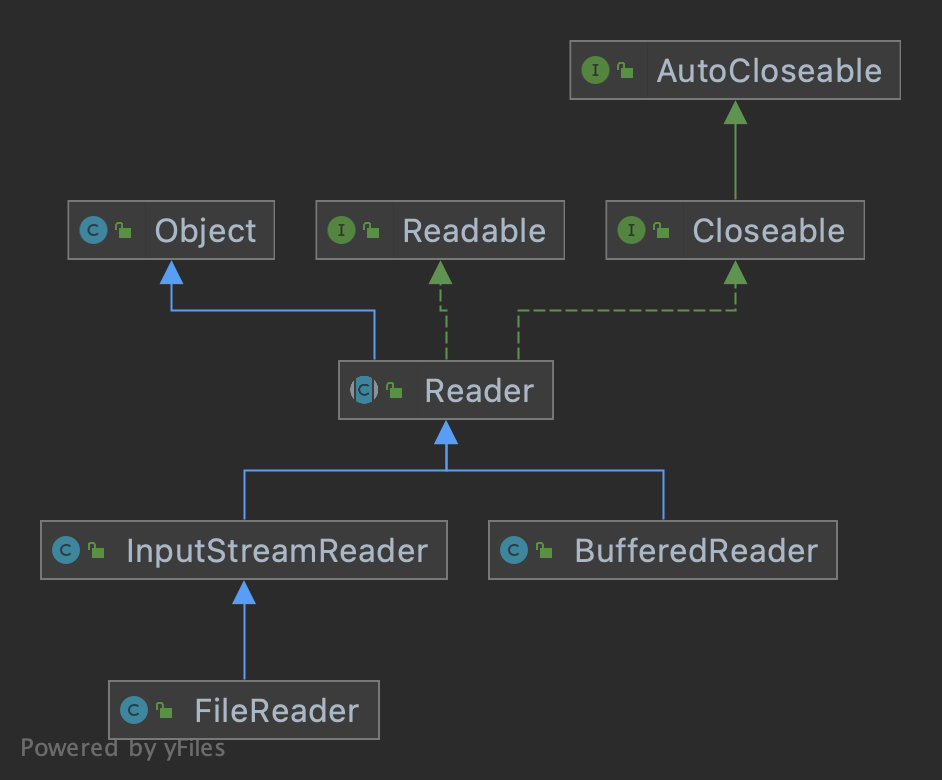
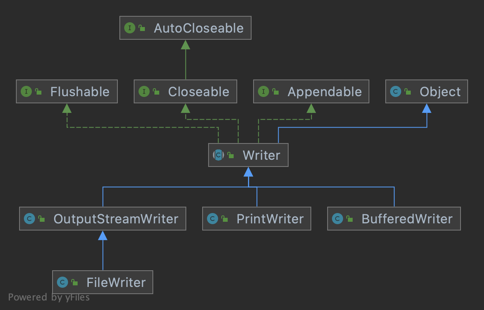

## 基础知识

**文件：**

​		文件就是对若干数据的存储，是这些数据存储后对外呈现的一种表现形式。文件可以是一个 word、excel，又或者是一段视频或一张图片。

​		在操作系统中，目录也是一种特殊的文件，只不过他存储的数据是用于表示管理文件的目录。


## 创建文件

在 java 中，创建一个新的文件，需要使用 File 类。


### 创建文件

创建文件的 File 类，常用的有三个构造方法，形式如下：

```java
// 1、根据文件路径创建对象
public File(String pathname) {...}

// 2、根据父目录文件对象和子文件路径创建对象
public File(File parent, String child) {...}

// 3、根据父目录路径和子文件路径创建对象
public File(String parent, String child) {...}
```


代码演示下文件的创建：

```java
package com.zhangjian.IO流;

import java.io.File;
import java.io.IOException;

public class IO {
    public static void main(String[] args) throws IOException {

        // 1、根据文件路径创建。路径可以是绝对路径，也可以是相对路径
        File file = new File("IO/news01.txt");
        if (file.createNewFile()){
            System.out.println("news01 创建成功...");
        }

        // 2、根据父目录对象和子文件路径创建
        File parent = new File("IO");
        File file1 = new File(parent, "news02.txt");
        if (file1.createNewFile()){
            System.out.println("news02 创建成功...");
        }

        // 3、根据父目录和子文件路径创建
        File file2 = new File("IO", "news03.txt");
        if (file2.createNewFile()){
            System.out.println("news03 创建成功...");
        }

    }
}
```


### 常用方法

1. getName  获取文件名称
2. getAbsolutePath  获取文件的绝对路径，不包含文件名。注意：java 程序不会将 包 当做文件路径。
3. getParent  获取文件的父级目录，只是 父级目录 名称
4. length  获取文件的大小（字节数）
5. exists  判断文件是否存在
6. isFile  判断文件是否是一个文件
7. isDirectory  判断文件是否是一个目录
8. mkdir  创建一级目录
9. mkdirs  创建多级目录。推荐使用，一级目录也可以创建
10. delete  删除空目录 或 文件。如果是一个文件可直接删除，如果是一个目录，目录不为空时不能删除


简单演示：

```java
package com.zhangjian.IO流;

import java.io.File;
import java.io.IOException;

public class IO {
    public static void main(String[] args) throws IOException {

        // 文件已经创建
        File file = new File("IO/news01.txt");

        System.out.println(file.getName()); // news01.txt
        System.out.println(file.getAbsolutePath());  // /Users/zhangjian1138/IdeaProjects/LearnJava/IO/news01.txt
        System.out.println(file.getParent()); // IO
        System.out.println(file.length()); // 0
        System.out.println(file.exists()); // true
        System.out.println(file.isFile()); // true

        // 目录也当做文件处理
        File file1 = new File("IO/didi/");

        // 是否存在
        if (!file1.exists()) {
            // 创建目录
            if (file1.mkdirs()) {
                System.out.println("目录创建成功...");
            }

            System.out.println(file1.isDirectory()); // true

            if (file1.delete()){
                System.out.println("目录删除成功...");
            }
        }
    }
}
```


## IO流

### 原理

1. I/O 是 Input/Output 的缩写，I/O 技术是非常实用的技术，通常用于数据传输处理。比如：读写文件、网络传输等

2. Java 程序中，对于数据的传输操作，以 流（Stream）的方式进行

3. 在 java.io 包下提供了各种 stream 的 类 和 接口 ，用来操作不同种类的数据

4. input 输入：读取外部数据（光盘、磁盘等）到程序（内存）中

5. output输出：将程序（内存）中的数据输出到 外部存储设备中

    

### 流分类

**按照流的流向划分：**

- 输入流
- 输出流

**按照流的角色划分：**

- 节点流
- 处理流/包装流

**按照流的传输单位划分：**

- 字节流	以 一个字节（8 bit）为单位进行传输。字节流传输对中文及特殊字符不友好
- 字符流    以 一个字符（字符的大小由编码方式决定）为单位进行传输


### 四个基类

1. 字节流 的 抽象基类是  InputStream 和 OutputStream
2. 字符流 的 抽象积累是 Reader 和 Writer
3. Java 中IO相关的类有很多，他们都是从 上面 4 个 基类派生出来的
4. 4个 基类的派生出来的子类的名称都是以其父类的名称作为子类名称的后缀


#### InputStream

InputStream 抽象类是所有 字节输入流类 的超类。用于读取二进制文件

常用子类：

1. FileInputStream  文件字节输入流
2. BufferedInputStream  缓冲字节输入流
3. ObjectInputStream  对象字节输入流


关系图：


#### OutputStream

OutputStream 抽象类是所有 字节输出流类 的超类。用于写入二进制文件

常用子类：

1. FileOutputStream  文件字节输出流
2. BufferedOutputStream  缓冲字节输出流
3. ObjectOutputStream  对象字节输出流


关系图：


#### Reader

Reader 抽象类是所有 字符输入流类 的超类。用于读取文本文件

常用子类：

1. FileReader  文件字符输入流
2. BufferedReader  缓冲字符输入流
3. InputStreamReader  字节转字符输入流


关系图：




#### Writer

Writer 抽象类是所有 字符输出流类 的超类。用于写入文本文件

常用子类：

1. FileWriter  文件字符输出流
2. BufferedWriter  缓冲字符输出流
3. OutputStreamWriter 字节转字符输出流


关系图：




## 字节流

### FileInputStream

构造方法：


成员方法：


简单的数据读取代码演示：

```java
package com.zhangjian.IO流;

import org.junit.jupiter.api.Test;

import java.io.FileInputStream;
import java.io.FileNotFoundException;
import java.io.IOException;
import java.io.InputStream;
import java.util.Arrays;

public class IO {

    @Test
    public void readFile01() throws FileNotFoundException {
        String filePath = "/Users/zhangjian1138/IdeaProjects/LearnJava/IO/news01.txt";
        FileInputStream stream = new FileInputStream(filePath);;

        // 使用 read ，按单个字节读取。文件读完之后，返回-1
        int readRes;
        try {
            while ((readRes = stream.read()) != -1) {
                // read 返回的是对应字符的 ascii 码
                System.out.print((char) (readRes));
            }
        } catch (IOException e) {
            e.printStackTrace();
        } finally {
            try {
                stream.close();
            } catch (IOException e) {
                e.printStackTrace();
            }
        }
    }


    @Test
    public void readFile02() throws IOException {
        String filePath = "/Users/zhangjian1138/IdeaProjects/LearnJava/IO/news01.txt";
        FileInputStream stream = new FileInputStream(filePath);

        // 使用 read ，按 byte[] 数组长度读取。每次返回当前读取的字节长度
        int len;
        byte[] readRes = new byte[8];
        try {
            while ((len = stream.read(readRes)) != -1){
                System.out.println("读取字节数: " + len);
                System.out.println(new String(readRes, 0, len));
            }
        } catch (IOException e) {
            e.printStackTrace();
        } finally {
            try {
                stream.close();
            } catch (IOException e) {
                e.printStackTrace();
            }
        }
    }
}
```


### FileOutputStream

构造方法：


成员方法：


注意：

1. 使用 FileOutputStream 向文件输出字节流时，如果文件不存在，会自动创建。但前提是目录必须存在


代码演示：

```java
package com.zhangjian.IO流;

import org.junit.jupiter.api.Test;

import java.io.*;
import java.nio.charset.StandardCharsets;

public class IO {

    @Test
    public void writeFile() throws FileNotFoundException {
        String filePath = "/Users/zhangjian1138/IdeaProjects/LearnJava/IO/news04.txt";

        // 创建文件输出流，append 追加模式
        FileOutputStream stream = new FileOutputStream(filePath, true);;

        // 使用 write 向文件输出字节流
        try {
            //1. 写入单个字符
            stream.write('A');
            stream.write("\n".getBytes(StandardCharsets.UTF_8)); // 获取字节时，指定编码方式

            // 2. 写入一个字符串
            stream.write("stay hungry; stay foolish".getBytes());
            stream.write("\n".getBytes());

            //3. 写入字符串的一部分
            stream.write("stay hungry; stay foolish".getBytes(), 0, 4);

        } catch (IOException e) {
            e.printStackTrace();
        } finally {
            try {
                stream.close();
            } catch (IOException e) {
                e.printStackTrace();
            }
        }
    }

    /**
     * 将 谁不喜欢上班呢.jpeg 复制到当前目录 名字 改为 自愿上班.jpeg
     */
    @Test
    public void copyFile() throws FileNotFoundException {
        String origin = "/Users/zhangjian1138/IdeaProjects/LearnJava/IO/谁不喜欢上班呢.jpeg";
        String target = "/Users/zhangjian1138/IdeaProjects/LearnJava/IO/自愿上班.jpeg";

        FileInputStream inputStream = new FileInputStream(origin);
        FileOutputStream outputStream = new FileOutputStream(target, true);

        // 将源文件内容读出来写入到新文件
        int len;
        byte[] readRes = new byte[1024];
        try {
            while ((len = inputStream.read(readRes)) != -1){
                System.out.println("本次写入字节数: " + len);
                // 注意：写入时要注意最后一次读取的长度，如果直接写入整个 byte[] ，可能会出错
                outputStream.write(readRes, 0, len);
            }
        } catch (IOException e) {
            e.printStackTrace();
        } finally {
            try {
                inputStream.close();
                outputStream.close();
            } catch (IOException e) {
                e.printStackTrace();
            }
        }

    }
}
```


## 字符流

### FileReader

常用方法：

1. new FileReader(File/String)  构造器。接收一个 File对象 或 String的 文件路径
2. read()  每次读取单个字符，并返回该字符。如果已经到文件末尾就返回 -1
3. read(char[])  批量读取字符到数组，返回读取到的字符数。如果已经到文件末尾就返回 -1


相关API：

1. new String(char[])  将char[]数组转成String
2. new String(char[],offset,length)  将char[]数组指定位置处制定个数的字符转成String


代码演示：

```java
package com.zhangjian.IO流;

import org.junit.jupiter.api.Test;

import java.io.*;

public class IO {

    @Test
    public void readFile01(){
        String filePath = "/Users/zhangjian1138/IdeaProjects/LearnJava/IO/news03.txt";

        FileReader reader = null;

        // 按单个字符读取输出
        int readData;

        try {
            reader = new FileReader(filePath);
            while ((readData = reader.read()) != -1){
                System.out.print((char) readData);
            }
        } catch (IOException e) {
            e.printStackTrace();
        } finally {
            try {
                if(reader != null){
                    reader.close();
                }
            } catch (IOException e) {
                e.printStackTrace();
            }
        }
    }

    @Test
    public void readFile02(){
        String filePath = "/Users/zhangjian1138/IdeaProjects/LearnJava/IO/news03.txt";

        FileReader reader = null;

        // 按 char[] 读取输出
        int length;
        char[] readData = new char[12];

        try {
            reader = new FileReader(filePath);
            while ((length = reader.read(readData)) != -1){
                System.out.print(new String(readData, 0, length));
            }
        } catch (IOException e) {
            e.printStackTrace();
        } finally {
            try {
                if(reader != null){
                    reader.close();
                }
            } catch (IOException e) {
                e.printStackTrace();
            }
        }
    }
}
```


### FileWriter

常用方法：

1. New FileWriter(File/String)  覆盖模式。相当于流的指针在文件起始位置
2. New FileWriter(File/String,true)  追加模式。相当于流的指针在文件的结束位置，从文件最后新增内容
3. write(int)  写入单个字符。char 和 int 自动转换
4. write(char[])  写入指定数组的字符
5. write(char[],offset,length)  写入数组的指定部分
6. write(String)  写入整个字符串
7. write(String,offset,length)  写入字符串的指定部分


**注意：** Filewriter 对象写入数据后，需要调用 close() 或 flush()  方法，保存的数据才会真正的保存到文件！


代码演示：

```java
package com.zhangjian.IO流;

import org.junit.jupiter.api.Test;

import java.io.*;

public class IO {

    @Test
    public void writeFile(){
        String filePath = "/Users/zhangjian1138/IdeaProjects/LearnJava/IO/news02.txt";

        FileWriter writer = null;

        try {
            // 已覆盖的方式写入。原文件的内容将被覆盖
            writer = new FileWriter(filePath);

            // 1. 写入单个字符。写数字会转成对应的字符
            writer.write('A');
            writer.write(98);

            // 2. 写入字符数组
            char[] chars = {'h', 'e', 'l', 'l', 'o'};
            writer.write(chars);

            // 3. 写入字符数组指定长度
            writer.write(chars, 2, 3);

            // 4. 写入字符串
            writer.write(" 我自狂歌空度日 ");

            // 5. 写入字符串 指定长度
            writer.write(" 飞扬跋扈为谁雄", 5, 3);


        } catch (IOException e) {
            e.printStackTrace();
        } finally {
            try {
                if(writer != null){
                    writer.close();
                    System.out.println("数据写入完成");
                }
            } catch (IOException e) {
                e.printStackTrace();
            }
        }
    }
}
```


## 节点流和处理流

**节点流**

节点流可以从一个特定的数据源 读写数据，如 FileReader、FileWriter


**处理流**

处理流也叫包装流。是 建立 在已存在的流（节点流或处理流）之上的，为程序提供更为强大的读写功能，如 BufferedReader、BufferedWriter


**区别和联系**

1. 节点流是 底层流 ，直接跟数据源相接
2. 处理流包装节点流，既可以消除不同节点流的实现差异，也可以提供更方便的方法来完成输入输出
3. 处理流包装了节点流，使用的是 修饰器模式 ，不会与数据源直接相连


**处理流的优势：**

1. 性能的提高。主要以增加缓冲的方式来提高输入输出的效率
2. 操作的便捷。处理流可以提供一系列的便捷方法来处理大批量的数据，使用更加灵活方便


### 缓冲字符流

#### BufferedReader

| 构造器                                                       |
| :----------------------------------------------------------- |
| `BufferedReader(Reader in) ` 创建使用默认大小的输入缓冲区的缓冲字符输入流。 |
| `BufferedReader(Reader in, int sz)   `创建使用指定大小的输入缓冲区的缓冲字符输入流。 |


方法：      

| 返回类型         | 方法                                                         |
| :--------------- | :----------------------------------------------------------- |
| `void`           | `close()`关闭流并释放与之相关联的任何系统资源。              |
| `Stream<String>` | `lines()`返回一个 `Stream` ，其元素是从这个 `BufferedReader`读取的行。 |
| `void`           | `mark(int readAheadLimit)`标记流中的当前位置。               |
| `boolean`        | `markSupported()`告诉这个流是否支持mark（）操作。            |
| `int`            | `read()`读一个字符                                           |
| `int`            | `read(char[] cbuf, int off, int len)`将字符读入数组的一部分。 |
| `String`         | `readLine()`读一行文字，如果已达到流的末尾，则为null         |
| `boolean`        | `ready()`告诉这个流是否准备好被读取。                        |
| `void`           | `reset()`将流重置为最近的标记。                              |
| `long`           | `skip(long n)`跳过字符                                       |


代码演示，读取一个文本文件：

```java
package com.zhangjian.IO流;

import org.junit.jupiter.api.Test;

import java.io.*;

public class IO {

    @Test
    public void readFile(){
        String filePath = "/Users/zhangjian1138/IdeaProjects/LearnJava/IO/news03.txt";

        // 创建BufferedReader对象
        BufferedReader reader = null;

        try {
            reader = new BufferedReader(new FileReader(filePath));

            // 按行读取
            String line;

            while ((line = reader.readLine()) != null){
                System.out.println(line);
            }
        } catch (IOException e) {
            e.printStackTrace();
        } finally {
            if (reader != null){
                try {
                    reader.close();
                } catch (IOException e) {
                    e.printStackTrace();
                }
            }
        }

    }
}
```


#### BufferedWriter

| 构造器                                                       |
| :----------------------------------------------------------- |
| `BufferedWriter(Writer out)`创建使用默认大小的输出缓冲区的缓冲字符输出流。 |
| `BufferedWriter(Writer out, int sz)`创建一个新的缓冲字符输出流，使用给定大小的输出缓冲区。 |


方法：

| 返回值 | Method and Description                                       |
| :----- | :----------------------------------------------------------- |
| `void` | `close()`关闭流，先刷新。                                    |
| `void` | `flush()`刷新流。                                            |
| `void` | `newLine()`写一行行分隔符。                                  |
| `void` | `write(int c)`写一个字符                                     |
| `void` | `write(char[] cbuf)`写入字符数组。                           |
| `void` | `write(char[] cbuf, int off, int len)`写入字符数组的一部分。 |
| `void` | `write(String s)`写一个字符串。                              |
| `void` | `write(String s, int off, int len)`写一个字符串的一部分。    |


**注意：**

包装流要使用追加模式，那么构造器传入的节点流实例，应该是追加模式的对象。


文件拷贝代码演示：

```java
package com.zhangjian.IO流;

import org.junit.jupiter.api.Test;

import java.io.*;
import java.util.Iterator;

public class IO {

    @Test
    public void readFile(){
        String source = "/Users/zhangjian1138/IdeaProjects/LearnJava/IO/news03.txt";
        String target = "/Users/zhangjian1138/IdeaProjects/LearnJava/IO/new-news03.txt";

        // 创建缓冲对象
        BufferedReader reader = null;
        BufferedWriter writer = null;

        try {
            reader = new BufferedReader(new FileReader(source));
            writer = new BufferedWriter(new FileWriter(target, true)); // 追加模式

            // 读取所有行，遍历写入
            Iterator<String> stringIterator = reader.lines().iterator();
            while (stringIterator.hasNext()){
                String next = stringIterator.next();

                // 写入字符串
                writer.write(next);
                
                // 写一个换行符
                writer.newLine();
            }

        } catch (IOException e) {
            e.printStackTrace();
        } finally {
            try {
                if (reader != null){
                    reader.close();
                }
                if (writer != null){
                    writer.close();
                }
            } catch (IOException e) {
                e.printStackTrace();
            }
        }

    }
}
```


### 缓冲字节流

缓冲字节流包括 BufferedInputStream（缓冲字节输入流）和 BufferedOutputStream（缓冲字节输出流）

缓冲字节流既可以处理文本，也可以处理二进制文件。但通常用于处理二进制文件，处理文本文件的效率相比于 缓冲字符流 要低。

**BufferedInputStream 构造器和方法：**

| 构造器                                                       |
| :----------------------------------------------------------- |
| `BufferedInputStream(InputStream in)`创建一个 `BufferedInputStream`并保存其参数，输入流 `in` ，供以后使用。 |
| `BufferedInputStream(InputStream in, int size)`创建 `BufferedInputStream`具有指定缓冲区大小，并保存其参数，输入流 `in` ，供以后使用。 |

| 返回值    | 方法                                                         |
| :-------- | :----------------------------------------------------------- |
| `int`     | `available()`返回从该输入流中可以读取（或跳过）的字节数的估计值，而不会被下一次调用此输入流的方法阻塞。 |
| `void`    | `close()`关闭此输入流并释放与流相关联的任何系统资源。        |
| `void`    | `mark(int readlimit)`见的总承包 `mark`的方法 `InputStream` 。 |
| `boolean` | `markSupported()`测试这个输入流是否支持 `mark`和 `reset`方法。 |
| `int`     | `read()`见 `read`法 `InputStream`的一般合同。                |
| `int`     | `read(byte[] b)`将字节输入流中的字节读入指定的字节数组。 返回字节数；若到文件末尾，返回-1 |
| `int`     | `read(byte[] b, int off, int len)`从给定的偏移开始，将字节输入流中的字节读入指定的字节数组。 |
| `void`    | `reset()`见 `reset`法 `InputStream`的一般合同。              |
| `long`    | `skip(long n)`见 `skip`法 `InputStream`的一般合同。          |


**BufferedOutputStream 构造器和方法：**

| 构造器                                                       |
| :----------------------------------------------------------- |
| `BufferedOutputStream(OutputStream out)`创建一个新的缓冲输出流，以将数据写入指定的底层输出流。 |
| `BufferedOutputStream(OutputStream out, int size)`创建一个新的缓冲输出流，以便以指定的缓冲区大小将数据写入指定的底层输出流。 |

| 返回值 | 方法                                                         |
| :----- | :----------------------------------------------------------- |
| `void` | `close()`关闭此输出流并释放与流相关联的任何系统资源。        |
| `void` | `flush()`刷新此输出流，并强制将任何缓冲的输出字节写入流。    |
| `void` | `write(byte[] b)`将 `b.length`个字节写入此输出流。           |
| `void` | `write(byte[] b, int off, int len)`<br />将 `len`字节从位于偏移量 `off`的指定 `byte`阵列写入此输出流。 |
| `void` | `write(int b)`写入指定 `byte`此输出流。                      |


复制图片，代码演示：

```java
package com.zhangjian.IO流;

import org.junit.jupiter.api.Test;

import java.io.*;

public class IO {

    @Test
    public void copyFile(){
        String source = "/Users/zhangjian1138/IdeaProjects/LearnJava/IO/谁不喜欢上班呢.jpeg";
        String target = "/Users/zhangjian1138/IdeaProjects/LearnJava/IO/她喜欢.jpeg";

        // 创建缓冲对象
        BufferedInputStream reader = null;
        BufferedOutputStream writer = null;

        try {
            reader = new BufferedInputStream(new FileInputStream(source));
            writer = new BufferedOutputStream(new FileOutputStream(target));

            // 读取字节并写入新文件
            byte[] readRes = new byte[1024];
            int len;

            while ((len = reader.read(readRes)) != -1){
                writer.write(readRes, 0, len);
            }

            System.out.println("图片复制完成~~~");

        } catch (IOException e) {
            e.printStackTrace();
        } finally {
            try {
                if (reader != null){
                    reader.close();
                }
                if (writer != null){
                    writer.close();
                }
            } catch (IOException e) {
                e.printStackTrace();
            }
        }

    }
}
```


### 对象处理流

对象流也是一种处理流（包装流），主要是 ObjectInputStream（对象输入流）和 ObjectOutputStream（对象输出流），能够将 基本数据类型 或 对象 进行 序列化 和 反序列化 操作。

1. 序列化：就是在保存数据时，同时保存 数据的值 和 数据的类型
2. 反序列化：就是在恢复数据时，恢复 数据的值 和 数据的类型
3. 需要让某个对象支持序列化机制，则必须让其类是可序列化的。类实现序列化的方式 继承可序列化的父类 或者 实现如下两个接口之一即可：
    - Serializable
    - Externalizable


**注意事项：**

1. 序列化 和 反序列化 的顺序要一致
2. 序列化的类中建议添加 SerialversionUID ，该属性可提高版本的兼容性
3. 序列化对象时，默认将里面的额所有属性都进行序列化，但不包括 static 和 transient 修饰的成员
4. 序列化对象时，要求里面的属性 类型 也实现 序列化接口
5. 序列化具备可继承性。即 父类实现了序列化，则它的所有子类（不限于直接子类）都默认实现了序列化


代码演示 序列化 和 反序列化 操作：

```java
package com.zhangjian.IO流;

import org.junit.jupiter.api.Test;

import java.io.*;

public class IO {

    @Test
    public void serialize(){
        String file = "/Users/zhangjian1138/IdeaProjects/LearnJava/IO/serialize.dat";

        // 创建序列化对象
        ObjectOutputStream serializer = null;
        try {
            serializer = new ObjectOutputStream(new FileOutputStream(file));

            // 基础类型序列化
            serializer.writeInt(10086);
            serializer.writeBoolean(true);
            serializer.writeChar('Z');
            serializer.writeDouble(3.1415926);

            // 引用类型序列化
            serializer.writeUTF("何不食肉糜"); // 序列化字符串
            serializer.writeObject(new Dog(18, 'F', "旺财"));

            System.out.println("序列化完成~~~");
        } catch (IOException e) {
            e.printStackTrace();
        } finally {
            try {
                if (serializer != null){
                    serializer.close();
                }
            } catch (IOException e) {
                e.printStackTrace();
            }
        }
    }

    @Test
    public void deserialize(){
        String file = "/Users/zhangjian1138/IdeaProjects/LearnJava/IO/serialize.dat";

        // 创建序列化对象
        ObjectInputStream deserializer = null;
        try {
            deserializer = new ObjectInputStream(new FileInputStream(file));

            // 基础类型反序列化
            System.out.println(deserializer.readInt());
            System.out.println(deserializer.readBoolean());
            System.out.println(deserializer.readChar());
            System.out.println(deserializer.readDouble());

            // 引用类型反序列化
            System.out.println(deserializer.readUTF());
            System.out.println(deserializer.readObject()); // Dog{age=18, gender=F, name='旺财', master=Master{name='旺财'}, nickname='null'}

        } catch (IOException | ClassNotFoundException e) {
            e.printStackTrace();
        } finally {
            try {
                if (deserializer != null){
                    deserializer.close();
                }
            } catch (IOException e) {
                e.printStackTrace();
            }
        }
    }
}

class Dog implements Serializable{
    // 基础数据类型 可序列化 和 反序列化
    private int age;
    private char gender;

    // 引用类型 实现 Serializable 接口后，也可以 序列化 和 反序列化
    private String name;
    private Master master = new Master("旺财");

    // static transient 修饰属性不能序列化
    private static String nation = "China";
    private transient String nickname = "中华田园犬";

    public Dog(int age, char gender, String name) {
        this.age = age;
        this.gender = gender;
        this.name = name;
    }

    private void sing(){
        System.out.println("来了老弟");
    }

    @Override
    public String toString() {
        return "Dog{" +
                "age=" + age +
                ", gender=" + gender +
                ", name='" + name + '\'' +
                ", master=" + master +
                ", nickname='" + nickname + '\'' +
                '}';
    }
}

class Master implements Serializable{
    private String name;

    public Master(String name) {
        this.name = name;
    }

    @Override
    public String toString() {
        return "Master{" +
                "name='" + name + '\'' +
                '}';
    }
}
```


### 标准输入输出流

Java 中的 标准输入 和 标准输出 分别是 `System.in` 和 `System.out`

```java
// 源码
public final class System {
  public static final InputStream in = null;

  public static final PrintStream out = null;
  
  ...
```


```java
package com.zhangjian.IO流;

import org.junit.jupiter.api.Test;

import java.io.*;

public class IO {
    public static void main(String[] args) {

        /**
         * 标准输入  System.in
         *
         *  编译类型 InputStream
         *  运行类型 BufferedInputStream
         */
        System.out.println(System.in.getClass());

        /**
         * 标准输出  System.out
         *
         *  编译类型 PrintStream
         *  运行类型 PrintStream
         */
        System.out.println(System.out.getClass());
    }
}
```


### 转换流

**背景：**

Java中字节流和字符流默认的编码方式是 utf-8，如果数据源文件，不是这个编码格式，那么数据读入读出会出现乱码的问题。


**转换流：**

InputStreamReader 和 OutputStreamWriter ，分别 取用了 字节流基类（InputStream、OutputStream）和 字符流基类（Reader、Writer）名字的组合。

转换流的主要作用是将 字节流 转成 字符流，且可以指定编码类型


**说明：**

1. InputStreamReader 是 Reader 的子类，可以将 InputStream 包装成 Reader
2. OutputStreamWriter 是 Writer 的子类，可以将 OutputStream 包装成 Writer
3. 档处理纯文本数据时，使用字符流的效率会更高，并且可以有效解决中文问题
4. 转换流将 字节流 转成 字符流 之后，可以继续使用 缓冲字符流 进一步提高处理效率


代码演示：

```java
package com.zhangjian.IO流;

import org.junit.jupiter.api.Test;

import java.io.*;

public class IO {

    @Test
    public void write() throws IOException{
        String file = "/Users/zhangjian1138/IdeaProjects/LearnJava/IO/news05.txt";

        BufferedWriter bufferedWriter = new BufferedWriter(new OutputStreamWriter(new FileOutputStream(file), "gbk"));

        // 写入 gbk 编码的数据
        bufferedWriter.write("星斗倒灌入银河，清酒半盏覆周天");

        // 关闭流
        bufferedWriter.close();

        System.out.println("写入文件完成");
    }

    @Test
    public void convertRead() throws IOException {
        // 文件编码方式 为 gbk
        String file = "/Users/zhangjian1138/IdeaProjects/LearnJava/IO/news05.txt";

        // 1. 创建字节流对象
        FileInputStream inputStream = new FileInputStream(file);

        // 2. 将 字节流转成字符流，并指定编码。不指定编码 输出将乱码
        InputStreamReader inputStreamReader = new InputStreamReader(inputStream, "gbk");

        // 3. 将字符流放进缓冲流
        BufferedReader bufferedReader = new BufferedReader(inputStreamReader);

        // 读取数据
        System.out.println(bufferedReader.readLine());

        // 关闭流
        bufferedReader.close();
    }
}
```


### 打印流

打印流有 PrintStream 和 PrintWriter。打印流只有 输出流 ，没有输入流。

1. PrintStream 是 OutputStream 的子类，是 字节打印流
2. PrintWriter 是 Writer 的子类，是 字符打印流


代码演示：

```java
package com.zhangjian.IO流;

import org.junit.jupiter.api.Test;

import java.io.*;

public class IO {

    @Test
    public void printStream() throws IOException{
        // 1.java中标准输出流类型就是 PrintStream
        PrintStream out = System.out;

        // 1.1 print 底层其实调用的还是 write，直接使用 write 需要手动 close 才会打印出来
        out.println("苍生涂涂，天下寥寥");

        out.write("诸子百家，唯我纵横\n".getBytes());
        out.close();

        // 1.2 System.out 默认输出到控制台，可以重新输出到文件
        System.setOut(new PrintStream("/Users/zhangjian1138/IdeaProjects/LearnJava/IO/news01.txt"));

        System.out.print("侯非侯，王非王，千乘万骑走北邙");

        // 2. 输出流同样可以追加到文件
        PrintStream printStream = new PrintStream(new FileOutputStream("/Users/zhangjian1138/IdeaProjects/LearnJava/IO/news02.txt", true));
        printStream.println("我自狂歌空度日");
        printStream.println("飞扬跋扈为谁雄");
        printStream.close();
    }

    @Test
    public void printWriter() throws IOException {
        // 1. PrintWriter 可以接收 Writer 的其他子类
        PrintWriter printWriter = new PrintWriter(System.out);
        printWriter.println("今朝有酒今朝醉");
        printWriter.close();  // 输出到控制台

        // 2.打印到文件
        PrintWriter printWriter1 = new PrintWriter(new FileWriter("/Users/zhangjian1138/IdeaProjects/LearnJava/IO/news02.txt", true));
        printWriter1.write("\n");
        printWriter1.write("欲买桂花同载酒，终不似，少年游");
        printWriter1.close();
    }
}
```


## Properties 类

### 基本介绍

1. Properties 类 专门用于读写 xxx.properties 配置文件的集合类

2. 配置格式如下

    ```properties
    键=值
    键=值
    
    # 注意: 键值对不需要有空格，值 不需要使用引号引起来。键值 默认都是 String 类型
    ```

3. 常用方法

    - load  加载配置文件的键值对到 Properties 对象
    - list  将数据输出到指定位置（控制台、文件）
    -  getProperty(key)  根据 键 获取值
    - setProperty(key,value)  设置键值到Properties对象，如果是已存在key，则覆盖原来的值
    - remove  删除Properties对象中的键值
    - store  将Properties对象中的键值对存储到配置文件中，可以给定comment信息。如果键值存在中文，要注意 Writer 实例的编码


### 使用演示

```java
package com.zhangjian.IO流;

import org.junit.jupiter.api.Test;

import java.io.*;
import java.util.Properties;

public class IO {

    @Test
    public void readProperties() throws IOException{
        // 1. 创建实例
        Properties properties = new Properties();

        // 2.加载指定配置文件
        properties.load(new FileReader("mysql.properties"));

        // 3. 输出所有 k-v
        properties.list(System.out);

        // 4. 根据 key 获取对应的值
        System.out.println(properties.getProperty("host"));
        System.out.println(properties.getProperty("port"));
        System.out.println(properties.getProperty("user"));
        System.out.println(properties.getProperty("pwd"));
        System.out.println(properties.getProperty("comment"));
    }

    @Test
    public void configProperties() throws IOException{
        // 1. 创建实例
        Properties properties = new Properties();

        // 2.加载指定配置文件
        properties.load(new FileReader("mysql.properties"));

        // 3. 增 删 改 Properties 中的键值
        properties.setProperty("secret", "admin9527");
        properties.remove("port");
        properties.setProperty("comment", "你方唱罢我登场");

        // 4. 保存到文件
        OutputStreamWriter writer = new OutputStreamWriter(new FileOutputStream("IO/mysql.properties"), "utf8");
        properties.store(writer, null);

        System.out.println("保存成功");
    }
}
```


## 加载资源文件

除了前面的 xxx.properties 文件，我们还经常需要读取一些其他类型的资源文件，配置文件、文本文件、图片、音频等。


### Class类

所有的Java类都是 Class类 的一个实例，Class类 提供了获取资源文件的方法 `getResourceAsStream()` 和 `getResource()`

> Class对象获取资源可以使用 相对路径 和 绝对路径：
>
> 相对路径：从当前类所在的路径开始查找（不以 / 开头）
>
> 绝对路径：从 classpath根路径（SourceRoot目录） 开始查找（以 / 开头）

```java
package com.zhangjian.IO流;

import java.io.BufferedReader;
import java.io.IOException;
import java.io.InputStream;
import java.io.InputStreamReader;
import java.net.URL;

public class IO {
    public static void main(String[] args) throws IOException {
        // 获取Class对象
        Class<IO> ioClass = IO.class;

        // 获取资源 返回一个 URL示例
        URL resource = ioClass.getResource("/JavaBase.iml"); // 绝对路径  从classpath开始查找
        System.out.println(resource.getPath()); // 获取资源在操作系统的绝对路径

        // 以 字节流 形式获取资源
        InputStream stream = ioClass.getResourceAsStream("../../../JavaBase.iml"); // 相对路径，相对于 类所在的位置
        BufferedReader reader = new BufferedReader(new InputStreamReader(stream));
        String line;
        while ((line = reader.readLine()) != null){
            System.out.println(line);
        }
    }
}
```


### ClassLoader类

Java中的ClassLoader类也提供了获取资源文件的方法（`getResourceAsStream()` 和 `getResource()`），可以通过 类路径（classpath）加载器 获取资源文件的输入流。

> ClassLoader 对象获取资源 不能以 "/" 开头，且路径总是从 classpath根路径（SourceRoot目录） 开始

```java
package com.zhangjian.IO流;

import java.io.BufferedReader;
import java.io.IOException;
import java.io.InputStream;
import java.io.InputStreamReader;
import java.net.URL;

public class IO {
    public static void main(String[] args) throws IOException {
        // 获取ClassLoader对象
        ClassLoader classLoader = IO.class.getClassLoader();
        
        // 获取资源 返回一个 URL示例
        URL resource = classLoader.getResource("JavaBase.iml"); // 从 classpath根路径（SourceRoot目录） 开始查找
        System.out.println(resource.getPath()); 
      
        // 以 字节流 形式获取资源
        InputStream stream = classLoader.getResourceAsStream("JavaBase.iml");
        BufferedReader reader = new BufferedReader(new InputStreamReader(stream));
        String line;
        while ((line = reader.readLine()) != null){
            System.out.println(line);
        }
    }
}
```


