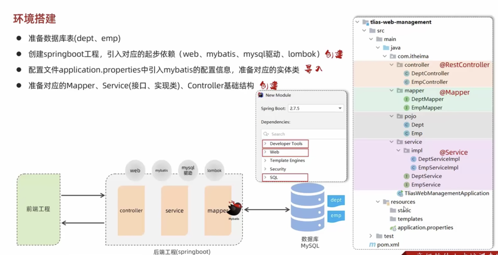
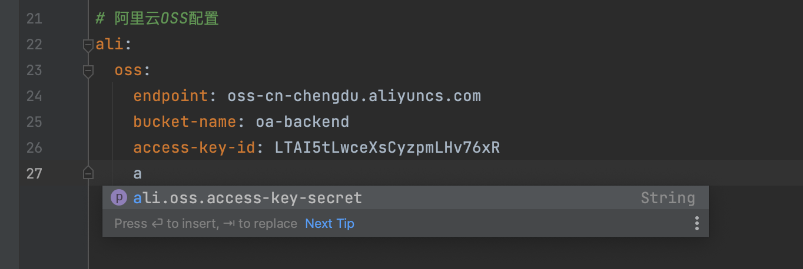
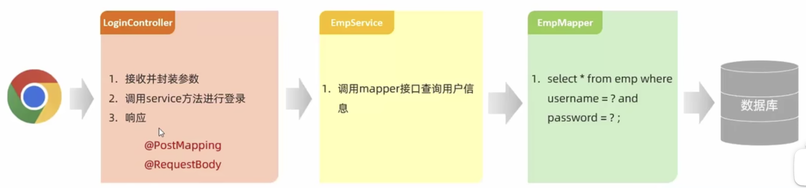
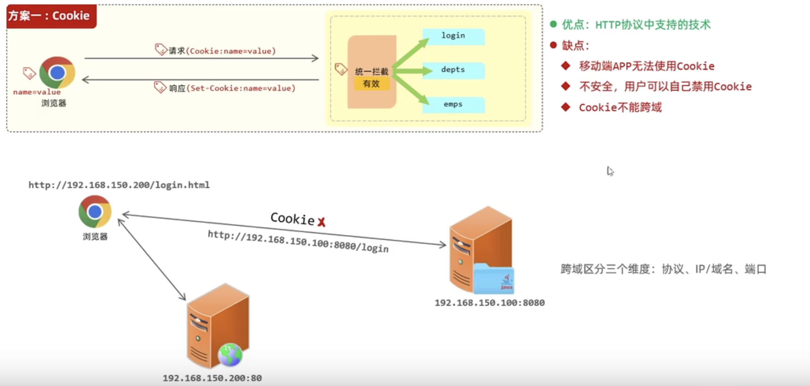

## 项目准备



数据库表SQL：

```sql
create table if not exists dept
(
    id          int unsigned auto_increment comment '主键ID',
    name        varchar(10) not null unique comment '部门名称',
    create_time datetime    not null comment '创建时间',
    update_time datetime    not null comment '更新时间',
    primary key (`id`)
) comment '部门表' engine InnoDB
                charset utf8mb4
                COLLATE utf8mb4_general_ci;

insert into dept(id, name, create_time, update_time)
values (1, '学工部', now(), now()),
       (2, '教研部', now(), now()),
       (3, '咨询部', now(), now());

create table if not exists emp
(
    id          int unsigned auto_increment comment '员工ID',
    username    varchar(20)      not null unique comment '用户名',
    password    varchar(20) default '123456' comment '密码',
    name        varchar(10)      not null comment '姓名',
    gender      tinyint unsigned not null comment '性别 0 女 1 男',
    image       varchar(300) comment '头像',
    job         tinyint unsigned comment '职位：1 班主任，2 讲师，3 学工主管，4 教研主任，5 咨询师',
    entry_date  date comment '入职时间',
    dept_id     int unsigned comment '部门id',
    create_time datetime         not null comment '创建时间',
    update_time datetime         not null comment '更新时间',
    primary key (`id`)
) comment '员工表' engine InnoDB
                charset utf8mb4
                collate utf8mb4_general_ci;

insert into emp(id, username, password, name, gender, image, job, entry_date, dept_id, create_time, update_time)
values (1, 'seeker', '123456', '追逐者', 1, '1.jpg', 4, '2018-12-09', 1, now(), now()),
       (2, 'faker', '123456', '欺诈者', 0, '2.jpg', 1, '2015-08-12', 3, now(), now()),
       (3, 'fiona', '123456', '无双剑姬', 0, '3.jpg', 2, '2017-2-19', 2, now(), now()),
       (4, 'griff', '123456', '格里芬', 1, '4.jpg', 5, '2008-11-03', 1, now(), now()),
       (5, 'lucky', '123456', '赏金猎人', 0, '5.jpg', 3, '2020-06-12', 1, now(), now()),
       (6, 'xander', '123456', '胖子', 1, '6.jpg', 2, '2020-07-21', 1, now(), now()),
       (7, '段正淳', '123456', '瘸子', 1, '1.jpg', 4, '2018-12-09', 1, now(), now()),
       (8, '叶二娘', '123456', '女的', 0, '2.jpg', 1, '2015-08-12', 3, now(), now()),
       (9, '洪七公', '123456', '丐帮', 1, '3.jpg', 2, '2017-2-19', 2, now(), now()),
       (10, '乔峰', '123456', '降龙十八掌', 1, '4.jpg', 5, '2008-11-03', 1, now(), now()),
       (11, '慕容复', '123456', '小人', 1, '5.jpg', 3, '2020-06-12', 1, now(), now()),
       (12, '天山童姥', '123456', '老人', 0, '6.jpg', 2, '2020-07-21', 1, now(), now());
```


## 开发细节

编码细节：

1. 在后续的开发中，不再使用 System.out.println 打印日志。在各个类上使用 注解 @Slf4j ，为当前类提供日志打印属性 log
2. 一个完整的请求路径，应该是类上 @RequestMapping 的value属性 + 方法上@RequestMapping 的value属性。因此，对于方法上公共部分的请求路径，可以统一放在类上


## 部门管理

部门管理主要有四部分功能，均已在代码中实现，定义 DeptController、DeptService、DeptMapper 三个结构来实现具体的开发，具体参见代码。

1. 部门列表
1. 删除部门
1. 新增部门
1. 修改部门


## 员工管理

定义 EmpController、EmpService、EmpMapper 三个结构来实现具体的开发。


### 分页查询

进行条件分页查询前，先学习两个新知识。

- 请求参数默认值

  @RequestParam 注解不仅可以手动映射请求参数到形参，也可以设置参数校验（是否必填），也可以为参数设置默认值

- PageHelper 插件

    为了简化分页查询的开发工作，使用这样一个插件。

    - 添加依赖

        ```xml
                <dependency>
                    <groupId>com.github.pagehelper</groupId>
                    <artifactId>pagehelper-spring-boot-starter</artifactId>
                    <version>1.4.2</version>
                </dependency>
        ```

    - 执行查询

        ```java
            public PageInfo findAllUser(int pageNum, int pageSize) {
                // 使用 PageHelper 分页
                PageHelper.startPage(pageNum, pageSize);
                
                // 调用 Mapper 中的方法
                List userList = userMapper.findAllUser();
              	Page<UserPO> empPOPage = (Page<UserPO>)userList;
                
                // 返回结果
                return new UserVO(empPOPage.getTotal(), empPOPage.getResult());
            }
        
        ```

    另外，在分页查询时，我们往往需要返回查询数据的总数以及当前页的数据信息。因此，这里新建一个 vo 实体类，用于封装某个查询页面的数据对象。

    ```java
    package com.zhangjian.vo;
    
    import com.zhangjian.po.EmpPO;
    
    import java.util.List;
    
    /**
     * 员工分页查询页面数据类
     */
    public class EmpPageVO {
        private long total; // 员工总数
        private List<EmpPO> rows; // 当前页的员工信息列表
    }
    ```

### 批量删除

单个删除本质就是批量删除的一个特例，因此针对删除功能，实现一个批量删除即可。


### 新增员工

新增时，id自增不用传；密码有默认值不用传；创建时间和更新时间由后端自动添加。


### 修改员工

修改员工分为两步：

- 根据 id 查询出员工信息
- 将修改后的信息提交给服务端


## 文件上传

文件上传主要使用到一个 接口类型 MultipartFile，该类型用于接收前端传递的文件对象。其 参数名 和 前端文件对象的key保持一致即可。当然也可以使用 @RequestParam 映射到别的形参上。

新增一个UploadController文件：

```java
package com.zhangjian.controller;

import com.zhangjian.pojo.Result;
import lombok.extern.slf4j.Slf4j;
import org.springframework.web.bind.annotation.PostMapping;
import org.springframework.web.bind.annotation.RestController;
import org.springframework.web.multipart.MultipartFile;

@Slf4j
@RestController
public class UploadController {

    @PostMapping("/upload")
    public Result upload(String name, Integer age, MultipartFile file){
        log.info("文件上传");
        log.info(String.valueOf(file.getSize())); // log.info 不能传入 long 类型，要转一下
        return Result.success();
    }
}
```


### 本地存储

本地存储就是直接将文件保存在服务器磁盘中，这里仅做演示，是不推荐使用的一种方式。

```java
package com.zhangjian.controller;

import com.zhangjian.pojo.Result;
import lombok.extern.slf4j.Slf4j;
import org.springframework.web.bind.annotation.PostMapping;
import org.springframework.web.bind.annotation.RestController;
import org.springframework.web.multipart.MultipartFile;

import java.io.File;
import java.io.IOException;
import java.util.Arrays;
import java.util.UUID;

@Slf4j
@RestController
public class UploadController {

    @PostMapping( "/upload" )
    public Result upload(String name, Integer age, MultipartFile file) throws IOException {
        log.info("文件上传");

        // 1. 获取原始文件名
        String originalFilename = file.getOriginalFilename();

        // 2. 使用 uuid 构建保存的文件名
        int index = originalFilename.lastIndexOf('.');
        String substring = originalFilename.substring(index);

        String newFilename = UUID.randomUUID().toString() + substring;

        // 3. 将文件保存到 static/images 目录下
        File dir = new File("oa-backend/src/main/resources/static/images");

        log.info(dir.getAbsolutePath());

        if (!dir.exists()) { // 创建目录
            dir.mkdirs();
        }

        file.transferTo(new File(dir.getAbsolutePath(), newFilename));

        // 4. 其他常用方法
        log.info(String.valueOf(file.getSize())); // 获取文件大小， 单位字节
//        log.info(Arrays.toString(file.getBytes())); // 获取文件内容的数组
//        file.getInputStream();  // 获取文件内容的输入流

        return Result.success();
    }
}
```


### 对象存储

相关概念：

> SDK：Software Development Kit 的缩写，软件开发工具包。这包括 辅助软件开发的的依赖、示例代码 等。
>
> Bucket：存储空间。适用于存储对象（Object，就是文件）的容器，所有的对象都必须隶属于摸个存储空间。


对象存储是指将文件保存到专门的文件存储服务器上。在项目的实际开发中，几乎不会直接将文件保存在服务器上，这既不可靠，也不安全。现下比较流行的两种方式是 **公司自己搭建对象存储服务（webdav、minio）** 或 **使用第三方提供的云存储服务（阿里云、腾讯云 等）**。

下面演示将文件保存到阿里云OSS服务的过程：

1. 注册阿里云OSS，获取AccessKey

    ```shell
    host: http://oss-cn-chengdu.aliyuncs.com
    
    bucket: oa-backend
    
    AccessKey ID: LTAI5tLwceXsCyzpmLHv76xR
    
    AccessKey Secret: 40OBM9Ry7ZRs6DKz9H7HLAYhsr6VLD
    ```

2. 引入 Ali-OSS依赖到项目中

    ```xml
            <dependency>
                <groupId>com.aliyun.oss</groupId>
                <artifactId>aliyun-sdk-oss</artifactId>
                <version>3.15.1</version>
            </dependency>
            <dependency>
                <groupId>javax.xml.bind</groupId>
                <artifactId>jaxb-api</artifactId>
                <version>2.3.1</version>
            </dependency>
            <dependency>
                <groupId>javax.activation</groupId>
                <artifactId>activation</artifactId>
                <version>1.1.1</version>
            </dependency>
            <!-- no more than 2.3.3-->
            <dependency>
                <groupId>org.glassfish.jaxb</groupId>
                <artifactId>jaxb-runtime</artifactId>
                <version>2.3.3</version>
            </dependency>
    ```

3. 根据SDK实例文档，编写一个文件上传的工具类

    ```java
    package com.zhangjian.utils;
    
    import com.aliyun.oss.ClientException;
    import com.aliyun.oss.OSS;
    import com.aliyun.oss.OSSClientBuilder;
    import com.aliyun.oss.OSSException;
    import lombok.extern.slf4j.Slf4j;
    import org.springframework.stereotype.Component;
    import org.springframework.web.multipart.MultipartFile;
    
    import java.io.IOException;
    import java.util.UUID;
    
    /**
     * 文件存储类
     */
    @Slf4j
    @Component // 将文件存储类交给IOC容器
    public class FileStorage {
    
        private final String endpoint = "http://oss-cn-chengdu.aliyuncs.com";
    
        private final String bucketName = "oa-backend";
    
        private final String accessKeyId = "LTAI5tLwceXsCyzpmLHv76xR";
    
        private final String accessKeySecret = "40OBM9Ry7ZRs6DKz9H7HLAYhsr6VLD";
      
        private OSS getOSS() {
            return new OSSClientBuilder().build(endpoint, accessKeyId, accessKeySecret);
        }
    
        public boolean bucketIsExist(String bucketName) {
            OSS oss = getOSS();
    
            return oss.doesBucketExist(bucketName);
        }
    
        public void createBucket(String bucketName) {
            OSS oss = getOSS();
    
            try {
                oss.createBucket(bucketName);
            } catch (OSSException | ClientException e) {
                e.printStackTrace();
            } finally {
                oss.shutdown();
            }
        }
    
        public String getBucketEndpoint(){
            StringBuilder builder = new StringBuilder(endpoint);
            builder.insert(builder.indexOf("//") + 2, bucketName + ".");
    
            return builder.toString();
        }
    
        public String upload(MultipartFile file) throws IOException {
            OSS oss = getOSS();
    
            String originalFilename = file.getOriginalFilename();
    
            int index = originalFilename.lastIndexOf('.');
            String substring = originalFilename.substring(index);
    
            String newFilename = UUID.randomUUID() + substring;
    
            try {
                oss.putObject(bucketName, newFilename, file.getInputStream());
                return getBucketEndpoint() + "/" + newFilename;
            } catch (OSSException | ClientException e) {
                e.printStackTrace();
                return null;
            } finally {
                oss.shutdown();
            }
        }
    }
    ```

4. 在UploadController中实现接口

    ```java
        @Autowired
        private FileStorage fileStorage;    
    
    		@PostMapping( "/upload/ali/oss" )
        public Result upload(MultipartFile file) throws IOException {
            log.info("上传文件到OSS");
            String url = fileStorage.upload(file);
            log.info("文件上传成功，访问地址: {}", url);
            return Result.success(url);
        }
    ```

    


## 配置文件

在前面接口开发中，实现文件上传工具类时，是直接将阿里云相关的信息硬编码在了代码中，这很明显不符合编码的规范，且很不利于后续的维护。


### 参数配置化

对于这种参数信息，通常将其放入 *.properties 配置文件中，然后使用 Properties 类加载配置文件，来获取具体的配置项。

但是，我们目前使用的是springboot项目，这些配置已经提前加载好了，只需在对应属性上使用 @Value 注解引入对应的配置即可，形式如下：

```java
// 假设 properties 中有一个配置key为 username
@Value("${username}")
public String name; // 这就将配置文件中 username 的值，给到了属性 name
```


在默认配置文件 application.properties 中增加阿里云OSS相关的配置：

> 配置名通常建议取得有意义，且有较高的辨识度

```properties
# ali oss 配置
ali.oss.endpoint=oss-cn-chengdu.aliyuncs.com
ali.oss.bucket-name=oa-backend
ali.oss.access-key-id=LTAI5tLwceXsCyzpmLHv76xR
ali.oss.access-key-secret=40OBM9Ry7ZRs6DKz9H7HLAYhsr6VLD
```


改造文件上传工具类：

```java
    // 要使用@Value来注入配置的值时，属性就不能是 final

    @Value( "${ali.oss.endpoint}" )
    private String endpoint;

    @Value( "${ali.oss.bucket-name}" )
    private String bucketName;

    @Value( "${ali.oss.access-key-id}" )
    private String accessKeyId;

    @Value( "${ali.oss.access-key-secret}" )
    private String accessKeySecret;
```


### yml/yaml 配置文件

在前面使用的 *.properties 时，可以明显的感觉到，到配置信息变多时，配置信息将变得臃肿，层级结构也不清晰。再此引入 *.yml（等价于 *.yaml） 配置文件。

下面将 applicaton.properties 转为 application.yml：

```yml
spring:
  # 数据库连接配置
  datasource:
    driver-class-name: com.mysql.cj.jdbc.Driver
    url: jdbc:mysql://172.16.20.64:3307/mybatis
    username: root
    password: mybatis123

  # 文件上传文件大小配置
  servlet:
    multipart:
      max-file-size: 10MB
      max-request-size: 100MB

# mybatis 日志输出及命名转换配置
mybatis:
  configuration:
    log-impl: org.apache.ibatis.logging.stdout.StdOutImpl
    map-underscore-to-camel-case: true

# 自定义 阿里云OSS 配置
ali:
  oss:
    endpoint: oss-cn-chengdu.aliyuncs.com
    bucket-name: oa-backend
    access-key-id: LTAI5tLwceXsCyzpmLHv76xR
    access-key-secret: 40OBM9Ry7ZRs6DKz9H7HLAYhsr6VLD
```


从上面不难看出，yml 形式的配置文件，其目录结构比 properties 清晰了很多。在实际项目中通常建议使用 yml 配置。（这里将 properties 文件重命名保存）


### @ConfigurationProperties

在参数配置化小节中，我们将参数抽离到配置文件后，使用 @Value 注解依次为每个属性注入参数值。可以发现，如果参数配置变多之后，挨个的使用 @Value 注解也将成为一件很麻烦事情。


#### 实现配置类

基于此，我们因此 配置类，类中的属性名和配置的key保持一致，他们之间可以自动完成驼峰和中划线的转换。按照如下步骤来实现：

1. 定义一个配置类

    ```java
    package com.zhangjian.pojo;
    
    public class AliOSSProperties {
        private String endpoint;
        private String bucketName;
        private String accessKeyId;
        private String accessKeySecret;
    }
    ```

2. 要为属性注入配置的值，就要为配置类提供 Getter、Setter 方法。使用 lombok 的 @Data 注解

    ```java
    package com.zhangjian.pojo;
    
    import lombok.Data;
    
    @Data
    public class AliOSSProperties {
        private String endpoint;
        private String bucketName;
        private String accessKeyId;
        private String accessKeySecret;
    }
    ```

3. 想要让spring帮忙完成自动属性的注入，还需要将配置类交给IOC容器管理，使其称为bean对象

    ```java
    package com.zhangjian.pojo;
    
    import lombok.Data;
    import org.springframework.stereotype.Component;
    
    @Data
    @Component
    public class AliOSSProperties {
        private String endpoint;
        private String bucketName;
        private String accessKeyId;
        private String accessKeySecret;
    }
    ```

4. 最后，因为在配置文件中配置繁多。我们需要使用 @ConfigurationProperties 注解，为配置类指定其所归属的配置前缀

    ```java
    package com.zhangjian.pojo;
    
    import lombok.Data;
    import org.springframework.boot.context.properties.ConfigurationProperties;
    import org.springframework.stereotype.Component;
    
    @Data
    @Component
    @ConfigurationProperties(prefix = "ali.oss")
    public class AliOSSProperties {
        private String endpoint;
        private String bucketName;
        private String accessKeyId;
        private String accessKeySecret;
    }
    ```


#### 改造工具类

如此一来，配置类有了。我们在工具类中注入配置类，直接使用相关配置即可。工具类改造后代码：

```java
package com.zhangjian.utils;

import com.aliyun.oss.ClientException;
import com.aliyun.oss.OSS;
import com.aliyun.oss.OSSClientBuilder;
import com.aliyun.oss.OSSException;
import com.zhangjian.pojo.AliOSSProperties;
import lombok.extern.slf4j.Slf4j;
import org.springframework.beans.factory.annotation.Autowired;
import org.springframework.stereotype.Component;
import org.springframework.web.multipart.MultipartFile;

import java.io.IOException;
import java.util.UUID;

/**
 * 文件存储类
 */
@Slf4j
@Component // 将文件存储类交给IOC容器
public class FileStorage {

    @Autowired
    private AliOSSProperties aliOSSProperties;


    private OSS getOSS() {
        return new OSSClientBuilder().build(aliOSSProperties.getEndpoint(), aliOSSProperties.getAccessKeyId(), aliOSSProperties.getAccessKeySecret());
    }

    public boolean bucketIsExist(String bucketName) {
        OSS oss = getOSS();
        boolean exist = oss.doesBucketExist(bucketName);
        oss.shutdown();

        return exist;
    }

    public void createBucket(String bucketName) {
        OSS oss = getOSS();

        try {
            oss.createBucket(bucketName);
        } catch (OSSException | ClientException e) {
            e.printStackTrace();
        } finally {
            oss.shutdown();
        }
    }

    public String getBucketEndpoint() {
        StringBuilder builder = new StringBuilder(aliOSSProperties.getEndpoint());

        if (aliOSSProperties.getEndpoint().startsWith("http:")) {
            builder.insert(builder.indexOf("//") + 2, aliOSSProperties.getBucketName() + ".");
        }else {
            builder.insert(0, "http://" + aliOSSProperties.getBucketName() + ".");
        }

        return builder.toString();
    }

    public String upload(MultipartFile file) throws IOException {
        OSS oss = getOSS();

        String originalFilename = file.getOriginalFilename();

        String suffix = originalFilename.substring(originalFilename.lastIndexOf('.'));

        String newFilename = UUID.randomUUID() + suffix;

        try {
            oss.putObject(aliOSSProperties.getBucketName(), newFilename, file.getInputStream());
            return getBucketEndpoint() + "/" + newFilename;
        } catch (OSSException | ClientException e) {
            e.printStackTrace();
            return null;
        } finally {
            oss.shutdown();
        }
    }
}
```


#### 使用配置提示

当我们使用 @ConfigurationProperties 注解定义配置类后，我们可以引入一个依赖，这个依赖可以根据代码中定义的配置类，在我们编辑配置文件时，给出像系统配置一样的提示，方便我们维护配置文件。

依赖信息：

```xml
        <!--自定义配置提示-->
        <dependency>
            <groupId>org.springframework.boot</groupId>
            <artifactId>spring-boot-configuration-processor</artifactId>
        </dependency>
```


引入配置后，再次编辑配置文件，就可以得到相应的提示：




## 登录管理

在前面的开发中，我们已经分别定义了 DeptController、EmpController、UploadController 三个控制类，他们都不适合直接用来创建登录相关的接口，因此对于登录再单独创建一个 LoginController。

登录本质上就是员工的操作，通过账号密码检查某个员工是否存在，因此，service 和 mapper 都可以直接使用 EmpService 和 EmpMapper。




### 登录接口

controller定义：

```java
package com.zhangjian.controller;

import com.zhangjian.po.EmpPO;
import com.zhangjian.pojo.Result;
import com.zhangjian.service.EmpService;
import lombok.extern.slf4j.Slf4j;
import org.springframework.beans.factory.annotation.Autowired;
import org.springframework.web.bind.annotation.PostMapping;
import org.springframework.web.bind.annotation.RestController;

@Slf4j
@RestController
public class LoginController {

    @Autowired
    private EmpService empService;

    @PostMapping("/login")
    public Result login(EmpPO empPO){
        log.info("用户 {} 登录", empPO.getUsername());

        EmpPO emp = empService.login(empPO);

        // 如果查到用户表示登录成功；否则表示登录失败
        return emp == null ? Result.fail("用户名或密码错误") : Result.success("登录成功");
    }
}
```

其它代码已在项目中实现，此处不再展示。


### 登录校验

#### 会话技术

**会话：** 用户打开浏览器，访问web服务器资源，会话建立，直到有一方断开连接，会话结束。再一次绘画中可以包含 多次 请求和响应。

**会话跟踪：** 一种维护浏览器状态的方法，服务器需要识别多次请求是否来自于同一浏览器，以便在同一次会话的多次请求间 共享数据。

**会话跟踪方案：**

- 客户端会话跟踪技术：Cookie
- 服务端会话跟踪技术：Session
- 令牌技术


**会话跟踪技术方案对比**

1. Cookie

    Cookie 方案的实现是通过在首次访问服务器时，服务器通过 Set-Cookie将信息自动保存到浏览器。浏览器下次访问时，会自动带上设置的Cookie信息，以证明当前来自哪里。 

    

    演示代码：

    ```java
    package com.zhangjian.controller;
    
    import com.zhangjian.pojo.Result;
    import lombok.extern.slf4j.Slf4j;
    import org.springframework.web.bind.annotation.GetMapping;
    import org.springframework.web.bind.annotation.RestController;
    
    import javax.servlet.http.Cookie;
    import javax.servlet.http.HttpServletRequest;
    import javax.servlet.http.HttpServletResponse;
    
    @Slf4j
    @RestController
    public class CookieController {
    
        /**
         * 设置Cookie
         * @param response
         * @return
         */
        @GetMapping("/c1")
        public Result cookie1(HttpServletResponse response){
            response.addCookie(new Cookie("login_user", "tom"));
            return Result.success();
        }
    
        /**
         * 获取cookie
         * @param request
         * @return
         */
        @GetMapping("/c2")
        public Result cookie2(HttpServletRequest request){
            Cookie[] cookies = request.getCookies();
            for (Cookie cookie : cookies) {
                System.out.println(cookie.getName() + " : " + cookie.getValue());
            }
            return Result.success();
        }
    }
    ```

    

