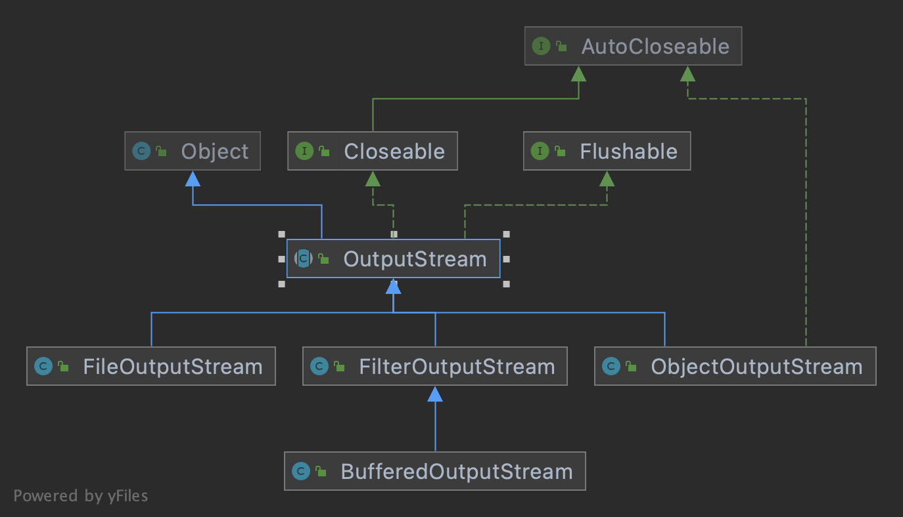
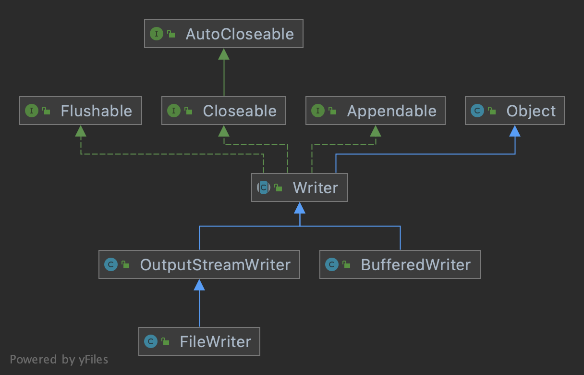

## 基础知识

**文件：**

​		文件就是对若干数据的存储，是这些数据存储后对外呈现的一种表现形式。文件可以是一个 word、excel，又或者是一段视频或一张图片。

​		在操作系统中，目录也是一种特殊的文件，只不过他存储的数据是用于表示管理文件的目录。


## 创建文件

在 java 中，创建一个新的文件，需要使用 File 类。


### 创建文件

创建文件的 File 类，常用的有三个构造方法，形式如下：

```java
// 1、根据文件路径创建对象
public File(String pathname) {...}

// 2、根据父目录文件对象和子文件路径创建对象
public File(File parent, String child) {...}

// 3、根据父目录路径和子文件路径创建对象
public File(String parent, String child) {...}
```


代码演示下文件的创建：

```java
package com.zhangjian.IO流;

import java.io.File;
import java.io.IOException;

public class IO {
    public static void main(String[] args) throws IOException {

        // 1、根据文件路径创建。路径可以是绝对路径，也可以是相对路径
        File file = new File("IO/news01.txt");
        if (file.createNewFile()){
            System.out.println("news01 创建成功...");
        }

        // 2、根据父目录对象和子文件路径创建
        File parent = new File("IO");
        File file1 = new File(parent, "news02.txt");
        if (file1.createNewFile()){
            System.out.println("news02 创建成功...");
        }

        // 3、根据父目录和子文件路径创建
        File file2 = new File("IO", "news03.txt");
        if (file2.createNewFile()){
            System.out.println("news03 创建成功...");
        }

    }
}
```


### 常用方法

1. getName  获取文件名称
2. getAbsolutePath  获取文件的绝对路径，不包含文件名。注意：java 程序不会将 包 当做文件路径。
3. getParent  获取文件的父级目录，只是 父级目录 名称
4. length  获取文件的大小（字节数）
5. exists  判断文件是否存在
6. isFile  判断文件是否是一个文件
7. isDirectory  判断文件是否是一个目录
8. mkdir  创建一级目录
9. mkdirs  创建多级目录。推荐使用，一级目录也可以创建
10. delete  删除空目录 或 文件。如果是一个文件可直接删除，如果是一个目录，目录不为空时不能删除


简单演示：

```java
package com.zhangjian.IO流;

import java.io.File;
import java.io.IOException;

public class IO {
    public static void main(String[] args) throws IOException {

        // 文件已经创建
        File file = new File("IO/news01.txt");

        System.out.println(file.getName()); // news01.txt
        System.out.println(file.getAbsolutePath());  // /Users/zhangjian1138/IdeaProjects/LearnJava/IO/news01.txt
        System.out.println(file.getParent()); // IO
        System.out.println(file.length()); // 0
        System.out.println(file.exists()); // true
        System.out.println(file.isFile()); // true

        // 目录也当做文件处理
        File file1 = new File("IO/didi/");

        // 是否存在
        if (!file1.exists()) {
            // 创建目录
            if (file1.mkdirs()) {
                System.out.println("目录创建成功...");
            }

            System.out.println(file1.isDirectory()); // true

            if (file1.delete()){
                System.out.println("目录删除成功...");
            }
        }
    }
}
```


## IO流

### 原理

1. I/O 是 Input/Output 的缩写，I/O 技术是非常实用的技术，通常用于数据传输处理。比如：读写文件、网络传输等

2. Java 程序中，对于数据的传输操作，以 流（Stream）的方式进行

3. 在 java.io 包下提供了各种 stream 的 类 和 接口 ，用来操作不同种类的数据

4. input 输入：读取外部数据（光盘、磁盘等）到程序（内存）中

5. output输出：将程序（内存）中的数据输出到 外部存储设备中

    

### Stream 分类

**按照流的流向划分：**

- 输入流
- 输出流

**按照流的角色划分：**

- 节点流
- 处理流/包装流

**按照流的传输单位划分：**

- 字节流	以 一个字节（8 bit）为单位进行传输。字节流传输对中文及特殊字符不友好
- 字符流    以 一个字符（字符的大小由编码方式决定）为单位进行传输


**说明：**

1. 字节流 的 抽象基类是  InputStream 和 OutputStream
2. 字符流 的 抽象积累是 Reader 和 Writer
3. Java 中IO相关的类有很多，他们都是从 上面 4 个 基类派生出来的
4. 4个 基类的派生出来的子类的名称都是以其父类的名称作为子类名称的后缀


## InputStream

InputStream 抽象类是所有 字节输入流类 的超类

常用子类：

1. FileInputStream  文件字节输入流
2. BufferedInputStream  缓冲字节输入流
3. ObjectInputStream  对象字节输入流


关系图：


### FileInputStream

构造方法：


成员方法：


简单的数据读取代码演示：

```java
package com.zhangjian.IO流;

import org.junit.jupiter.api.Test;

import java.io.FileInputStream;
import java.io.FileNotFoundException;
import java.io.IOException;
import java.io.InputStream;
import java.util.Arrays;

public class IO {

    @Test
    public void readFile01() throws FileNotFoundException {
        String filePath = "/Users/zhangjian1138/IdeaProjects/LearnJava/IO/news01.txt";
        FileInputStream stream = new FileInputStream(filePath);;

        // 使用 read ，按单个字节读取。文件读完之后，返回-1
        int readRes;
        try {
            while ((readRes = stream.read()) != -1) {
                // read 返回的是对应字符的 ascii 码
                System.out.print((char) (readRes));
            }
        } catch (IOException e) {
            e.printStackTrace();
        } finally {
            try {
                stream.close();
            } catch (IOException e) {
                e.printStackTrace();
            }
        }
    }


    @Test
    public void readFile02() throws IOException {
        String filePath = "/Users/zhangjian1138/IdeaProjects/LearnJava/IO/news01.txt";
        FileInputStream stream = new FileInputStream(filePath);

        // 使用 read ，按 byte[] 数组长度读取。每次返回当前读取的字节长度
        int len;
        byte[] readRes = new byte[8];
        try {
            while ((len = stream.read(readRes)) != -1){
                System.out.println("读取字节数: " + len);
                System.out.println(new String(readRes, 0, len));
            }
        } catch (IOException e) {
            e.printStackTrace();
        } finally {
            try {
                stream.close();
            } catch (IOException e) {
                e.printStackTrace();
            }
        }
    }
}
```


## OutputStream

OutputStream 抽象类是所有 字节输出流类 的超类

常用子类：

1. FileOutputStream  文件字节输出流
2. BufferedOutputStream  缓冲字节输出流
3. ObjectOutputStream  对象字节输出流


关系图：




### FileOutputStream

构造方法：


成员方法：


注意：

1. 使用 FileOutputStream 向文件输出字节流时，如果文件不存在，会自动创建。但前提是目录必须存在


代码演示：

```java
package com.zhangjian.IO流;

import org.junit.jupiter.api.Test;

import java.io.*;
import java.nio.charset.StandardCharsets;

public class IO {

    @Test
    public void writeFile() throws FileNotFoundException {
        String filePath = "/Users/zhangjian1138/IdeaProjects/LearnJava/IO/news04.txt";

        // 创建文件输出流，append 追加模式
        FileOutputStream stream = new FileOutputStream(filePath, true);;

        // 使用 write 向文件输出字节流
        try {
            //1. 写入单个字符
            stream.write('A');
            stream.write("\n".getBytes(StandardCharsets.UTF_8)); // 获取字节时，指定编码方式

            // 2. 写入一个字符串
            stream.write("stay hungry; stay foolish".getBytes());
            stream.write("\n".getBytes());

            //3. 写入字符串的一部分
            stream.write("stay hungry; stay foolish".getBytes(), 0, 4);

        } catch (IOException e) {
            e.printStackTrace();
        } finally {
            try {
                stream.close();
            } catch (IOException e) {
                e.printStackTrace();
            }
        }
    }

    /**
     * 将 谁不喜欢上班呢.jpeg 复制到当前目录 名字 改为 自愿上班.jpeg
     */
    @Test
    public void copyFile() throws FileNotFoundException {
        String origin = "/Users/zhangjian1138/IdeaProjects/LearnJava/IO/谁不喜欢上班呢.jpeg";
        String target = "/Users/zhangjian1138/IdeaProjects/LearnJava/IO/自愿上班.jpeg";

        FileInputStream inputStream = new FileInputStream(origin);
        FileOutputStream outputStream = new FileOutputStream(target, true);

        // 将源文件内容读出来写入到新文件
        int len;
        byte[] readRes = new byte[1024];
        try {
            while ((len = inputStream.read(readRes)) != -1){
                System.out.println("本次写入字节数: " + len);
                // 注意：写入时要注意最后一次读取的长度，如果直接写入整个 byte[] ，可能会出错
                outputStream.write(readRes, 0, len);
            }
        } catch (IOException e) {
            e.printStackTrace();
        } finally {
            try {
                inputStream.close();
                outputStream.close();
            } catch (IOException e) {
                e.printStackTrace();
            }
        }

    }
}
```


## Reader

Reader 抽象类是所有 字符输入流类 的超类

常用子类：

1. FileReader  文件字符输入流
2. BufferedReader  缓冲字符输入流


关系图：


### FileReader

常用方法：

1. new FileReader(File/String)  构造器。接收一个 File对象 或 String的 文件路径
2. read()  每次读取单个字符，并返回该字符。如果已经到文件末尾就返回 -1
3. read(char[])  批量读取字符到数组，返回读取到的字符数。如果已经到文件末尾就返回 -1


相关API：

1. new String(char[])  将char[]数组转成String
2. new String(char[],offset,length)  将char[]数组指定位置处制定个数的字符转成String


代码演示：

```java
package com.zhangjian.IO流;

import org.junit.jupiter.api.Test;

import java.io.*;

public class IO {

    @Test
    public void readFile01(){
        String filePath = "/Users/zhangjian1138/IdeaProjects/LearnJava/IO/news03.txt";

        FileReader reader = null;

        // 按单个字符读取输出
        int readData;

        try {
            reader = new FileReader(filePath);
            while ((readData = reader.read()) != -1){
                System.out.print((char) readData);
            }
        } catch (IOException e) {
            e.printStackTrace();
        } finally {
            try {
                if(reader != null){
                    reader.close();
                }
            } catch (IOException e) {
                e.printStackTrace();
            }
        }
    }

    @Test
    public void readFile02(){
        String filePath = "/Users/zhangjian1138/IdeaProjects/LearnJava/IO/news03.txt";

        FileReader reader = null;

        // 按 char[] 读取输出
        int length;
        char[] readData = new char[12];

        try {
            reader = new FileReader(filePath);
            while ((length = reader.read(readData)) != -1){
                System.out.print(new String(readData, 0, length));
            }
        } catch (IOException e) {
            e.printStackTrace();
        } finally {
            try {
                if(reader != null){
                    reader.close();
                }
            } catch (IOException e) {
                e.printStackTrace();
            }
        }
    }
}
```


## Writer

Writer 抽象类是所有 字符输出流类 的超类

常用子类：

1. FileWriter  文件字符输出流
2. BufferedWriter  缓冲字符输出流


关系图：




### FileWriter

常用方法：

1. New FileWriter(File/String)  覆盖模式。相当于流的指针在文件起始位置
2. New FileWriter(File/String,true)  追加模式。相当于流的指针在文件的结束位置，从文件最后新增内容
3. write(int)  写入单个字符。char 和 int 自动转换
4. write(char[])  写入指定数组的字符
5. write(char[],offset,length)  写入数组的指定部分
6. write(String)  写入整个字符串
7. write(String,offset,length)  写入字符串的指定部分


**注意：** Filewriter 对象写入数据后，需要调用 close() 或 flush()  方法，保存的数据才会真正的保存到文件！


代码演示：

