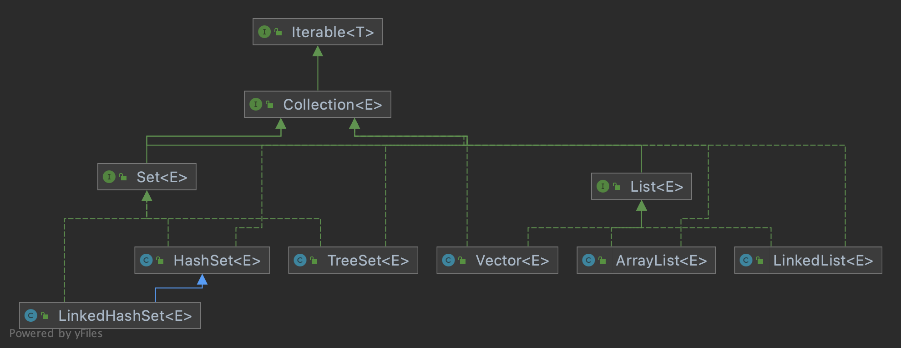
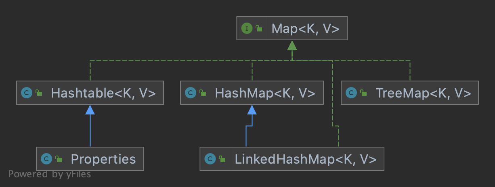
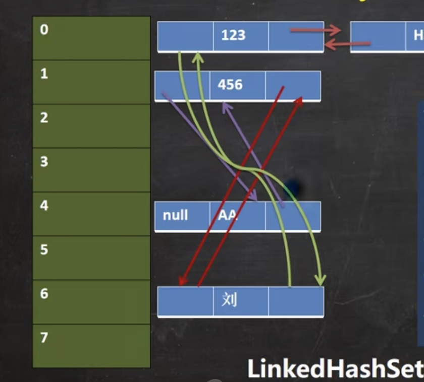

## 背景

 在此之前，我们保存多个数据使用的是数组，但数组有很多不足的地方。比如：

- 长度在初始化时必须指定，而且一旦指定，就不能更改；
- 保存的哥哥元素必须为同一类型
- 使用数组进行增加删除元素很麻烦


**集合的优势：**

- 可以动态保存任意多个对象
- 提供了一系列方便的操作方法，比如：add、remove、set、get 等
- 使用集合来维护多个数据很方便，且代码很清晰


## 集合的框架体系

集合主要分为两类，分别是 单列集合、双列集合。

下面图中仅绘制了常用的类。


### 单列集合 Collection

Collection 接口有两个重要的子接口 List(保证添加和读取有序) 和 Set(不保证能按添加的顺序读取) ，它们的实现子类都是单列集合。

单列集合就是指，集合内部的元素都是以 单项(item) 的形式存在的。




### 双列集合 Map

Map 接口的实现子类都是双列集合。

双列集合特点是，集合中的每一项都是以 key-value 键值对的形式添加保存的。




## Collection

实现了Collection接口的子类，都可以称为单列集合。


### 可迭代

从框架体系中，可以看到 Collection 实现了 Iterable 接口，也就意味着 Collection 的所有实现子类也都是可迭代的。


#### iterator

**基本介绍：**

1. Iterator 对象称为迭代器，主要用于遍历 Collection 中的元素
2. 所有实现了 Collection 接口的集合类都有一个 iterator() 方法，用于返回一个 Iterator接口的对象，也就是迭代器
3. 迭代器本身不存放元素，仅用于遍历集合
4. Iterator 对象的方法：
    1. hasNext()  判断集合中是否还有下一个元素，返回 boolean
    2. next()  迭代器游标下移，并且返回下以后集合位置上的元素
    3. 如果集合中元素已经遍历完，仍继续调用 next() ，将抛出 NoSuchElementException 异常
    4. 如果想再次遍历，则需要再次调用集合的iterator() 方法，获取新的迭代器


**代码示例：**

```java
package com.zhangjian.集合;

import java.util.ArrayList;
import java.util.Iterator;

/*
用 ArrayList 类演示
 */
public class CollectionIntroduction {
    public static void main(String[] args) {
        ArrayList list = new ArrayList();
        // 添加元素
        list.add(new Book("天龙八部", "金庸", 99.8));
        list.add(new Book("西游记", "吴承恩", 108.8));
        list.add(new Book("红楼梦", "曹雪芹", 102.5));

        // 获取迭代器
        Iterator iterator = list.iterator();

        // 迭代获取元素
        while (iterator.hasNext()){
            System.out.println(iterator.next());
        }

    }
}


class Book{
    private String name;
    private String author;
    private double price;

    public Book(String name, String author, double price) {
        this.name = name;
        this.author = author;
        this.price = price;
    }

    @Override
    public String toString() {
        return "Book{" +
                "name='" + name + '\'' +
                ", author='" + author + '\'' +
                ", price=" + price +
                '}';
    }
}
```


#### 增强for

增强for循环，可以替代iterator迭代器。可以理解为简化版的iterator，但他们本质上是一样的。

一个实现类，只要实现了 Iterable接口，那么它的实例可以称为可迭代对象，也就意味着它可以使用 增强for循环。


**语法：**

```java
for(元素类型 元素名: 可迭代对象){
  // 访问元素
}
```


**代码示例：**

仅修改上面 main方法 部分代码即可。

```java
package com.zhangjian.集合;

import java.util.ArrayList;

/*
用 ArrayList 类演示
 */
public class CollectionIntroduction {
    public static void main(String[] args) {
        ArrayList list = new ArrayList();
        // 添加元素
        list.add(new Book("天龙八部", "金庸", 99.8));
        list.add(new Book("西游记", "吴承恩", 108.8));
        list.add(new Book("红楼梦", "曹雪芹", 102.5));
        

        // 迭代获取元素
        for (Object book: list) {
            System.out.println(book);
        }
    }
}
```


### List

#### 特征

List 是 Collection接口的子接口，具有以下特征：

1. List集合类中元素有序（即添加顺序和取出顺序一致），且元素可以重复
2. List集合中的每个元素都有其对应的顺序索引，可以根据 索引 获取List中的元素（底层仍然是数组）
3. 因为List接口提供了通过索引获取元素的方式，因此遍历List对象时，除了 Iterator迭代器、增强for循环 以外，还可以通过 size() 获取元素个数后，使用 普通for循环 遍历。因此 List对象 有三种遍历方式。


#### 常用方法

```java
package com.zhangjian.集合;

import java.util.*;

/*
用 ArrayList 类演示
 */
public class CollectionIntroduction {
    @SuppressWarnings({"all"})
    public static void main(String[] args) {
        // 向上转型。因为是演示 List 接口的方法，因此 编译类型 使用 List
        List list = new ArrayList();

        // add addAll 添加元素
        list.add("tom");
        list.add("jack");
        list.add(1, "john"); // 将元素添加到指定位置，原有的元素后移
        System.out.println(list);

        List l2 = new ArrayList();
        l2.add("xiaoxin");
        l2.add("猪仔");

        list.addAll(l2); // 将目标集合里面的所有元素追加到当前集合末尾
        System.out.println(list);
        list.addAll(2, l2); // 将目标集合里面的所有元素从索引处开始插入到当前集合，原有的元素往后移
        System.out.println(list);

        // get 获取指定位置的元素
        System.out.println(list.get(3));

        // indexOf 返回obj在集合中首次出现的位置
        System.out.println(list.indexOf("xiaoxin"));

        // lastIndexOf 返回obj在集合中最后一次出现的位置
        System.out.println(list.lastIndexOf("xiaoxin"));

        // remove 移除集合中的元素
        list.remove("john"); // 按对象移除
        System.out.println(list);
        list.remove(5); // 按索引移除
        System.out.println(list);

        // size 获取当前集合中元素的个数
        System.out.println(list.size());

        // contains 返回当前集合是否包含目标对象
        System.out.println(list.contains("tom"));

        // set 设置指定位置的元素，指定的索引必须在当前集合长度范围内。相当于替换某个位置的元素
        list.set(1, "克里金娃");
        System.out.println(list);

        // subList 返回一个从 fromIndex 到 toIndex 的子集合，不包含 toIndex 位置的元素
        List list1 = list.subList(1, 4);
        System.out.println(list1);
    }
}
```


#### 练习一下

创建一个Book对象，有三个属性 name、author、price ，使用 List 的三个常用实现类（Vector、LinkedList、ArrayList）分别输出 Book信息，要求输出结果按 Book.price 升序。

```java
package com.zhangjian.集合;

import java.util.*;

/*
用 ArrayList 类演示
 */
public class CollectionIntroduction {
    @SuppressWarnings({"all"})
    public static void main(String[] args) {
        // ArrayList Vector LinkedList 都是 List接口的实现类，此处又只使用了 List 的方法，所以换谁上都一样
//        List list = new ArrayList();
//        Vector list = new Vector();
        LinkedList list = new LinkedList();

        // 添加元素
        list.add(new Book("天龙八部", "金庸", 99.8));
        list.add(new Book("西游记", "吴承恩", 108.8));
        list.add(new Book("红楼梦", "曹雪芹", 72.3));
        list.add(new Book("水浒传", "施耐庵", 88.2));
        list.add(new Book("三国演义", "罗贯中", 102.5));

        // 排序。使用 匿名内部类，直接实现排序逻辑
        list.sort(new Comparator() {
            @Override
            public int compare(Object o1, Object o2) {
                double diff = ((Book)o1).getPrice() - ((Book)o2).getPrice();
                if (diff > 0) return 1;
                if (diff < 0) return -1;
                return 0;
            }
        });

        // 获取输出元素
        Iterator iterator = list.iterator();
        while (iterator.hasNext()) {
            Object next =  iterator.next();
            System.out.println(next);
        }
    }
}


class Book{
    private String name;
    private String author;
    private double price;

    public Book(String name, String author, double price) {
        this.name = name;
        this.author = author;
        this.price = price;
    }

    public double getPrice() {
        return price;
    }

    @Override
    public String toString() {
        return "书名：" + name + "\t\t作者：" + author + "\t\t价格：" + price;
    }
}
```


#### ArrayList

ArrayList 是 List 接口 的实现类之一，也是常用的单列集合之一。

**注意：**

1. ArrayList 允许添加任何类型的元素，包括 null
2. ArrayList 底层是由数组来实现数据存储的
3. ArrayList 基本等同于 Vector，但 ArrayList执行效率要高于Vector（代价是线程不安全），ArrayList 不建议在多线程场景使用


##### 扩容源码分析

1. ArrayList 中维护了一个Object类型的数组 `elementData`，因此可以add任何类型的数据

    ```java
    // 源码
    
    // 初始化一个空数组
    private static final Object[] DEFAULTCAPACITY_EMPTY_ELEMENTDATA = {};
    
    // transient 关键字修饰的属性，
    transient Object[] elementData;
    
    // 默认构造器
    public ArrayList() {
      this.elementData = DEFAULTCAPACITY_EMPTY_ELEMENTDATA;
    }
    ```

2. 当创建ArrayList对象时，如果使用无参构造器，则初始化 `elementData` 容量为 0（从上面一眼可知），当第一次 add 元素时，`elementData` 扩容为10，如果需要再次扩容，则将容量扩为当前容量的1.5倍（0,10,15,22 ...），下面跟踪源码确认扩容逻辑。

    - 调用 add

        ```java
        public boolean add(E e) {
          modCount++;  // 1.记录当前集合对象的修改次数
          add(e, elementData, size);// 2.elementData={} size=0 size就是记录集合里面元素个数的属性
          return true;
        }
        ```

    - 进入 add(e, elementData, size)

        ```java
        private void add(E e, Object[] elementData, int s) {
          if (s == elementData.length) // 3.首次进入时，0 == 0 满足，执行下面 grow 方法
            elementData = grow();  // 4. 调用 grow 方法
          elementData[s] = e;
          size = s + 1;
        }
        ```

    - 进入 grow()

        ```java
        private Object[] grow() {
          return grow(size + 1); // 5. 再调用 重载的 grow。 size = 0
        }
        ```

    - 进入 grow(size + 1)

        ```java
        private Object[] grow(int minCapacity) { 
          // 6. 调用 Arrays.copyOf 复制数组，minCapacity 始终保持比先由元素个数大1
          //    扩容后的容量 要看 newCapacity 的返回值
          return elementData = Arrays.copyOf(elementData,
                                             newCapacity(minCapacity));
        }
        ```

    - 进入 newCapacity(minCapacity)

        ```java
        private int newCapacity(int minCapacity) {
          // 7.当前容量 首次进来是0
          int oldCapacity = elementData.length;
          // 8.oldCapacity >> 1 右移1位，等价于 oldCapacity/2 ，这里就是扩为 1.5 倍
          int newCapacity = oldCapacity + (oldCapacity >> 1); 
          // 9.正常情况下，只有使用默认构造器首次add才会进入。
          //   这里只要 elementData.length >= 4 ，则  newCapacity 一定大于 minCapacity
          //   因此，使用指定容量的构造器，当需要扩容时，先扩1个容量，当容量大于等于4时，才按1.5倍增加
          if (newCapacity - minCapacity <= 0) { 
            if (elementData == DEFAULTCAPACITY_EMPTY_ELEMENTDATA) // 10.首次进入时满足
              // 11.DEFAULT_CAPACITY = 10，minCapacity = 1 因此首次进入时直接返回 10
              return Math.max(DEFAULT_CAPACITY, minCapacity);  
            if (minCapacity < 0) // overflow
              throw new OutOfMemoryError();
            return minCapacity;
          }
          
          // 12.MAX_ARRAY_SIZE = Integer.MAX_VALUE - 8 是一个超大的容量了
          // 通常 newCapacity 都会小于这个值
          return (newCapacity - MAX_ARRAY_SIZE <= 0)
            ? newCapacity
            : hugeCapacity(minCapacity); // 13.这里最大也只是 Integer.MAX_VALUE 
        }
        ```

    - 通过上面分析源码，确认扩容逻辑无误

3. 如果使用指定大小的构造器，则初始 `elementData` 为指定大小。扩容逻辑有两部分

    - 如果自定义容量小于4，  `elementData` 容量先按1增加，直到容量大于等于4，才按1.5倍扩容
    - 如果自定义容量大于等于4，则直接扩容为  `elementData` 的 1.5 倍

    ```java
    // 自定义容量的构造器源码
    
    public ArrayList(int initialCapacity) {
      if (initialCapacity > 0) {
        this.elementData = new Object[initialCapacity];  // 直接 new 一个指定长度的数组
      } else if (initialCapacity == 0) {
        this.elementData = EMPTY_ELEMENTDATA; // EMPTY_ELEMENTDATA = {}
      } else {
        throw new IllegalArgumentException("Illegal Capacity: "+
                                           initialCapacity);
      }
    }
    ```

    

#### Vector

Vector 是 List 接口 的实现类之一，是线程安全的单列集合。

**注意：**

1. 定义

    ```java
    public class Vector<E>
        extends AbstractList<E>
        implements List<E>, RandomAccess, Cloneable, java.io.Serializable
    ```

2. Vector底层也是一个对象数组

    ```java
    protected Object[] elementData;
    ```

3. Vector 是线程同步的，即线程安全，Vector类的操作方法带有 synchronized

4. 当有多个线程同时操作集合对象时，推荐Vector

5. Vector 使用使用无参构造器时，默认容量为10。同时是可以自定义初始容量，以及扩容的增量。下面是Vector构造器源码，一目了然

    ```java
    // 三个构造器，殊途同归
    
    public Vector(int initialCapacity, int capacityIncrement) {
      super();
      if (initialCapacity < 0)
        throw new IllegalArgumentException("Illegal Capacity: "+
                                           initialCapacity);
      this.elementData = new Object[initialCapacity];
      this.capacityIncrement = capacityIncrement;
    }
    
    public Vector(int initialCapacity) {
      this(initialCapacity, 0);
    }
    
    public Vector() {
      this(10);
    }
    ```

6. Vector 在没有使用 扩容增量的构造器时，每次扩容为当前容量的 2 倍

    ```java
    // 源码
    
    private int newCapacity(int minCapacity) {
      // overflow-conscious code
      int oldCapacity = elementData.length;
      int newCapacity = oldCapacity + ((capacityIncrement > 0) ?
                                       capacityIncrement : oldCapacity);
      if (newCapacity - minCapacity <= 0) {
        if (minCapacity < 0) // overflow
          throw new OutOfMemoryError();
        return minCapacity;
      }
      return (newCapacity - MAX_ARRAY_SIZE <= 0)
        ? newCapacity
        : hugeCapacity(minCapacity);
    }
    ```


#### LinkedList

LinkedList 是 List 接口 的实现类之一，它和ArrayList、Vector最大的区别在于底层不使用数组维护数据，而是使用的链表。


**注意：**

1. LinkedList 实现了双向链表和双端队列的特点
    - 双向链表：链表既可以从头到尾遍历，也可以从尾到头遍历
    - 双端队列：链表节点的删除和添加，既可以发生在队列开头，也可以发生在队列尾部
2. 可以添加任意元素，包括null，且元素可以重复
3. LinkedList 线程不安全，是没有实现同步的


##### 底层实现

1. LinkedList底层维护了一个双向链表。

2. LinkedList中维护了两个属性，first 和 last 分别指向链表的首节点和尾节点。

    ```java
    // 源码
    
    public class LinkedList<E>
        extends AbstractSequentialList<E>
        implements List<E>, Deque<E>, Cloneable, java.io.Serializable
    {
        transient int size = 0;
    
        /**
         * Pointer to first node.
         */
        transient Node<E> first;
    
        /**
         * Pointer to last node.
         */
        transient Node<E> last;
      
      ...
    ```

3. 每个节点是一个Node对象（Node是LinkedList的一个内部类），里面维护了 prev、next、item 三个属性。其中，prev 指向前一个节点、next指向后一个节点、item表示当前节点的元素对象。以此实现双向链表。

    ```java
    // Node源码
    
    private static class Node<E> {
      E item;
      Node<E> next;
      Node<E> prev;
    
      Node(Node<E> prev, E element, Node<E> next) {
        this.item = element;
        this.next = next;
        this.prev = prev;
      }
    }
    ```

4. 因此，LinkedList对象元素操作不使用数组完成，执行效率相对较高。


##### 对比ArrayList

ArrayList 底层结构是可变数组，因为涉及到数组扩容，因此增删的效率会相对较低，但是查询效率比较高；

LinkedList 底层结构是双向链表，增删的效率相对较高，但是查询时通常需要遍历链表，因此查询效率相对较低。


### Set

#### 特征

Set 也是 Collection接口的子接口，具有以下特征：

1. Set集合中元素是无序的，即不保证取出元素的顺序和添加的顺序不一致
2. 不允许有重复元素，所以最多只能包含一个null
3. Set集合中没有索引，不能通过索引获取元素。同时，实现子类也没有提供 get 方法


**注意：**

​	虽然Set中取出元素顺序不是和添加顺序一致，但每次取出的顺序是固定的。


#### 常用方法

```java
package com.zhangjian.集合;

import java.util.*;

public class CollectionIntroduction {
    @SuppressWarnings({"all"})
    public static void main(String[] args) {
        // 这里用Set的实现子类 HashSet 演示
        HashSet set = new HashSet();

        // add 添加元素
        set.add("tom");
        set.add(new Book("金瓶梅", "兰陵笑笑生", 20.0));
        set.add("jack");

        // 迭代器遍历输出元素
        Iterator iterator = set.iterator();
        while (iterator.hasNext()) {
            Object next =  iterator.next();
            System.out.println(next);
        }

        // isEmpty 判断集合是否为空
        System.out.println(set.isEmpty());

        // size 获取当前集合元素的个数
        System.out.println(set.size());

        // remove 删除集合中的元素
        set.remove("tom");

        // 增强for输出元素
        for (Object o : set) {
            System.out.println(o);
        }
    }
}


class Book{
    private String name;
    private String author;
    private double price;

    public Book(String name, String author, double price) {
        this.name = name;
        this.author = author;
        this.price = price;
    }

    public double getPrice() {
        return price;
    }

    @Override
    public String toString() {
        return "书名：" + name + "\t\t作者：" + author + "\t\t价格：" + price;
    }
}
```


#### HashSet

HashSet 是 Set接口的实现类之一，具有以下特征：

1. HashSet 底层是 HashMap，维护一个 map 属性指向 HashMap 对象

    ```java
    // 无参构造器源码
    public HashSet() {
      map = new HashMap<>();
    }
    ```

2. 可以存放null值，但只能存放一个

3. HashSet不保证元素是有序的，元素具体的顺序，取决于元素Hash后得到的索引值

4. 不能有重复元素/对象

5. HashSet的底层是HashMap，而HashMap的底层是 **数组 + 链表 + 红黑树** 的结构，简单理解就是 数组的索引处不是简单的存放元素，而是存放的一个 链表/红黑树 的头节点。

6.  **数组 + 链表 + 红黑树** 这样的就结构通常也被称为数据表，因为从结构上和表格很接近

    ```shell
    # 简单示意一下数据结构的存在形式
    
    数组(index)
    		0	 [ Node1 -> Node2 -> Node3 ... ]
    		1	 [ Node1 -> Node2 -> Node3 ... ]
    		2	 [ Node1 -> Node2 -> Node3 ... ]
    		3	 [ Node1 -> Node2 -> Node3 ... ]
    		4	 [ Node1 -> Node2 -> Node3 ... ]
    		5	 [ Node1 -> Node2 -> Node3 ... ]
    		...
    		
    ```

7. 提示：两个值相同的String对象在HashMap中会被认为是相同的对象，因为 String 重写了 equals 和 hashCode，这两个方法都是用 字符序列 作为逻辑基础，与对象的内存地址无关。而 HashMap 底层判断两个对象是否相等，正好是使用 这个两个方法 判断的。


##### 新增源码分析

1. 在HashMap中，添加一个元素时，实际新增的是一个 Node/TreeNode 对象

    - 在HashSet使用HashMap时，将添加的元素作为 Node/TreeNode 对象的 key 值传入，而 value 给的是一个 Object实例（所有节点的value都指向的这一个实例）

        ```java
        // HashSet 部分添加代码
        
        // 维护了一个静态常量 PRESENT
        private static final Object PRESENT = new Object();
        
        // 添加元素时，PRESNET 直接当做value
        // 注意：HashSet的add方法，返回boolean值，比如有重复元素失败时，返回false
        public boolean add(E e) {
          return map.put(e, PRESENT)==null;  // map 就是 HashMap对象
        }
        
        // ===下面是HashMap源码===
        
        // HashMap源码跟踪1
        public V put(K key, V value) {
          return putVal(hash(key), key, value, false, true);
        }
        
        // HashMap源码跟踪2 -> 关注 newNode 使用的value，这里省略部分无关源码
        final V putVal(int hash, K key, V value, boolean onlyIfAbsent, boolean evict) {
          Node<K,V>[] tab; Node<K,V> p; int n, i;
          if ((tab = table) == null || (n = tab.length) == 0)
            n = (tab = resize()).length;
          if ((p = tab[i = (n - 1) & hash]) == null)
            tab[i] = newNode(hash, key, value, null);
        				
          			...  // 省略...
                  
                if ((e = p.next) == null) {
                  p.next = newNode(hash, key, value, null);
                  if (binCount >= TREEIFY_THRESHOLD - 1) // -1 for 1st
                    treeifyBin(tab, hash);
                  break;
                }
        								
          			...  // 省略...
        }
        
        // HashMap源码跟踪3 -> 得出结论。HashSet 也是用 HashMap的Node，只是把value写死了
        Node<K,V> newNode(int hash, K key, V value, Node<K,V> next) {
          return new Node<>(hash, key, value, next);
        }
        ```

    - HashMap 自身创建  Node/TreeNode 对象时，入参是以 key-value 键值对的形式

2. 添加一个元素时，先得到 hash值，然后通过算法得到一个 索引值。这个 索引值 决定新增的Node对象，放在数组的那个索引，算法如下。

    ```java
    // 计算hash的源码
    static final int hash(Object key) {
      int h;
      // 1.使用到Object提供的hashCode方法
      return (key == null) ? 0 : (h = key.hashCode()) ^ (h >>> 16); 
    }
    
    // 索引值在 putVal 中找到计算逻辑
    final V putVal(int hash, K key, V value, boolean onlyIfAbsent, boolean evict) {
      Node<K,V>[] tab; Node<K,V> p; int n, i;
      if ((tab = table) == null || (n = tab.length) == 0)
        n = (tab = resize()).length;
      // 2.用 数组长度-1 在和 上面计算的hash值 做 与 运算，得到该元素最终方法数组哪个索引
      if ((p = tab[i = (n - 1) & hash]) == null) 
        tab[i] = newNode(hash, key, value, null);
      else {
        Node<K,V> e; K k;
        if (p.hash == hash &&
    ```

3. 找到存储数据表（数组），看这个索引处，是否已经存放元素（实质上就是链表的头节点）

    - 如果没有。直接加入
    - 如果有。调用 添加元素的equals方法（注意不是Node对象的，因此判断元素是否相同的决定权在开发人员），依次判断链表上每一个节点的key和要添加的元素是不是相同。只要有一个相同就不添加，并把列表中重复的对象返回；如果所有的节点key都和添加的元素不相同，则将元素添加到链表的末尾

    ```java
    // 源码解析 核心逻辑就在 putVal 中
    final V putVal(int hash, K key, V value, boolean onlyIfAbsent, boolean evict) {
      Node<K,V>[] tab; Node<K,V> p; int n, i;
      if ((tab = table) == null || (n = tab.length) == 0)
        n = (tab = resize()).length;
      // 1.如果数组目标索引处没有元素，就直接放上去
      if ((p = tab[i = (n - 1) & hash]) == null)  
        tab[i] = newNode(hash, key, value, null);
      else {
        // 2.如果有就要进行其他逻辑校验
        Node<K,V> e; K k;
        // 2.1 如果待添加元素和头节点一样，就把 头节点 付给 临时变量e
        if (p.hash == hash &&
            ((k = p.key) == key || (key != null && key.equals(k))))
          e = p;
        // 2.2 如果和头节点不一样，但是头节点 TreeNode，那就执行 putTreeVal 逻辑
        //     putTreeVal 是向红黑树里面添加节点，逻辑更复杂，暂不深究
        //     但是原理是一样的，都是遍历对比有无相同节点，没有再添加到合适的位置
        else if (p instanceof TreeNode)
          e = ((TreeNode<K,V>)p).putTreeVal(this, tab, hash, key, value);
        else {
          // 2.3 如果和头节点不一样，就走下面的逻辑
          for (int binCount = 0; ; ++binCount) {
            // 2.3.1 先把下一个节点赋值给 e
            //       如果 e == null 表示遍历完了，就添加新的节点到链表结尾
            //       然后检查是否要将链表树化，最后退出循环
            if ((e = p.next) == null) {
              p.next = newNode(hash, key, value, null);
              if (binCount >= TREEIFY_THRESHOLD - 1) // -1 for 1st
                treeifyBin(tab, hash);
              break;
            }
            // 2.3.2 e 表示下一个节点，判断是否和插入的相同，如果相同就直接退出
            if (e.hash == hash &&
                ((k = e.key) == key || (key != null && key.equals(k))))
              break;
            // 2.3.3 如果上面两个都不满足，就往后移动一个节点
            p = e;
          }
        }
        // 2.4.e != null 表示存在相同的元素，并返回 重复key 对应的 value。
        //               前面说了，HashSet 在add时，value是给的一个固定对象
        if (e != null) { // existing mapping for key
          V oldValue = e.value;
          if (!onlyIfAbsent || oldValue == null)
            e.value = value;
          afterNodeAccess(e);
          return oldValue;
        }
      }
      // 3. 增加一次修改次数；增加一个元素个数统计；返回 null 
      //    add 方法判断 返回值==null ，则添加成功
      ++modCount;
      if (++size > threshold)
        resize();
      afterNodeInsertion(evict);
      return null;
    }
    ```

4. 在Java8中，如果一条链表的元素个数达到 TREEIFY_THRESHOLD ，且数据表中元素个数（size属性）大于MIN_TREEIFY_CAPACITY 时，那么这个链表将会被树化（由链表结构，转为红黑树结构）

    ```java
    // 源码属性定义
    static final int TREEIFY_THRESHOLD = 8;
    
    static final int MIN_TREEIFY_CAPACITY = 64;
    ```


##### 扩容源码分析

HashSet底层为HashMap，因为HashMap底层同样使用了数组，因此也会涉及到数组扩容的问题。

1. new HashSet() 时，初始的数据表中数组的容量是0

2. 首次添加元素时，数组扩容到16

3. HashMap 中有临界值的概念，就是说数组扩容并不是数组满了才触发，而是有专门的阈值在控制

    - 阈值是动态计算出来的。公式：阈值 = 当前数组容量 × 加载因子
    - **注意：和阈值做比较并不是当前数组使用了多少个空间，而是使用 当前数据表中元素的个数 同阈值作比较**

4. 当数据表元素到达阈值后，就会触发扩容逻辑。将数组容量扩为当前容量的 2 倍

5. 下面是扩容逻辑和扩容阈值的计算源码

    ```java
    // HashMap 维护默认初始化数组容量
    static final int DEFAULT_INITIAL_CAPACITY = 1 << 4; // aka 16
    
    // HashMap 维护了静态常量默认加载因子
    static final float DEFAULT_LOAD_FACTOR = 0.75f;
    
    // HashMap 阈值属性
    int threshold;
    
    // putVal 部分代码。上面 元素添加机制 中有该方法的完整代码
    final V putVal(int hash, K key, V value, boolean onlyIfAbsent,
                   boolean evict) {
      Node<K,V>[] tab; Node<K,V> p; int n, i;
      if ((tab = table) == null || (n = tab.length) == 0) 
        n = (tab = resize()).length; // 这条逻辑当首次添加元素时会触发
      if ((p = tab[i = (n - 1) & hash]) == null)
        tab[i] = newNode(hash, key, value, null);
      else {
        
      ... // 省略中间部分
    
        }
        ++modCount;
        // 每次添加完元素后，会检查元素个数和阈值的关系
        // 因此数组的扩容与数组使用了多少个索引没关系，只与数据表中的元素个数相关
        if (++size > threshold) 
          resize();
        afterNodeInsertion(evict);
        return null;
      }
        
        
    
    // resize 部分代码
    final Node<K,V>[] resize() {
      Node<K,V>[] oldTab = table;
      // 1.首次扩容时，oldCap 和 oldThr 都是 0，此时刷新容量和阈值的逻辑走 2
      //   非首次扩容，此时刷新容量和阈值的逻辑走 3
      int oldCap = (oldTab == null) ? 0 : oldTab.length;
      int oldThr = threshold; 
      int newCap, newThr = 0;
      if (oldCap > 0) {
        if (oldCap >= MAXIMUM_CAPACITY) {
          threshold = Integer.MAX_VALUE;
          return oldTab;
        }
        // 3.非首次扩容时，容量直接翻倍（位运算，左移1位），同样阈值也翻倍
        else if ((newCap = oldCap << 1) < MAXIMUM_CAPACITY &&
                 oldCap >= DEFAULT_INITIAL_CAPACITY)
          newThr = oldThr << 1; // double threshold
      }
      else if (oldThr > 0) // initial capacity was placed in threshold
        newCap = oldThr;
      else {               // zero initial threshold signifies using defaults
        // 2. 首次添加元素时，容量扩为16。阈值 则为 16 * 0.75 = 12
        newCap = DEFAULT_INITIAL_CAPACITY;
        newThr = (int)(DEFAULT_LOAD_FACTOR * DEFAULT_INITIAL_CAPACITY);
      }
      if (newThr == 0) {
        float ft = (float)newCap * loadFactor;
        newThr = (newCap < MAXIMUM_CAPACITY && ft < (float)MAXIMUM_CAPACITY ?
                  (int)ft : Integer.MAX_VALUE);
      }
      threshold = newThr;
      // 4. 根据计算得到的容量，创建新数组 Node[newCap] ，赋值给属性table
      Node<K,V>[] newTab = (Node<K,V>[])new Node[newCap];
      table = newTab;
      
      if (oldTab != null) {
    		... // 这部分就是旧的数组不为空时，将旧数据迁移到新的数组
      }
      return newTab;
    ```

    

##### 练习一下

题目：

​		定义一个Employee类，该类包含：private 成员属性 name、salary、birthday；

​		其中 birthday 为 MyDate类型，包含 year、month、day 三个属性

要求：

​		创建3个Employee放入HashSet中；当name和birthday相同时，认为是相同员工，不可重复添加

```java
package com.zhangjian.集合;

import java.util.*;

public class CollectionIntroduction {
    @SuppressWarnings({"all"})
    public static void main(String[] args) {
        HashSet set = new HashSet();

        // 添加 Employee 根据返回的布尔值判断是否添加成功
        System.out.println(set.add(new Employee("王强", 5688.00, new MyDate(1995, 8,12))));
        System.out.println(set.add(new Employee("何军", 7688.00, new MyDate(1992, 11,9))));
        System.out.println(set.add(new Employee("王强", 5688.00, new MyDate(1995, 8,11))));
        System.out.println(set.add(new Employee("何军", 7688.00, new MyDate(1992, 11,9))));

        for (Object o : set) {
            System.out.println(o);
        }
    }
}

class Employee{
    private String name;
    private double salary;
    private MyDate birthday;

    public Employee(String name, double salary, MyDate birthday) {
        this.name = name;
        this.salary = salary;
        this.birthday = birthday;
    }

    @Override
    public String toString() {
        return "Employee{" +
                "name='" + name + '\'' +
                ", birthday=" + birthday +
                '}';
    }

    /**
     * 仅判断 name 和 birthday
     * @param o
     * @return
     */
    @Override
    public boolean equals(Object o) {
        if (this == o) return true;
        if (o == null || getClass() != o.getClass()) return false;
        Employee employee = (Employee) o;
        // 需要重写MyDate的 equals 方法
        return name.equals(employee.name) && birthday.equals(employee.birthday);
    }

    /**
     * 仅使用 name 和 birthday 生成hash值
     * @return
     */
    @Override
    public int hashCode() {
        // 内部调用每个对象自身的 hashCode
        // 那这里 就会使用到 String 和 MyDate 的 hashCode 方法
        // String 类已经重写了，只要字符序列相同hashcode就相同。因此我们还需要重写MyDate的hashCode方法
        return Objects.hash(name, birthday);
    }
}


class MyDate{
    private int year;
    private int month;
    private int day;

    public MyDate(int year, int month, int day) {
        if (year < 1900 || year > 2015){
            throw new IllegalArgumentException("年份非法");
        }
        this.year = year;

        if (month < 1 || month > 12) {
            throw new IllegalArgumentException("月份非法");
        }
        this.month = month;

        if (day < 1 || day > 31) {
            throw new IllegalArgumentException("日期非法");
        }
        this.day = day;
    }

    @Override
    public String toString() {
        StringBuilder stringBuilder = new StringBuilder();
        stringBuilder.append(year);
        stringBuilder.append(month);
        stringBuilder.append(day);

        return stringBuilder.toString();
    }

    @Override
    public boolean equals(Object o) {
        if (this == o) return true;
        if (o == null || getClass() != o.getClass()) return false;
        MyDate myDate = (MyDate) o;
        return year == myDate.year && month == myDate.month && day == myDate.day;
    }

    @Override
    public int hashCode() {
        return Objects.hash(year, month, day);
    }
}
```


#### LinkedHashSet

LinkedHashSet 是HashSet的子类，具有以下特征：

1. LinkedHashSet 底层是 LinkedHashMap，维护一个 map 属性指向 LinkedHashMap 对象。LinkedHashMap 是HashMap的子类

    ```java
    // LinkedHashSet 构造器是调用的 HashSet 构造器
    public LinkedHashSet() {
      super(16, .75f, true);
    }
    
    //  HashSet 构造器
    HashSet(int initialCapacity, float loadFactor, boolean dummy) {
      map = new LinkedHashMap<>(initialCapacity, loadFactor);
    }
    ```

2. LinkedHashMap 底层维护的是 **数组+双向链表**

3. LinkedHashSet 根据元素的 hashCode 值来决定元素放在 数组的哪一个索引位置，同时又使用双向链表来维护元素的次序，这使得元素看起来是以插入顺序保存的（保证了输出顺序和插入顺序一致）。

    

4. LinkedHashSet 同样不允许添加重复元素，可以添加一个 null


##### 新增源码解析

1. LinkedHashSet 自身几乎没有维护任何属性，主要依赖于 父类 HashSet 和 LinkedHashMap 来维护

2. LinkedHashSet 和 HashSet 一样，将添加的元素作为 Node/TreeNode 对象的 key 值传入，而 value 给的是一个 Object实例（所有节点的value都指向的这一个实例）

3. LinkedHashMap 维护了 head 和 tail 属性，用于指向双向链表的 头节点和尾节点

    ```java
    transient LinkedHashMap.Entry<K,V> head;
    
    transient LinkedHashMap.Entry<K,V> tail;
    ```

4. 每个节点有一个 before 和 after 属性，用于形成双向链表

    ```java
    // LinkedHashMap 中节点类是 Entry，继承了 HashMap.Node
    static class Entry<K,V> extends HashMap.Node<K,V> {
      Entry<K,V> before, after;
      Entry(int hash, K key, V value, Node<K,V> next) {
        super(hash, key, value, next);
      }
    }
    ```

4. LinkedHashSet 中 新增 元素 和 数组扩容 的逻辑与 HashSet 完全一样（因为添加直接使用的 HashSet 的add，最终是 HashMap 的put方法），但是因为需要维护 head、tail 属性 和 双向链表，因此在 LinkedHashMap 中会有额外的逻辑。

5. LinkedHashMap 是HashMap的子类，而新增元素的核心逻辑仍然是HashSet中的putVal方法，那么 LinkedHashMap 要维护自身的属性，就需要重写部分在 putVal 中用到的其他方法。下面是找出 putVal 可疑的几个地方，理论上会被子类重写。

    ```java
    // 在putVal中，有三处 逻辑可被子类重写
    final V putVal(int hash, K key, V value, boolean onlyIfAbsent, boolean evict) {
      	...
        tab[i] = newNode(hash, key, value, null); // 1.可疑点1
    		...
          afterNodeAccess(e); // 2. 可疑点2
    		...
      afterNodeInsertion(evict); // 3. 可疑点3
      return null;
    }
    ```

    - 查看 LinkedHashMap 中的 newNode 方法，发现有部分处理逻辑

        ```java
        // 重写 newNode ，节点类 使用Entry
        Node<K,V> newNode(int hash, K key, V value, Node<K,V> e) {
          LinkedHashMap.Entry<K,V> p =
            new LinkedHashMap.Entry<>(hash, key, value, e);
          linkNodeLast(p);
          return p;
        }
        
        // linkNodeLast
        private void linkNodeLast(LinkedHashMap.Entry<K,V> p) {
          LinkedHashMap.Entry<K,V> last = tail; // 先把尾节点赋给临时变量 last
          tail = p;  // 让 tail 指向新建节点，新建节点作为双向链表的最后一个
          if (last == null) // 如果 last == null 表示 LinkedHashMap 之前一个节点都没有，链表是空的
            head = p; // 因此，让 head 也指向新建节点，这个逻辑只会在首次添加节点时执行一次
          else {
            // 如果以前链表不为空，就让 新节点的 before 指向上一个节点
            // 让上一个节点的 after 指向新建节点
            p.before = last;
            last.after = p;
          }
        }
        ```

    - 查看 LinkedHashMap 中的 afterNodeAccess 方法，发现 当添加重复元素后，会重置元素在链表中的位置。就是说虽然不能添加重复元素，但是执行添加后，会把这个元素放到链表的末端，变成尾节点。

        ```java
        // 通过 putVal 源码可知，入参的 e 就是链表中与新增元素重复的那个对象
        // 这块逻辑 就是把 重复对象 放到链表尾部
        void afterNodeAccess(Node<K,V> e) { // move node to last
          LinkedHashMap.Entry<K,V> last;
          if (accessOrder && (last = tail) != e) {
            LinkedHashMap.Entry<K,V> p =
              (LinkedHashMap.Entry<K,V>)e, b = p.before, a = p.after; // p == e
            p.after = null; // 尾节点的next置空
            // 处理 e 的上一个节点
            if (b == null) // p.before == null 表示 e 是头节点
              head = a;  // head = p.after  e 放到最后，当然 e.after 就成为 head
            else
              b.after = a;  // e 不是头节点，那就让 p.before.after = p.after
            
            // 处理 e 的下一个节点
            if (a != null) 
              a.before = b;
            else
              last = b;
            
            // 这里和 linkNodeLast 节点逻辑相同
            if (last == null)
              head = p;
            else {
              p.before = last;
              last.after = p;
            }
            tail = p;
            ++modCount;
          }
        }
        ```

    - 查看 LinkedHashMap 中的 afterNodeInsertion 方法，有一些几乎用不上的逻辑

        ```java
        void afterNodeInsertion(boolean evict) { // possibly remove eldest
          LinkedHashMap.Entry<K,V> first;
          if (evict && (first = head) != null && removeEldestEntry(first)) {
            K key = first.key;
            removeNode(hash(key), key, null, false, true);
          }
        }
        
        // 由于 removeEldestEntry 恒为 fasle ，所以这里暂时没用
        protected boolean removeEldestEntry(Map.Entry<K,V> eldest) {
          return false;
        }
        ```


#### TreeSet

TreeSet 是 Set 一个实现类，它有以下特征：

1. TreeSet 底层是 TreeMap，下面是TreeSet的无参构造器

    ```java
    public TreeSet() {
      this(new TreeMap<>());
    }
    ```

2. TreeSet 还有其他构造器，值得一提的是其中一个接收 Comparator 实例的构造器，这个构造器的作用是用来判断添加的元素是否相等，如果相等则判定为相同元素。因此 TreeSet 的优势在于，可以 自定义判定相同元素的规则，下面是构造器源码

    ```java
    public TreeSet(Comparator<? super E> comparator) {
      this(new TreeMap<>(comparator));
    }
    
    // TreeMap 的 comparator 属性就是传入的 比较器
    public TreeMap(Comparator<? super K> comparator) {
      this.comparator = comparator; 
    }
    ```

3. TreeMap 的底层数据结构是 **红黑树**，下面是 节点类 Entry 的定义源码

    ```java
    static final class Entry<K,V> implements Map.Entry<K,V> {
      K key;
      V value;
      Entry<K,V> left;
      Entry<K,V> right;
      Entry<K,V> parent;
      boolean color = BLACK;
    
      Entry(K key, V value, Entry<K,V> parent) {
        this.key = key;
        this.value = value;
        this.parent = parent;
      }
     
      public K getKey() {
        return key;
      }
    
      public V getValue() {
        return value;
      }
    
      public V setValue(V value) { 
        V oldValue = this.value;
        this.value = value;
        return oldValue;
      }
    
      public boolean equals(Object o) {
        if (!(o instanceof Map.Entry))
          return false;
        Map.Entry<?,?> e = (Map.Entry<?,?>)o;
    
        return valEquals(key,e.getKey()) && valEquals(value,e.getValue());
      }
    
      public int hashCode() {
        int keyHash = (key==null ? 0 : key.hashCode());
        int valueHash = (value==null ? 0 : value.hashCode());
        return keyHash ^ valueHash;
      }
    
      public String toString() {
        return key + "=" + value;
      }
    }
    ```

4. 因为TreeMap中涉及到元素对比，因此元素不能为 null 值，所以 TreeSet 也不能添加 null 值

5. 同样TreeMap中不能有重复的key（是否重复取决于Comparator的compare方法具体实现逻辑），如果添加相同的key，则用新value替换旧value。因此 TreeSet 也不能保存相同的元素

6. 由于底层是TreeMap，TreeMap 同样是保存映射关系的Key-value数据结构，因此TreeSet和HashSet、LinkedHashSet 一样，将所有节点的value值都指向了一个固定的对象

    ```java
    // TreeSet 代码
    private static final Object PRESENT = new Object();
    
    public boolean add(E e) {
      return m.put(e, PRESENT)==null;
    }
    ```


##### 新增源码解析

TreeSet 的底层是TreeMap，其实本质上就是分析TreeMap的代码逻辑。这里较之前的逻辑简单。

```java
// ====TreeSet 代码===

// TreeSet add 方法，直接调用了 TreeMap 的 put 方法
public boolean add(E e) {
  return m.put(e, PRESENT)==null;
}

// ====TreeMap 代码===

// put 方法
public V put(K key, V value) {
  Entry<K,V> t = root; // 1.首次添加元素 root == null
  if (t == null) { // 2. 首次 进来时走这里
    compare(key, key); // 2.1 首次只有一个元素，执行 compare 主要是检查是否是 null

    root = new Entry<>(key, value, null);
    size = 1;
    modCount++;
    return null;
  }
  int cmp;
  Entry<K,V> parent;
  // split comparator and comparable paths
  Comparator<? super K> cpr = comparator;  // 3.这里看一下是否有自定义的比较器
  if (cpr != null) { // 3.1 如果有就是用比较器的 compare 来判断两个 key 是否相同
    do {
      parent = t;  // 3.2 t 最开始是根节点
      cmp = cpr.compare(key, t.key);
      if (cmp < 0)
        t = t.left; // 3.3 新增的key比当前节点的key小，继续和 当前节点的左子结点对比 ...
      else if (cmp > 0)
        t = t.right; // 3.4 新增的key比当前节点的key大，继续和 当前节点的右子结点对比 ...
      else
        return t.setValue(value); // 3.4 如果相同就用 新的value替换旧的value
    } while (t != null); // 3.5 t == null 表示对比完了，此时 parent 就是最有一个节点
  }
  else {
    // 4. 这部分是使用TreeMap自己的逻辑，直接使用 key 的compareTo 方法
    if (key == null)
      throw new NullPointerException(); // 4.1 添加 null 是要抛异常的
    @SuppressWarnings("unchecked")
    Comparable<? super K> k = (Comparable<? super K>) key;
    do {
      parent = t;
      cmp = k.compareTo(t.key);
      if (cmp < 0)
        t = t.left;
      else if (cmp > 0)
        t = t.right;
      else
        return t.setValue(value);
    } while (t != null);
  }
  Entry<K,V> e = new Entry<>(key, value, parent); // 5. 创建一个新节点
  if (cmp < 0) // 6. 比父节点小就作为左子结点，比父节点大就作为右子节点
    parent.left = e;
  else
    parent.right = e;
  fixAfterInsertion(e); // 7. 红黑树平衡化的逻辑
  size++;
  modCount++;
  return null;
}
```


## Map

### 特征

Map 接口具有以下特征：

1. Map 是和 Collection 并列存在的，是集合的另一个大类
2. Map 接口是没有实现 Iterable接口的，因此 Map默认是不可迭代的
3. Map 用于保存具有映射关系的数据：key-value
4. Map 中的key和value可以使任何类型的数据，保存时，封装到 节点对象（Node/Entry） 中
5. Map 中不允许 key 重复，但 value 可以重复。当 添加重复的 key 时，等价于重新给 key 赋值，新的 value 会覆盖 旧的 value
6. 同理，只能存在 一个 key 为 null  的 键值对
7. Map 中的key和value可以使任何类型的数据，但通常使用 String 类型 来作为 key 值
8. key 和 value 存在单向一对一的关系，即通过指定的key总能找到对应的value。提供 get(key) 方法
9. Map 为了方便用户使用，提供了三个方法 keySet、values、entrySet，他们的返回值是 是三个可迭代的对象，可分别遍历得到 Map 中 所有的 key、所有的 value、所有的 节点 对象


### 常用方法

```java
package com.zhangjian.集合;

import java.util.*;

public class MapIntroduction {
    @SuppressWarnings({"all"})
    public static void main(String[] args) {
        // 这里用Map的实现子类 HashMap 演示
        Map map = new HashMap();

        // put  新增 k-v
        map.put("姓名", "洛洛做鸭");
        map.put(123, "吃了吗");
        map.put(null, 789);
        map.put("一个A", new A());
        map.put(new A(), "嘿嘿嘿");
        map.put("空空", null);

        System.out.println(map);

        // remove 根据key删除元素，并返回 key 对应的value
        Object o = map.remove(123);
        System.out.println(o);

        // get 根据 key 获取value
        System.out.println(map.get("姓名"));
        System.out.println(map.get(null));

        // size 获取map中有多少对k-v
        System.out.println(map.size());

        // isEmpty 返回map是否为空
        System.out.println(map.isEmpty());

        // containsKey 返回map中是否包含key
        System.out.println(map.containsKey("一个A"));
        System.out.println(map.containsKey("一个B"));

        // clear 清空map中所有元素
        map.clear();
        System.out.println(map);
    }
}

class A {}
```


### HashMap

HashMap 是 Map接口的实现子类，是使用频率最高的实现类。

HashMap 除了具有 Map的特征意外，还要注意以下几点：

1. 与HashSet一样（本质就是 HashMap），不保证映射的顺序，底层都是 **数组+链表+红黑树** 
2. HashMap 没有实现线程同步，是线程不安全的


#### 新增源码解析

HashMap 的添加元素的核心逻辑仍然是 putval 方法，其逻辑在 HashSet 中已经分析过一次，这里仅把HashMap独有特征部分分析一下。

```java
// putVal 部分源码
final V putVal(int hash, K key, V value, boolean onlyIfAbsent, boolean evict) {
		
    ...
    // 从上面 HashSet 中的分析可知，此处的 e 就是链表中重复的 Node 节点对象  
    if (e != null) { // existing mapping for key
      V oldValue = e.value;
      // ***  这里就是出现相同 key 覆盖 value的逻辑 ***
      // 1. 在 HashSet 中，因为 value 没有实际作用，因此没啥感知
      // 2. 在 hashMap 中，value 是一个有效值
      
      // 当下面两个条件满足一个时，就会把新增的 value 覆盖到原节点的value上
      // 1. onlyIfAbsent 为 false。 put 调用 putVal 时，onlyIfAbsent 值固定给的 false
      // 2. oldValue == null
      if (!onlyIfAbsent || oldValue == null)
        e.value = value;
      afterNodeAccess(e);
      return oldValue;
    }
  }
  ++modCount;
  if (++size > threshold)
    resize();
  afterNodeInsertion(evict);
  return null;
}

// put 方法
public V put(K key, V value) {
  return putVal(hash(key), key, value, false, true);
}
```


#### 扩容源码分析

扩容源码逻辑在HashSet中以分析完成，不再赘述。


#### 遍历源码分析

在Map特征中提到，`Map 为了方便用户使用，提供了三个方法 keySet、values、entrySet，他们的返回值是 是三个可迭代的对象，可分别遍历得到 Map 中 所有的 key、所有的 value、所有的 节点 对象` 。

基于此，在HashMap中自然也实现了这三个方法，它们的返回值是 HashMap 为这三个方法实现的三个内部类的实例，下面看看它们的源码。

```java
// keySet
final class KeySet extends AbstractSet<K> {
  public final int size()                 { return size; }
  public final void clear()               { HashMap.this.clear(); }
  public final Iterator<K> iterator()     { return new KeyIterator(); }  // 实现key的迭代器
  public final boolean contains(Object o) { return containsKey(o); }
  public final boolean remove(Object key) {
    return removeNode(hash(key), key, null, false, true) != null;
  }
  public final Spliterator<K> spliterator() {
    return new KeySpliterator<>(HashMap.this, 0, -1, 0, 0);
  }
  public final void forEach(Consumer<? super K> action) {
    Node<K,V>[] tab;
    if (action == null)
      throw new NullPointerException();
    if (size > 0 && (tab = table) != null) {
      int mc = modCount;
      for (Node<K,V> e : tab) {  // 从table遍历出 每个 首节点
        for (; e != null; e = e.next) // 从首节点开始遍历链表
          action.accept(e.key);  // 仅将 key 取出
      }
      if (modCount != mc)
        throw new ConcurrentModificationException();
    }
  }
}


// values
final class Values extends AbstractCollection<V> {
  public final int size()                 { return size; }
  public final void clear()               { HashMap.this.clear(); }
  public final Iterator<V> iterator()     { return new ValueIterator(); } // 实现value的迭代器
  public final boolean contains(Object o) { return containsValue(o); }
  public final Spliterator<V> spliterator() {
    return new ValueSpliterator<>(HashMap.this, 0, -1, 0, 0);
  }
  public final void forEach(Consumer<? super V> action) {
    Node<K,V>[] tab;
    if (action == null)
      throw new NullPointerException();
    if (size > 0 && (tab = table) != null) {
      int mc = modCount;
      for (Node<K,V> e : tab) {
        for (; e != null; e = e.next)
          action.accept(e.value); // 仅将 value 取出
      }
      if (modCount != mc)
        throw new ConcurrentModificationException();
    }
  }
}

// entrySet  这里需要注意 HashMap.Node 是 Map.Entry 的子类
final class EntrySet extends AbstractSet<Map.Entry<K,V>> {
  public final int size()                 { return size; }
  public final void clear()               { HashMap.this.clear(); }
  public final Iterator<Map.Entry<K,V>> iterator() {
    return new EntryIterator(); // 实现 Entry 的迭代器
  }
  public final boolean contains(Object o) {
    if (!(o instanceof Map.Entry))
      return false;
    Map.Entry<?,?> e = (Map.Entry<?,?>) o;
    Object key = e.getKey();
    Node<K,V> candidate = getNode(hash(key), key);
    return candidate != null && candidate.equals(e);
  }
  public final boolean remove(Object o) {
    if (o instanceof Map.Entry) {
      Map.Entry<?,?> e = (Map.Entry<?,?>) o;
      Object key = e.getKey();
      Object value = e.getValue();
      return removeNode(hash(key), key, value, true, true) != null;
    }
    return false;
  }
  public final Spliterator<Map.Entry<K,V>> spliterator() {
    return new EntrySpliterator<>(HashMap.this, 0, -1, 0, 0);
  }
  public final void forEach(Consumer<? super Map.Entry<K,V>> action) {
    Node<K,V>[] tab;
    if (action == null)
      throw new NullPointerException();
    if (size > 0 && (tab = table) != null) {
      int mc = modCount;
      for (Node<K,V> e : tab) { // Node 是 Map.Entry 子类
        for (; e != null; e = e.next)
          action.accept(e); // 这里将 Node 对象整个取出
      }
      if (modCount != mc)
        throw new ConcurrentModificationException();
    }
  }
}
```


从上面已经可以看得很清晰，这三个内部类其实本质就是遍历 table，将需要的信息返回而已。而三个内部类的实例仍然是可以迭代的，这得益于它们都实现了 iterator 方法，现在对 iterator 返回的对象的类，再分析看看。

```java
// 这里是三个 内部迭代类
// 1. 首先它们都实现了接口 Iterator ，所以他们的对象可定是可以被迭代的
// 2. 它们都继承了 HashIterator ，那具体迭代逻辑，肯定在父类中实现了
final class KeyIterator extends HashIterator
  implements Iterator<K> {
  public final K next() { return nextNode().key; }
}

final class ValueIterator extends HashIterator
  implements Iterator<V> {
  public final V next() { return nextNode().value; }
}

final class EntryIterator extends HashIterator
  implements Iterator<Map.Entry<K,V>> {
  public final Map.Entry<K,V> next() { return nextNode(); }
}

// HashIterator 中果然已经实现了具体的迭代逻辑
abstract class HashIterator {
  Node<K,V> next;        // next entry to return
  Node<K,V> current;     // current entry
  int expectedModCount;  // for fast-fail
  int index;             // current slot

  HashIterator() {
    expectedModCount = modCount;
    Node<K,V>[] t = table;
    current = next = null;
    index = 0;
    if (t != null && size > 0) { // advance to first entry
      do {} while (index < t.length && (next = t[index++]) == null);
    }
  }

  public final boolean hasNext() {
    return next != null;
  }

  final Node<K,V> nextNode() {
    Node<K,V>[] t;
    Node<K,V> e = next;
    if (modCount != expectedModCount)
      throw new ConcurrentModificationException();
    if (e == null)
      throw new NoSuchElementException();
    if ((next = (current = e).next) == null && (t = table) != null) {
      do {} while (index < t.length && (next = t[index++]) == null);
    }
    return e;
  }

  public final void remove() {
    Node<K,V> p = current;
    if (p == null)
      throw new IllegalStateException();
    if (modCount != expectedModCount)
      throw new ConcurrentModificationException();
    current = null;
    removeNode(p.hash, p.key, null, false, false);
    expectedModCount = modCount;
  }
}
```


#### 遍历方法演示

从上面的源码分析已经得到可靠的结论，HashMap 提供的三个方法确实可行。下面演示下这三个方法的使用。

```java
package com.zhangjian.集合;

import java.util.*;

public class MapIntroduction {
    @SuppressWarnings({"all"})
    public static void main(String[] args) {
        // 这里用Map的实现子类 HashMap 演示
        HashMap map = new HashMap();

        // put  新增 k-v
        map.put("姓名", "洛洛做鸭");
        map.put(123, "吃了吗");
        map.put(null, 789);
        map.put("一个A", new A());
        map.put(new A(), "嘿嘿嘿");
        map.put("空空", null);

        // 遍历 key
        System.out.println("====遍历key====");
        Set keySet = map.keySet();
        System.out.println(keySet.getClass());
        for (Object key : keySet) {
            // key 可以是任意类型，实际开发时 根据情况 向下转型
            System.out.println(key);
        }

        // 遍历 value
        System.out.println("====遍历value====");
        Collection values = map.values();
        System.out.println(values.getClass());
        for (Object value : values) {
            // value 可以是任意类型，实际开发时 根据情况 向下转型
            System.out.println(value);
        }

        // 遍历节点
        System.out.println("====遍历Node====");
        Set entrySet = map.entrySet();
        System.out.println(entrySet.getClass());
        for (Object o : entrySet) {
            // 向下转型一下，HashMap 中节点类都是 Node，但 Node 不是 public 的，因此转成 HashMap.Node 的实现接口 Map.Entry
            System.out.println(o.getClass());  // class java.util.HashMap$Node  可以看到，运行类型确实是 Node ，但是不让转 就很气
            Map.Entry entry = (Map.Entry) o;
            System.out.println(entry.getKey() + " : " + entry.getValue());
        }
    }
}

class A {}
```


### LinkedHashMap

LinkedHashMap 是 hashMap 的子类，最大的特点就是底层使用了 双向链表，这使得读取元素的顺序可以和插入的顺序保持一致。

LinkedHashMap 中新增的属性、使用的节点（Entry）、还有新增元素逻辑 和 底层数组扩容逻辑 都已经在 LinkedHashSet 中逐个分析，此处便不再赘述。


### TreeMap

TreeMap 是 Map接口的实现类之一，其底层结构是 **红黑树**。在 TreeSet 中已经详细介绍过 TreeMap，此处不再赘述。下面提供一些常用方法使用的演示。

**默认构造器：**

```java
package com.zhangjian.集合;

import java.util.*;

public class MapIntroduction {
    @SuppressWarnings({"all"})
    public static void main(String[] args) {
        TreeMap t = new TreeMap();

        // put 新增
        t.put("name", "Jack");
        t.put("age", 18);

        System.out.println(t);

        // remove 删除一个k-v
        t.remove("age");
        System.out.println(t);

        // isEmpty map 是否为空
        System.out.println(t.isEmpty());

        // size 元素的个数
        System.out.println(t.size());

        // put 添加相同的key，意味着修改
        t.put("name", "TomCat");
        System.out.println(t);
        
        // get 通过key获取对应的value
        System.out.println(t.get("name"));
    }
}
```


**带比较器的构造器：**

常用方法无区别。

需要注意的是，既然实现了比较器，那么比较器内部对存入key的类型是有要求的，否则无法保证比较器内部总能正确的获取key的某些属性。这时候最好加上泛型限制。

```java
package com.zhangjian.集合;

import java.util.*;

public class MapIntroduction {
    @SuppressWarnings({"all"})
    public static void main(String[] args) {
        // 编译类型 加上类型限制，key 只能传入 String 类型
        TreeMap<String, Object> t = new TreeMap(new Comparator() {
            @Override
            public int compare(Object o1, Object o2) {
                return ((String)o1).compareTo((String) o2);
            }
        });

        // put 新增
        t.put("name", "Jack");
        t.put("age", 18);
//        t.put(18, 18);
//        t.put(new Object(), 123);
        
    }
}
```


### Hashtable

Hashtable 是 Map接口的另一个实现子类，使用方法和HashMap基本一样，但还是有一些差异点：

1. Hashtable 的key和value都不能为 null，如果使用 null 会抛出 NullPointerException
2. Hashtable 是线程安全的，HashMap不是线程安全的
3. Hashtable 默认构造器初始化容量为 11，加载因子还是 0.75。出发扩容时，数组容量扩为 当前容量*2 + 1
4. Hashtable 因为要保证线程安全，效率 比 HashMap 低


### Properties

Properties 是 Hashtable 的一个子类，同时也实现了 Map 接口，它有以下特征：

1. Properties 也是用 key-value 的形式来保存数据
2. 和 Hashtable 一样，key和value都不能为 null，如果使用 null 会抛出 NullPointerException
3. Properties 还可以用于从 xxx.properties 文件，加载数据到 Properties 类中，并可以对数据进行修改
4. Properties 中，查询 Key-value 新增了 getProperty 方法，对于使用配置时，会更加友好。下面演示代码中有如何使用的指引


简单演示下Properties的方法：

```java
package com.zhangjian.集合;

import java.util.*;

public class MapIntroduction {
  @SuppressWarnings({"all"})
  public static void main(String[] args) {
    // 这里用Map的实现子类 HashMap 演示
    Properties p = new Properties();

    // put 新增
    p.put("number", 123);
    p.put(456, "joker");
    p.put("pwd", "djshadhsajk");
    System.out.println(p);

    // remove 根据key删除元素
    p.remove(456);
    System.out.println(p);

    // put 添加相同的key时，可理解为修改数据，这个 HashMap 一样
    p.put("number", 999);
    System.out.println(p);

    // get 查询
    System.out.println(p.get("number"));

    // getProperty 查询，和get有一些区别
    // 1. getProperty 查询出的 value 如果不是 String 类型，将被认为是无效值，返回 null
    // 2. getProperty 可以接受一个默认值，当查询的结果为 null 时，不返回 null 而返回默认值
    System.out.println(p.getProperty("number")); // null
    System.out.println(p.getProperty("pwd")); // djshadhsajk
    System.out.println(p.getProperty("吃了吗", "还没呢")); // "还没呢"
  }
}
```


## Collections

Collections 是一个操作 List、Set、Map 等集合的工具类

Collections 提供了一系列静态方法对集合元素进行 排序、查找、修改 等其他操作

下面演示一些常用方法：
```java
package com.zhangjian.集合;

import java.util.*;

public class MapIntroduction {
    @SuppressWarnings({"all"})
    public static void main(String[] args) {
        List list = new ArrayList();

        // add addAll 添加元素
        list.add("tom");
        list.add("jack");
        list.add(1, "john"); // 将元素添加到指定位置，原有的元素后移
        list.add("王老五");
        System.out.println(list);

        // reverse 反转list中元素的顺序
        System.out.println("==== reverse =====");
        Collections.reverse(list);
        System.out.println(list);

        // shuffle 对list元素进行随机排序
        System.out.println("==== shuffle =====");
        Collections.shuffle(list);
        System.out.println(list);

        // sort 对list元素进行升序排序
        // sort 还可以接收一个 Comparator ，用于控制排序规则
        System.out.println("==== sort =====");
        Collections.sort(list);
        System.out.println(list);

        Collections.sort(list, new Comparator() { // 这里按字符串长度排序
            @Override
            public int compare(Object o1, Object o2) {
                return ((String) o1).length() - ((String) o2).length();
            }
        });
        System.out.println(list);

        // swap 交换list中，两个索引处的元素
        System.out.println("==== swap =====");
        System.out.println(list);
        Collections.swap(list, 1, 3);
        System.out.println(list);

        HashSet set = new HashSet();
        set.add("风雨同舟");
        set.add("完璧归赵");
        set.add("曲高和寡");
        set.add("吃屎把你");
        System.out.println(set);

        // max 根据集合的自然顺序，返回其中最大的元素
        // max 同样可以接收一个 Comparator
        System.out.println("==== max =====");
        System.out.println(Collections.max(set));
        System.out.println(Collections.max(set, new Comparator() {
            @Override
            public int compare(Object o1, Object o2) {
                return ((String) o2).length() - ((String) o1).length();
            }
        }));

        // min 根据集合的自然顺序，返回其中最小的元素
        // min 同样可以接收一个 Comparator
        // 这里同 max 不做演示

        // frequency 返回指定集合中，指定元素出现的次数
        System.out.println("==== frequency =====");
        System.out.println(Collections.frequency(set, "风雨同舟"));

        // copy 将原List数据拷贝到目标List。需要注意的是 目标List的size不能比原List的size小，显得很睿智
        System.out.println("==== copy =====");
        ArrayList list1 = new ArrayList(list.size());
        for (int i = 0; i < list.size(); i++) {
            list1.add("");
//            list1.add(list.get(i));  直接就手动复制了，真 脱了裤子放屁
        }
        Collections.copy(list1, list);
        System.out.println(list);
        System.out.println(list1);

        // replaceAll 在指定List中，用 新值 替换列表中所有 旧值
        System.out.println("==== replaceAll =====");
        list.add("tom");
        System.out.println(list);
        Collections.replaceAll(list, "tom", "TomCat");
        System.out.println(list);
    }
}
```


