## 快速入门

### 入门案例

1. 数据库准备

    直接使用 oa-backend 的数据表

2. 创建 spring 工程，配置依赖

    ```xml
    <?xml version="1.0" encoding="UTF-8"?>
    <project xmlns="http://maven.apache.org/POM/4.0.0" xmlns:xsi="http://www.w3.org/2001/XMLSchema-instance"
             xsi:schemaLocation="http://maven.apache.org/POM/4.0.0 https://maven.apache.org/xsd/maven-4.0.0.xsd">
        <modelVersion>4.0.0</modelVersion>
        <groupId>com.zhangjian</groupId>
        <artifactId>spring-mybatis-plus</artifactId>
        <version>0.0.1-SNAPSHOT</version>
        <name>spring-mybatis-plus</name>
        <description>Demo project for Spring Boot</description>
        <properties>
            <java.version>11</java.version>
            <project.build.sourceEncoding>UTF-8</project.build.sourceEncoding>
            <project.reporting.outputEncoding>UTF-8</project.reporting.outputEncoding>
            <spring-boot.version>2.7.6</spring-boot.version>
        </properties>
        <dependencies>
            <dependency>
                <groupId>org.springframework.boot</groupId>
                <artifactId>spring-boot-starter-web</artifactId>
            </dependency>
    <!--        <dependency>-->
    <!--            <groupId>org.mybatis.spring.boot</groupId>-->
    <!--            <artifactId>mybatis-spring-boot-starter</artifactId>-->
    <!--            <version>2.3.0</version>-->
    <!--        </dependency>-->
            <!--mybatis plus-->
            <dependency>
                <groupId>com.baomidou</groupId>
                <artifactId>mybatis-plus-boot-starter</artifactId>
                <version>3.5.4</version>
            </dependency>
            <dependency>
                <groupId>com.mysql</groupId>
                <artifactId>mysql-connector-j</artifactId>
                <scope>runtime</scope>
            </dependency>
            <dependency>
                <groupId>org.springframework.boot</groupId>
                <artifactId>spring-boot-starter-test</artifactId>
                <scope>test</scope>
            </dependency>
    
            <dependency>
                <groupId>org.projectlombok</groupId>
                <artifactId>lombok</artifactId>
            </dependency>
        </dependencies>
    </project>
    ```

3. 创建 UserPo，映射到 emp 表

    ```java
    package com.zhangjian.de.po;
    
    import com.baomidou.mybatisplus.annotation.IdType;
    import com.baomidou.mybatisplus.annotation.TableId;
    import com.baomidou.mybatisplus.annotation.TableName;
    import lombok.AllArgsConstructor;
    import lombok.Data;
    import lombok.NoArgsConstructor;
    
    import java.time.LocalDate;
    import java.time.LocalDateTime;
    
    @TableName("emp") // 告诉spring，emp 表映射到 UserPo 实体类
    @Data
    @NoArgsConstructor
    @AllArgsConstructor
    public class UserPo {
        @TableId(type = IdType.AUTO) // 表示这是 主键 ，因为 emp 表主键名也是id，因为没有指定name
        private int id;
        private String username;
        private String password;
        private String name;
        private byte gender;
        private String image;
        private byte job;
        private LocalDate entryDate;
        private int deptId;
        private LocalDateTime createTime;
        private LocalDateTime updateTime;
    }
    ```

4. 创建 UserMapper

    ```java
    package com.zhangjian.mapper;
    
    import com.baomidou.mybatisplus.core.mapper.BaseMapper;
    import com.zhangjian.de.po.UserPo;
    import org.apache.ibatis.annotations.Mapper;
    
    @Mapper
    public interface UserMapper extends BaseMapper<UserPo> {}
    
    // 使用 mybatisplus 的好处就在这里体现出来了。如果只有基础的增删改查操作，完全不需要自己实现接口了。父类 BaseMapper 会根据泛型自动提供基础操作方法
    ```

5. 编写测试

    ```java
    package com.zhangjian;
    
    import com.zhangjian.mapper.UserMapper;
    import com.zhangjian.de.po.UserPo;
    import org.springframework.beans.factory.annotation.Autowired;
    
    import java.time.LocalDateTime;
    
    @SpringBootTest
    class SpringMybatisPlusApplicationTests {
    
        @Autowired
        private UserMapper userMapper;
    
        @Test
        public void testGetUserById(){
            UserPo userPo = userMapper.selectById(16);
            System.out.println(userPo);
        }
    
        @Test
        public void testAddUser(){
            UserPo userPo = new UserPo();
            userPo.setUsername("fiona");
            userPo.setName("无双剑姬");
            userPo.setGender((byte)1);
            userPo.setCreateTime(LocalDateTime.now());
            userPo.setUpdateTime(LocalDateTime.now());
            
          	userMapper.insert(userPo);
    
            System.out.println("新增用户成功，用户ID= " + userPo.getId());
        }
    }
    ```


### 常用注解

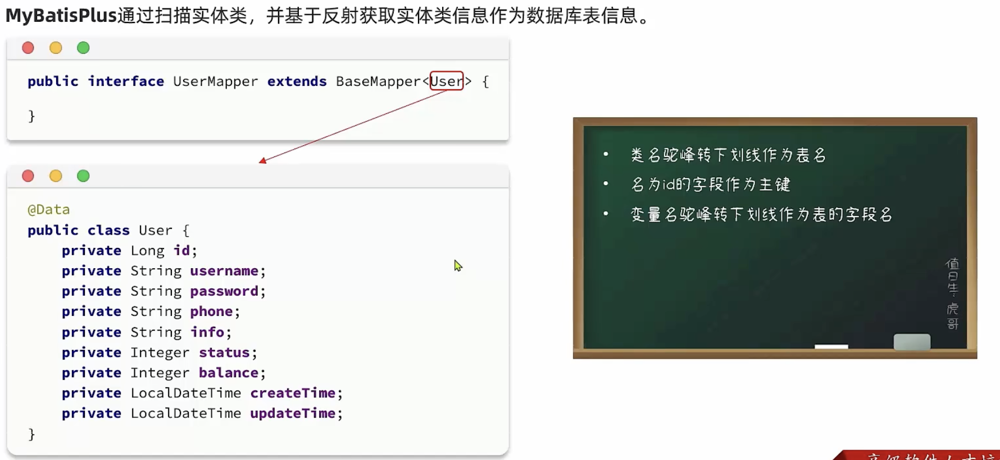

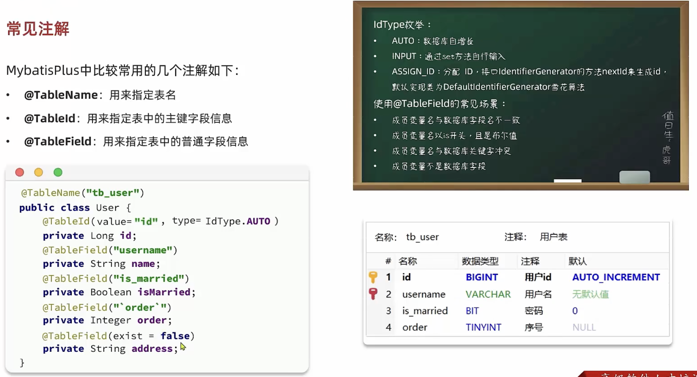


### 常用配置

mybatisplus部分注解是继承的 mybatis 的配置，有一部分是自己独有的。绝大多数配置无需配置，都有自己的默认值。

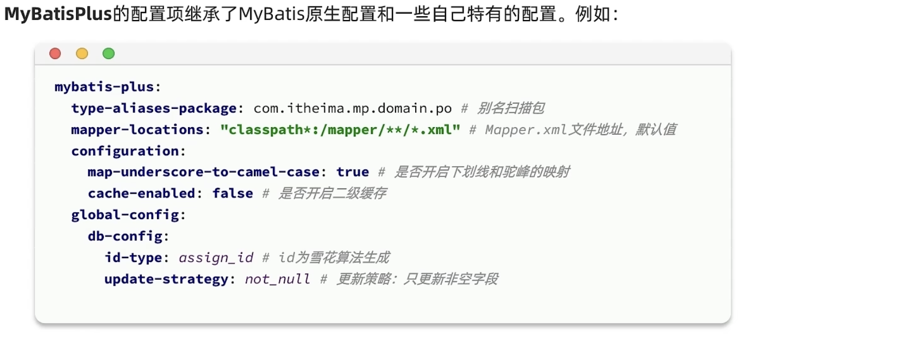


## 核心功能

### 条件构造器

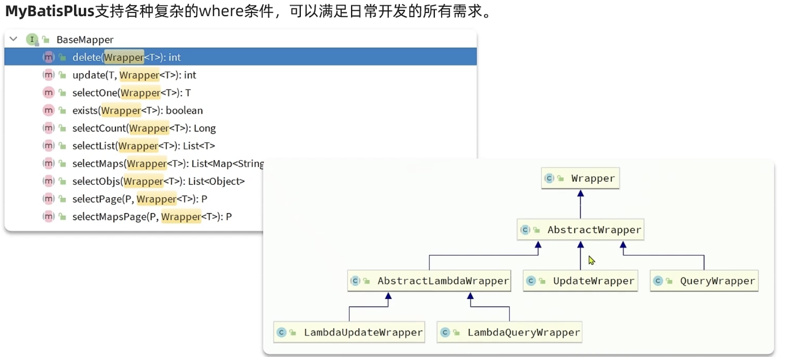

下面通过两个案例，分别演示 QueryWrapper 和 UpdateWrapper 来构造复杂语句。

1. 查询出 emp 表中 name 包含 人 字，且入职时间早于 2018 年员工的 id、username、name、gender 信息

    ```java
        @Test
        public void testQueryWrapper(){
            // 1. 构造查询条件
            QueryWrapper<UserPo> wrapper = new QueryWrapper<UserPo>()
                    .select("id", "username", "name", "gender") // 查询的字段
                    .like("name", "人") // 模糊匹配
                    .ge("entry_date", LocalDate.of(2018, 1, 1)); // 范围查询
    
            // 2. 执行查询
            List<UserPo> userPoList = userMapper.selectList(wrapper);
    
            userPoList.forEach(System.out::println);
        }
    ```

2. 将 username 为 xander 的用户的密码 修改为 12345678。这里使用 QueryWrapper 来实现更新

    ```java
        @Test
        public void testUpdateByQueryWrapper(){
            // 1. 要更新的内容用实体表示
            UserPo userPo = new UserPo();
            userPo.setPassword("12345678");
    
            // 2. 更新的条件
            QueryWrapper<UserPo> wrapper = new QueryWrapper<UserPo>()
                    .eq("username", "xander");
    
            // 3. 执行更新
            int rows = userMapper.update(userPo, wrapper);
    
            System.out.println("更新影响行数: " + rows);
        }
    ```

3. 为 emp 表所有用的 password 字段，加上 emp_ 前缀

    ```java
        @Test
        public void testUpdateWrapper(){
            // 1. 直接构造更新语句。这里要操作每一行数据。直接 setSql
            UpdateWrapper<UserPo> updateWrapper = new UpdateWrapper<UserPo>()
                    .setSql("password = concat('emp_', password)");
    
            // 2. 执行更新。此时是更新所有数据，没有使用实体来表示更新内容，name直接给一个 null 就可以
            int rows = userMapper.update(null, updateWrapper);
    
            System.out.println("更新影响行数: " + rows);
        }
    ```


从以上例子中，我们可以看出，一些复杂的SQL语句也可以轻松的实现。但有一个缺点，那就是对于各种字段，太多硬编码。因此从前面的 关系图 可以看到有 Lambda 相关的实现类，他就是来解决这个问题的，下面使用 LambdaQueryWrapper 演示一下上面相同的查询语句。

```java
    @Test
    public void testLambdaQueryWrapper(){
        // 1. 构造查询条件
        LambdaQueryWrapper<UserPo> wrapper = new LambdaQueryWrapper<UserPo>()
                .select(UserPo::getId, UserPo::getUsername, UserPo::getName, UserPo::getGender) // 查询的字段
                .like(UserPo::getName, "人") // 模糊匹配
                .ge(UserPo::getEntryDate, LocalDate.of(2018, 1, 1)); // 范围查询

        // 2. 执行查询
        List<UserPo> userPoList = userMapper.selectList(wrapper);

        userPoList.forEach(System.out::println);
    }
```


### 自定义SQL

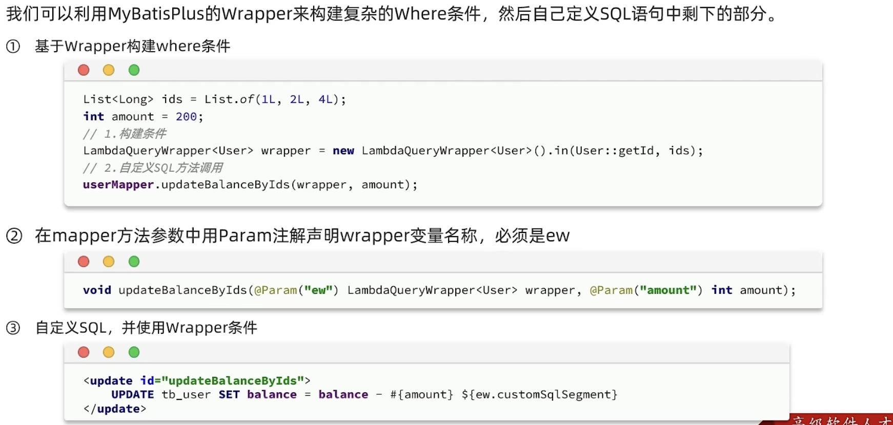


### IService 接口

MP提供了一个IService接口，它已经实现了业务层基础的增删改查操作，实现了IService，简单的业务层代码也不用自己写了。


#### 入门使用

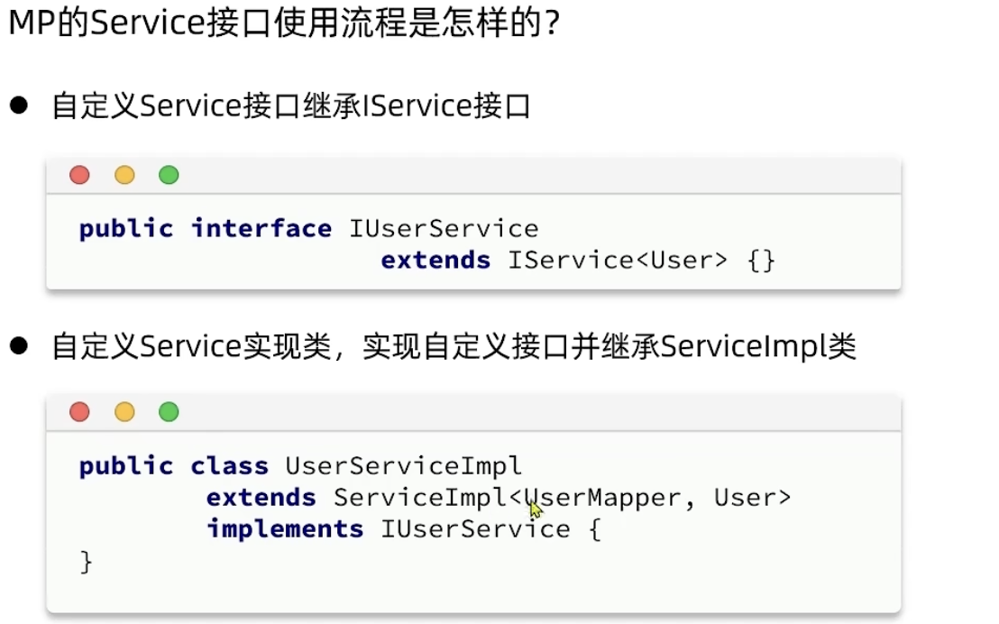


1. 创建业务接口

    ```java
    /**
     * 创建业务接口 UserService。继承 IService 并指定泛型为 UserPo
     */
    public interface UserService extends IService<UserPo> {}
    ```

2. 创建接口实现类

    ```java
    /**
     * 实现类实现 UserService，要实现接口所有的抽象方法
     * MP还提供了ServiceImpl实现类，已经默认实现了 IService 接口所有的抽象方法。业务实现类直接继承即可
     */
    @Service
    public class UserServiceImpl extends ServiceImpl<UserMapper, UserPo> implements UserService {}
    ```

3. 测试业务方法

    ```java
    package com.zhangjian.service.impl;
    
    import com.zhangjian.de.po.UserPo;
    import com.zhangjian.service.UserService;
    import org.junit.jupiter.api.Test;
    import org.springframework.beans.factory.annotation.Autowired;
    import org.springframework.boot.test.context.SpringBootTest;
    
    import java.time.LocalDateTime;
    import java.util.List;
    
    @SpringBootTest
    class UserServiceImplTest {
    
        @Autowired
        private UserService userService;
    
        @Test
        public void testSave(){
            UserPo userPo = new UserPo();
            userPo.setUsername("faker");
            userPo.setName("诡术妖姬");
            userPo.setGender((byte)1);
            userPo.setCreateTime(LocalDateTime.now());
            userPo.setUpdateTime(LocalDateTime.now());
    
            userService.save(userPo);
    
            System.out.println("新增用户成功，用户ID= " + userPo.getId());
        }
        
        @Test
        public void testQuery(){
            List<UserPo> userPoList = userService.listByIds(List.of(5, 6, 7, 8));
            userPoList.forEach(System.out::println);
        }
    }
    ```


#### 简单操作

基于Restful实现以下几个接口。本次实现同步使用 swagger 自动生成接口文档，同时尽量使用 IService 接口提供的方法。

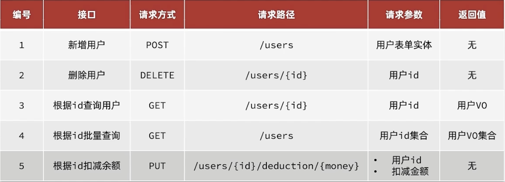


1. 引入 swagger 依赖

    ```xml
            <!-- swagger -->
            <dependency>
                <groupId>com.github.xiaoymin</groupId>
                <artifactId>knife4j-openapi2-spring-boot-starter</artifactId>
                <version>4.1.0</version>
            </dependency>
    
            <!-- 糊涂工具 -->
            <dependency>
                <groupId>cn.hutool</groupId>
                <artifactId>hutool-all</artifactId>
                <version>5.7.3</version>
            </dependency>
    ```

2. 添加 swagger 相关配置

    ```yml
    # swagger 配置
    knife4j:
      enable: true
      openapi:
        title: 用户管理接口文档
        description: "用户管理接口文档"
        email: 123@qq.com
        concat: Seeker
        url: https://www.baidu.com
        version: v1.0.0
        group:
          default:
            group-name: default
            api-rule: package
            api-rule-resources:
              - com.zhangjian.controller
    ```

3. 为emp表新增一列薪资字段

    ```sql
    alter table emp add column `salary` int unsigned default 2000 comment '薪资';
    ```

4. 更新并创建数据实体

    ```java
    // po
    package com.zhangjian.de.po;
    
    import com.baomidou.mybatisplus.annotation.IdType;
    import com.baomidou.mybatisplus.annotation.TableId;
    import com.baomidou.mybatisplus.annotation.TableName;
    import lombok.AllArgsConstructor;
    import lombok.Data;
    import lombok.NoArgsConstructor;
    
    import java.time.LocalDate;
    import java.time.LocalDateTime;
    
    @Data
    @NoArgsConstructor
    @AllArgsConstructor
    @TableName("emp")
    public class UserPo {
        @TableId(type = IdType.AUTO)
        private int id;
        private String username;
        private String password;
        private String name;
        private byte gender;
        private String image;
        private byte job;
        private LocalDate entryDate;
        private int deptId;
        private LocalDateTime createTime;
        private LocalDateTime updateTime;
        private Integer salary;
    }
    
    // dto
    package com.zhangjian.de.dto;
    
    import io.swagger.annotations.ApiModel;
    import io.swagger.annotations.ApiModelProperty;
    import lombok.AllArgsConstructor;
    import lombok.Data;
    import lombok.NoArgsConstructor;
    
    import java.time.LocalDate;
    
    @Data
    @NoArgsConstructor
    @AllArgsConstructor
    @ApiModel(description = "用户表单实体") // swagger 采集注解
    public class UserDto {
    
        @ApiModelProperty("id") // swagger 采集注解
        private int id;
    
        @ApiModelProperty("用户账号")
        private String username;
        
        @ApiModelProperty("用户密码")
        private String password;
    
        @ApiModelProperty("用户名")
        private String name;
    
        @ApiModelProperty("性别。0 女；1 男")
        private byte gender;
    
        @ApiModelProperty("入职日期")
        private LocalDate entryDate;
    
        @ApiModelProperty("薪资")
        private Integer salary;
    }
    
    // vo
    package com.zhangjian.de.vo;
    
    import io.swagger.annotations.ApiModel;
    import io.swagger.annotations.ApiModelProperty;
    import lombok.AllArgsConstructor;
    import lombok.Data;
    import lombok.NoArgsConstructor;
    
    import java.time.LocalDate;
    import java.time.LocalDateTime;
    
    @Data
    @AllArgsConstructor
    @NoArgsConstructor
    @ApiModel(description = "用户VO实体")
    public class UserVo {
    
        @ApiModelProperty("id") // swagger 采集注解
        private int id;
    
        @ApiModelProperty("用户账号")
        private String username;
    
        @ApiModelProperty("用户名")
        private String name;
    
        @ApiModelProperty("性别。0 女；1 男")
        private byte gender;
    
        @ApiModelProperty("头像图片")
        private String image;
    
        @ApiModelProperty("岗位")
        private byte job;
    
        @ApiModelProperty("入职日期")
        private LocalDate entryDate;
    
        @ApiModelProperty("部门ID")
        private int deptId;
    
        @ApiModelProperty("创建时间")
        private LocalDateTime createTime;
    
        @ApiModelProperty("更新时间")
        private LocalDateTime updateTime;
    
        @ApiModelProperty("薪资")
        private Integer salary;
    }
    ```

5. 实现Controller

    ```java
    package com.zhangjian.controller;
    
    import cn.hutool.core.bean.BeanUtil;
    import com.zhangjian.de.dto.UserDto;
    import com.zhangjian.de.po.UserPo;
    import com.zhangjian.de.vo.UserVo;
    import com.zhangjian.service.UserService;
    import io.swagger.annotations.Api;
    import io.swagger.annotations.ApiOperation;
    import io.swagger.annotations.ApiParam;
    import lombok.RequiredArgsConstructor;
    import org.springframework.web.bind.annotation.*;
    
    import java.time.LocalDateTime;
    import java.util.List;
    
    @RequestMapping( "/users" )
    @RestController
    @RequiredArgsConstructor
    @Api(tags = "用户管理" )
    public class UserController {
    
        /**
         * spring在controller中直接使用 Autowired 直接注入属性，推荐使用构造器。
         * 这里使用 final + RequiredArgsConstructor 实现bean的注入
         */
        private final UserService userService;
    
    
        @ApiOperation( "新增用户" )
        @PostMapping
        public void addUser(@RequestBody UserDto userDto) {
            // 1. 将 dto 转为 po
            UserPo userPo = BeanUtil.copyProperties(userDto, UserPo.class);
    
            // 2. 添加 创建时间 和 更新时间
            userPo.setCreateTime(LocalDateTime.now());
            userPo.setUpdateTime(LocalDateTime.now());
    
            // 3. 添加数据
            userService.save(userPo);
        }
    
    
        @ApiOperation( "删除用户" )
        @DeleteMapping( "{id}" )
        public void deleteUserById(@ApiParam( "用户id" ) @PathVariable( "id" ) Integer id) {
            // 1. 删除用户
            userService.removeById(id);
        }
    
    
        @ApiOperation( "根据ID查询用户" )
        @GetMapping( "{id}" )
        public UserVo queryUserById(@ApiParam( "用户id" ) @PathVariable( "id" ) Integer id) {
            // 1. 查询用户
            UserPo userPo = userService.getById(id);
    
            // 2. 将 po 转成 vo 返回
            return BeanUtil.copyProperties(userPo, UserVo.class);
        }
    
    
        @ApiOperation( "根据ID集合批量查询用户" )
        @GetMapping
        public List<UserVo> queryUserByIds(@ApiParam( "用户id集合" ) @RequestParam( "ids" ) List<Integer> ids) {
            // 1. 查询用户
            List<UserPo> userPos = userService.listByIds(ids);
    
            // 2. 将 po集合 转成 vo集合 返回
            return BeanUtil.copyToList(userPos, UserVo.class);
        }
    
    
        @ApiOperation( "根据ID扣减用户薪资" )
        @PutMapping( "{id}/deduction/{money}" )
        public void deductMoneyById(
                @ApiParam( "用户id" ) @PathVariable( "id" ) Integer id,
                @ApiParam( "扣减金额" ) @PathVariable( "money" ) Integer money) {
    
            // 扣减用户金额的操作，是一个复杂逻辑，IService 没有提供现成的方法，需要自己实现
            userService.deductMoneyById(id, money);
        }
    
    }
    ```

6. 实现 Service

    ```JAVA
    package com.zhangjian.service.impl;
    
    import com.baomidou.mybatisplus.extension.service.impl.ServiceImpl;
    import com.zhangjian.mapper.UserMapper;
    import com.zhangjian.de.po.UserPo;
    import com.zhangjian.service.UserService;
    import org.springframework.stereotype.Service;
    
    /**
     * 实现类实现 UserService，要实现接口所有的抽象方法
     * MP还提供了ServiceImpl实现类，已经默认实现了 IService 接口所有的抽象方法。业务实现类直接继承即可
     */
    @Service
    public class UserServiceImpl extends ServiceImpl<UserMapper, UserPo> implements UserService {
    
        @Override
        public void deductMoneyById(Integer id, Integer money) {
            // 1. 查询用户是否存在
            UserPo userPo = getById(id);
    
            if (userPo == null){
                throw new RuntimeException("用户不存在，用户ID: " + id);
            }
    
            // 2. 检查salary是否充足，不能使salary为负 或 为零
            if (userPo.getSalary() <= money){
                throw new RuntimeException("用户余额不足，不能扣减");
            }
    
            // 3. 扣减余额。ServiceImpl 中已经有属性 baseMapper，其类型就是 泛型指定的 UserMapper
            baseMapper.deductMoneyById(id, money);
        }
    }
    ```

7. 实现mapper

    ```java
    package com.zhangjian.mapper;
    
    import com.baomidou.mybatisplus.core.mapper.BaseMapper;
    import com.zhangjian.de.po.UserPo;
    import org.apache.ibatis.annotations.Mapper;
    import org.apache.ibatis.annotations.Param;
    import org.apache.ibatis.annotations.Update;
    
    @Mapper
    public interface UserMapper extends BaseMapper<UserPo> {
    
        /**
         * 根据 id 扣减薪资
         * @param id
         * @param money
         */
        @Update("update emp set salary = salary - #{money} where id = #{id}")
        void deductMoneyById(@Param("id") Integer id, @Param("money") Integer money);
    }
    ```

8. 启动服务，进入 swagger 页面，完成测试

    http://localhost:8080/doc.html

    


#### Lambda

在上一小节中，通过练习使用了 IService 提供的一些简单操作的方法。同时，也发现在复杂逻辑下，还是需要编写SQL来实现业务逻辑的。基于此 mp 提供了Lambda 语法，来方便我们构造复杂的查询和更新操作。


- lambda 查询

  > 根据一下条件组合查询员工信息：
  >
  > 1. username 中包含某个关键字，可以为空
  > 2. gender 员工性别，可以为空
  > 3. start 员工最早入职时间，可以为空
  > 4. end 员工最晚入职时间，可以为空
  
  1. 多条件查询，使用一个实体来接收参数
  
      ```java
      package com.zhangjian.de.dto;
      
      import io.swagger.annotations.Api;
      import io.swagger.annotations.ApiModel;
      import io.swagger.annotations.ApiModelProperty;
      import lombok.AllArgsConstructor;
      import lombok.Data;
      import lombok.NoArgsConstructor;
      
      import java.time.LocalDate;
      
      @Data
      @AllArgsConstructor
      @NoArgsConstructor
      @ApiModel(description = "员工条件查询Dto")
      public class UserQueryDto {
          @ApiModelProperty("用户名关键字")
          private String username;
      
          @ApiModelProperty("性别。0 女；1 男")
          private Byte gender;
      
          @ApiModelProperty("入职时间起始值")
          private LocalDate start;
      
          @ApiModelProperty("入职时间截止日")
          private LocalDate end;
      }
      ```
  
  2. 实现Controller接口
  
      ```java
          @ApiOperation( "根据条件批量查询用户" )
          @GetMapping("list")
          public List<UserVo> queryUsers(UserQueryDto userQueryDto) { // get请求使用实体接收参数时，不需要任何注解
              // 1. 查询用户
              List<UserPo> userPos = userService.listByConditions(userQueryDto.getUsername(), userQueryDto.getGender(), userQueryDto.getStart(), userQueryDto.getEnd());
      
              // 2. 将 po集合 转成 vo集合 返回
              return BeanUtil.copyToList(userPos, UserVo.class);
          }
      ```
  
  3. 实现 service
  
      ```java
          @Override
          public List<UserPo> listByConditions(String username, Byte gender, LocalDate start, LocalDate end) {
      
              return this.lambdaQuery()
                      .like(username != null, UserPo::getUsername, username) // 字段不为空时，才会某个字段的构造条件
                      .eq(gender != null, UserPo::getGender, gender)
                      .ge(start != null, UserPo::getEntryDate, start)
                      .le(end != null, UserPo::getEntryDate, end)
                      .list(); // 这一步 执行查询。前面都是在构造查询条件
          }
      ```
  
  4. 这里有一个需要注意的点。请求带过来的日期是 String，但我们接收实体的类型是 LocalDate，如果不做任何处理，类型转换时，是会有问题的。此时，需要在配置文件 spring.mvc 中配置一下日期格式。
  
      ```yml
      spring:
        # 数据库连接配置
        datasource:
          driver-class-name: com.mysql.cj.jdbc.Driver
          url: jdbc:mysql://172.16.20.64:3307/mybatis
          username: root
          password: mybatis123
        mvc:
          format:
            date: yyyy-MM-dd
      ```
  
- lambda 更新

  在上一小节，实现了根据id扣减员工薪资。当时是基于Mapper实现的复杂SQL，现在使用 lambdaupdate 来处理。只需更新 service 即可。
  
  ```java
      @Override
      @Transactional
      public void deductMoneyById(Integer id, Integer money) {
          // 1. 查询用户是否存在
          UserPo userPo = getById(id);
  
          if (userPo == null){
              throw new RuntimeException("用户不存在，用户ID: " + id);
          }
  
          // 2. 检查salary是否充足，不能使salary为负 或 为零
          if (userPo.getSalary() <= money){
              throw new RuntimeException("用户余额不足，不能扣减");
          }
  
          // 3. 扣减余额。ServiceImpl 中已经有属性 baseMapper，其类型就是 泛型指定的 UserMapper
          // baseMapper.deductMoneyById(id, money);
  
          // 使用 lambdaUpdate 处理，就不需要再实现 mapper 
          // 其实这里还有线程安全问题。此处使用 事务 + 乐观锁 处理
          int diff = userPo.getSalary() - money;
  
          this.lambdaUpdate()
                  .set(diff > 0, UserPo::getSalary, diff)
                  .eq(UserPo::getSalary, userPo.getSalary()) // 乐观锁。执行更新时再次检查当前用户的薪资版本是否没有发生变更
                  .eq(UserPo::getId, id)
                  .update();
      }
  ```


#### 批量新增

批量新增这样的接口往往不会对外开放，这里使用单元测试来演示 批量新增。

1. 单元测试逻辑实现

    ```java
        public UserPo build(int idx){
            UserPo userPo = new UserPo();
            userPo.setUsername("faker" + idx);
            userPo.setName("诡术妖姬" + idx);
            userPo.setGender((byte)1);
            userPo.setCreateTime(LocalDateTime.now());
            userPo.setUpdateTime(LocalDateTime.now());
    
            return userPo;
        }
    
        @Test
        public void testSaveBatch(){
            // 开始时间
            long start = System.currentTimeMillis();
    
            // 插入1000条数据，使用批量插入，每次插入 100 个
            ArrayList<UserPo> userPoArrayList = new ArrayList<>(100);
            for (int i = 1; i <= 1000; i++) {
    
                    userPoArrayList.add(build(i));
    
                    if (i % 100 == 0){
                        userService.saveBatch(userPoArrayList);
                        userPoArrayList.clear();
                    }
            }
    
            System.out.println("新增完成，耗时: " + (System.currentTimeMillis() - start));
        }
    ```

2. 测试数据新增耗时。新增完成，耗时: 98340

3. 删掉新增的数据，修改jdbc连接参数，打开重写批量语句的配置

    ```sql
    delete from emp where id > 23;
    ```

    ```yml
    spring:
      # 数据库连接配置
      datasource:
        driver-class-name: com.mysql.cj.jdbc.Driver
        url: jdbc:mysql://172.16.20.64:3307/mybatis?rewriteBatchedStatements=true
        username: root
        password: mybatis123
      mvc:
        format:
          date: yyyy-MM-dd
    ```

4. 再次测试数据新增耗时。新增完成，耗时: 6242


## 扩展功能

### Db静态工具

在复杂的业务场景下，有时可能会出现在两个 service 中相互注入的情况，形成循环依赖。为了解决这个问题，在新版本的mp中（此处使用版本是 3.5.4），就提供了Db静态工具。

由于是静态工具，因此相比于IService提供的方法，需要多传一个Class参数。通过下面的需求来联系静态工具的使用。


#### 准备工作

1. 创建新表-地址表，并根据员工id插入一些数据

    ```sql
    # 建表语句
    create table if not exists address(
        id int unsigned auto_increment primary key comment '主键ID',
        user_id int unsigned not null comment '用户id',
        province varchar(24) comment '省',
        city varchar(24) comment '市',
        town varchar(36) comment '区县',
        mobile varchar(11) comment '手机号',
        street varchar(300) comment '详细地址',
        concat varchar(50) comment '联系人',
        is_default bit default 0 comment '是否默认。1 是；0 否',
        notes varchar(100) comment '备注',
        is_delete bit default 0 comment '是否逻辑删除。1 是；0 否'
    )comment '员工地址表' engine InnoDB charset utf8mb4 collate utf8mb4_general_ci;
    
    # 插入语句
    insert into address(user_id, province, city, town, mobile, street, concat, is_default, notes, is_delete) VALUES
    (5, '四川', '遂宁', '安岳', 15188997700, '正上街18号', '风沙燕', 1, '不要放丰巢~', 0),
    (5, '四川', '成都', '双流', 15188997700, '警官学院', '风沙燕', 0, '', 0),
    (6, '四川', '成都', '成华区', 13344556677, '成都东站', '上官婉儿', 1, '', 0),
    (6, '内蒙古', '赤峰', '那个山头', 13344312977, '寡妇村', '王寡妇', 0, '别送错了', 1),
    (7, '辽宁', '朝阳', '双塔区', 18854612398, '幸福路', '老李头', 1, '放在小区门口的柜子', 0);
    ```

2. 创建address的PO实体

    ```java
    package com.zhangjian.de.po;
    
    import com.baomidou.mybatisplus.annotation.IdType;
    import com.baomidou.mybatisplus.annotation.TableId;
    import com.baomidou.mybatisplus.annotation.TableName;
    import lombok.Data;
    
    
    @Data
    @TableName( "address" )
    public class AddressPo {
    
        @TableId( type = IdType.AUTO )
        private Integer id;
    
        private Integer userId;
    
        private String province;
    
        private String city;
    
        private String town;
    
        private String mobile;
    
        private String street;
    
        private String concat;
    
        private int isDefault;
    
        private String notes;
    
        private int isDelete;
    }
    ```

3. 创建address的VO实体

    ```java
    package com.zhangjian.de.vo;
    
    import io.swagger.annotations.ApiModel;
    import io.swagger.annotations.ApiModelProperty;
    import lombok.Data;
    
    @Data
    @ApiModel(description = "收货地址VO实体")
    public class AddressVo {
    
        @ApiModelProperty("省")
        private String province;
    
        @ApiModelProperty("市")
        private String city;
    
        @ApiModelProperty("区县")
        private String town;
    
        @ApiModelProperty("电话")
        private String mobile;
    
        @ApiModelProperty("街道")
        private String street;
    
        @ApiModelProperty("联系人")
        private String concat;
    
        @ApiModelProperty("是否是默认收货地址。1 是；0 否")
        private int isDefault;
    
        @ApiModelProperty("备注")
        private String notes;
    }
    ```

4. 在UserVO中新增 addresses 属性。注意 用户和地址 是 一对多的关系

    ```java
    package com.zhangjian.de.vo;
    
    import io.swagger.annotations.ApiModel;
    import io.swagger.annotations.ApiModelProperty;
    import lombok.AllArgsConstructor;
    import lombok.Data;
    import lombok.NoArgsConstructor;
    
    import java.time.LocalDate;
    import java.time.LocalDateTime;
    import java.util.List;
    
    @Data
    @AllArgsConstructor
    @NoArgsConstructor
    @ApiModel(description = "用户VO实体")
    public class UserVo {
    
        @ApiModelProperty("id") // swagger 采集注解
        private int id;
    
        @ApiModelProperty("用户账号")
        private String username;
    
        @ApiModelProperty("用户名")
        private String name;
    
        @ApiModelProperty("性别。0 女；1 男")
        private byte gender;
    
        @ApiModelProperty("头像图片")
        private String image;
    
        @ApiModelProperty("岗位")
        private byte job;
    
        @ApiModelProperty("入职日期")
        private LocalDate entryDate;
    
        @ApiModelProperty("部门ID")
        private int deptId;
    
        @ApiModelProperty("创建时间")
        private LocalDateTime createTime;
    
        @ApiModelProperty("更新时间")
        private LocalDateTime updateTime;
    
        @ApiModelProperty("薪资")
        private Integer salary;
    
        @ApiModelProperty("用户地址信息") // 新增
        private List<AddressVo> addresses;
    }
    ```

5. 创建 AddressMapper ，在 mp 中，想要使用mp提供的所有工具，或者IService 的接口，都要实现对应的mapper，并且继承 BaseMapper<T>，通过给定的泛型，mp就知道了实体和数据表的关系

    ```java
    package com.zhangjian.mapper;
    
    import com.baomidou.mybatisplus.core.mapper.BaseMapper;
    import com.zhangjian.de.po.AddressPo;
    import org.apache.ibatis.annotations.Mapper;
    
    @Mapper
    public interface AddressMapper extends BaseMapper<AddressPo> {
    }
    ```

    

#### 实现需求

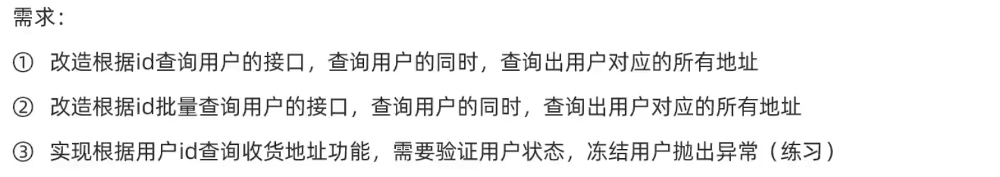

**需求一**

1. 改造 controller

    ```java
        @ApiOperation( "根据ID查询用户" )
        @GetMapping( "{id}" )
        public UserVo queryUserById(@ApiParam( "用户id" ) @PathVariable( "id" ) Integer id) {
    //        // 1. 查询用户
    //        UserPo userPo = userService.getById(id);
    //
    //        // 2. 将 po 转成 vo 返回
    //        return BeanUtil.copyProperties(userPo, UserVo.class);
    
            // 同时查询 用户及其地址，是一个复杂查询，将逻辑放到service中
            return userService.queryUserAndAddress(id);
        }
    ```

2. 实现 queryUserAndAddress 方法逻辑

    ```java
        @Override
        public UserVo queryUserAndAddress(Integer id) {
            // 1. 查询用户
            UserPo userPo = this.getById(id);
    
            if (userPo == null){
                throw new RuntimeException("用户不存在，id: " + id);
            }
    
            // 2. 使用 Db静态工具 直接查询用户的地址。这里用户和地址是一对多，因此查询使用 list
            List<AddressPo> addressPos = Db.lambdaQuery(AddressPo.class).eq(AddressPo::getUserId, id).list();
    
            // 3. 将PO转为VO，将 地址信息也添加到user中
            UserVo userVo = BeanUtil.copyProperties(userPo, UserVo.class); // BeanUtil  糊涂工具中的 bean工具类
    
            if (CollUtil.isNotEmpty(addressPos)){ // CollUtil  糊涂工具中的 集合工具类
                userVo.setAddresses(BeanUtil.copyToList(addressPos, AddressVo.class));
            }
    
            return userVo;
        }
    ```

    

**需求二**

1. 改造 controller

    ```java
        @ApiOperation( "根据ID集合批量查询用户" )
        @GetMapping
        public List<UserVo> queryUserByIds(@ApiParam( "用户id集合" ) @RequestParam( "ids" ) List<Integer> ids) {
    //        // 1. 查询用户
    //        List<UserPo> userPos = userService.listByIds(ids);
    //
    //        // 2. 将 po集合 转成 vo集合 返回
    //        return BeanUtil.copyToList(userPos, UserVo.class);
            return userService.queryUserAndAddressByIds(ids);
        }
    ```

2. 实现 queryUserAndAddressByIds。说明 下面代码中 stream方法 将 集合转成 流；而 collect方法 将 流 重新规约成 集合。

    ```java
        @Override
        public List<UserVo> queryUserAndAddressByIds(List<Integer> ids) {
            // 1. 查询出所有用户
            List<UserPo> userPoList = this.listByIds(ids);
    
            if (CollUtil.isEmpty(userPoList)){
                throw new RuntimeException("无效的id集合");
            }
    
            // 2. 可以直接使用 ids查询地址，这里演示一个语法，从查询出的用户中，获取 id
            //    map 接受一个函数，将 UserPo 转成，UserId；
            //    collect 接受一个 Collector的实现类，这里直接使用已有的方法，toList 返回的是将 item 收集到列表的 Collector 实例
            List<Integer> userIds = userPoList.stream().map(UserPo::getId).collect(Collectors.toList());
    
            // 3. 查询所有用户的地址信息，每个人还会有多个地址
            List<AddressPo> addressPoList = Db.lambdaQuery(AddressPo.class).in(AddressPo::getUserId, userIds).list();
    
            // 4. 此时地址信息是所有用户的地址信息，这里按用户id，将地址信息分组
            Map<Integer, List<AddressPo>> userAddressList = new HashMap<>();
            if (CollUtil.isNotEmpty(addressPoList)){
                //    groupingBy 返回的是一个实现了分组操作的 Collector 实例
                userAddressList = addressPoList.stream().collect(Collectors.groupingBy(AddressPo::getUserId));
            }
    
            // 5. 将用户PO转成VO，并将 地址信息也添加到user中
            ArrayList<UserVo> userVos = new ArrayList<>(userPoList.size()); // 当明确知道列表大小时，初始化时指定大小，可以避免后续触发扩容
            for (UserPo userPo : userPoList) {
                UserVo userVo = BeanUtil.copyProperties(userPo, UserVo.class);
                if (userAddressList.containsKey(userVo.getId())){ // 不是所有用户都一定有收货地址
                    List<AddressVo> addressVos = BeanUtil.copyToList(userAddressList.get(userVo.getId()), AddressVo.class);
                    userVo.setAddresses(addressVos);
                }
                userVos.add(userVo);
            }
            return userVos;
        }
    }
    ```


### 逻辑删除


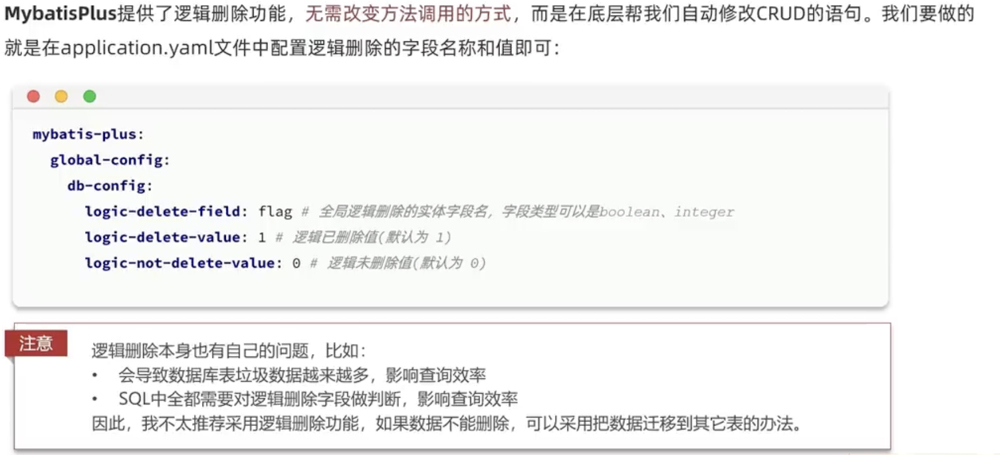


### 枚举处理器

在前面的代码中，address 的实体类中，表示 是否删除、是否是默认地址，这种有限个状态时，使用的是 int 类型来表示。可以明显的感受到，这很不规范，因为针对这种情况，我们往往都是用 **枚举类型** 来表示不同的状态。

要使用枚举来表示实体类的某个字段，且能够让枚举变量和数据库字段相互转换，需要进行以下几步操作：

1. 在mp配置中配置枚举处理器

    ```yml
    # mp 配置
    mybatis-plus:
      configuration:
        default-enum-type-handler: com.baomidou.mybatisplus.core.handlers.MybatisEnumTypeHandler
    ```

2. 实现一个通用的枚举类

    ```java
    package com.zhangjian.enums;
    
    import com.baomidou.mybatisplus.annotation.EnumValue;
    import com.fasterxml.jackson.annotation.JsonValue;
    
    public enum BoolStatus {
        TRUE(1, "是"),
        FALSE(0, "否");
    
        @EnumValue // mp提供的注解，标记字段与数据库字段映射。实现实体类中枚举变量和数据库字段的转换
        private final int value;
    
        @JsonValue // spring 提供的注解。spring 在处理响应json时，遇到枚举默认是将枚举实例名字返回，使用这个注解后，就可以返回枚举中具体的字段
        private final String desc;
    
        BoolStatus(int value, String desc) {
            this.value = value;
            this.desc = desc;
        }
    }
    ```

3. 将address相关的实体类 isDelete 和 isDefault 字段类型改成 BoolStatus

    ```java
    ...
    		@ApiModelProperty("是否是默认收货地址。1 是；0 否")
        private BoolStatus isDefault;
    ...
      
    ...
        private BoolStatus isDefault;
    
        private String notes;
    
        private BoolStatus isDelete;
    ... 
    ```


### JSON处理器

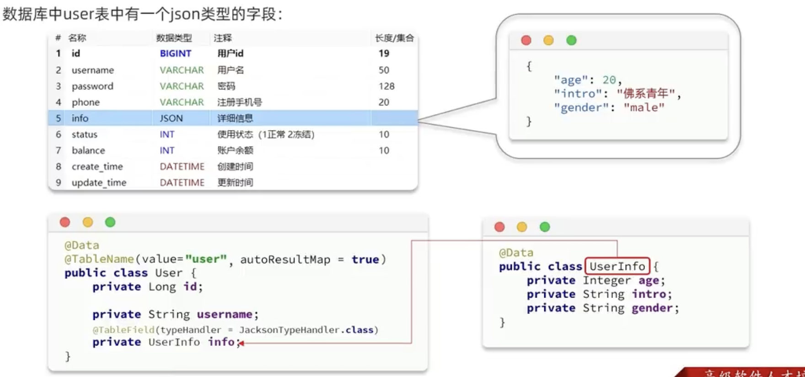

说明：

1. 数据库中的 JSON 类型，本质上也是 VARCHAR，只不过保存的是json结构的字符串
2. 在java中没有类型可以直接与json数据映射，通常的做法是定义一个与json结构相同的实体类
3. 在上层实体类中，嵌套另一个实体类（UserInfo）
4. 为了能让 UserInfo 类型与数据库JSON类型之间实现自动转换，需要使用 @TableField 注解，并指定JSON的处理器，这里使用的 JacksonTypeHandler 是mp提供的处理器
5. 因为存在实体嵌套，因此在 @TableName 注解中，将 autoResultMap 改为true，来实现嵌套实体的自动结果映射


这里在为了方便练习，为 emp 表新增一个名为 accountInfo，类型是 JSON 的字段。

1. 添加字段并给默认值

    ```sql
    alter table emp add column `account_info` JSON comment '账户信息';
    
    update emp set emp.account_info = '{"id": 46836478, "bank": "china", "balance": 50000 }' where id <= 23;
    ```

2. 新建 AccountInfoPO 实体

    ```java
    package com.zhangjian.de.po;
    
    import lombok.Data;
    
    @Data
    public class AccountInfoPo {
        private int id;
        private String bank;
        private double balance;
    }
    ```

3. 更新 UserPO

    ```java
    package com.zhangjian.de.po;
    
    import com.baomidou.mybatisplus.annotation.IdType;
    import com.baomidou.mybatisplus.annotation.TableField;
    import com.baomidou.mybatisplus.annotation.TableId;
    import com.baomidou.mybatisplus.annotation.TableName;
    import com.baomidou.mybatisplus.extension.handlers.JacksonTypeHandler;
    import lombok.AllArgsConstructor;
    import lombok.Data;
    import lombok.NoArgsConstructor;
    
    import java.time.LocalDate;
    import java.time.LocalDateTime;
    
    @Data
    @NoArgsConstructor
    @AllArgsConstructor
    @TableName(value = "emp", autoResultMap = true) // 自动处理嵌套实体的映射
    public class UserPo {
        @TableId(type = IdType.AUTO)
        private int id;
        private String username;
        private String password;
        private String name;
        private byte gender;
        private String image;
        private byte job;
        private LocalDate entryDate;
        private int deptId;
        private LocalDateTime createTime;
        private LocalDateTime updateTime;
        private Integer salary;
    
        @TableField(typeHandler = JacksonTypeHandler.class )  // 实现 实体类属性 和 数据库字段的转换
        private AccountInfoPo accountInfo;
    }
    ```

4. 更新 UserVO

    ```java
    package com.zhangjian.de.vo;
    
    import com.zhangjian.de.po.AccountInfoPo;
    import io.swagger.annotations.ApiModel;
    import io.swagger.annotations.ApiModelProperty;
    import lombok.AllArgsConstructor;
    import lombok.Data;
    import lombok.NoArgsConstructor;
    
    import java.time.LocalDate;
    import java.time.LocalDateTime;
    import java.util.List;
    
    @Data
    @AllArgsConstructor
    @NoArgsConstructor
    @ApiModel(description = "用户VO实体")
    public class UserVo {
    
    		... // 省略了
    
        @ApiModelProperty("薪资")
        private Integer salary;
    
        @ApiModelProperty("用户地址信息") // 新增
        private List<AddressVo> addresses;
    
        @ApiModelProperty("账户信息") // 新增
        private AccountInfoPo accountInfo;
    }
    ```

    


## 插件功能

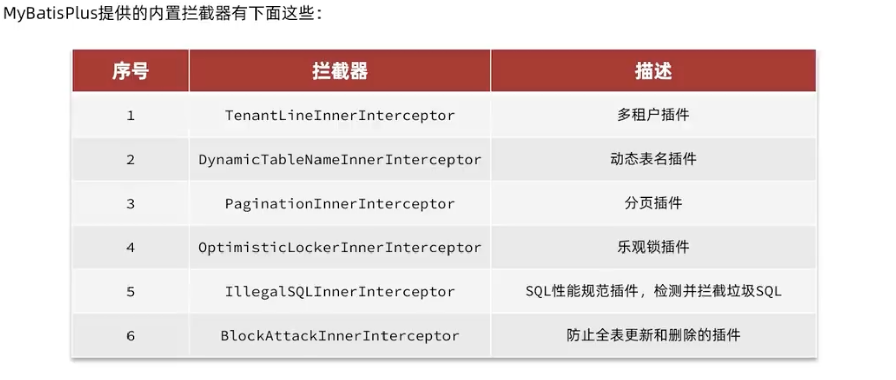

mp提供的插件，需要我们添加 MybatisPlusIntercepter 的一个bean，在 bean中添加我们需要的插件。


### 分页插件

配置分页插件：

```java
package com.zhangjian.config;

import com.baomidou.mybatisplus.annotation.DbType;
import com.baomidou.mybatisplus.extension.plugins.MybatisPlusInterceptor;
import com.baomidou.mybatisplus.extension.plugins.inner.PaginationInnerInterceptor;
import org.springframework.context.annotation.Bean;
import org.springframework.context.annotation.Configuration;

@Configuration
public class MybatisPlusConfig {

    @Bean
    public MybatisPlusInterceptor mybatisPlusInterceptor(){
        // 1. 创建 MybatisPlusInterceptor 实例
        MybatisPlusInterceptor interceptor = new MybatisPlusInterceptor();

        // 2. 创建分页插件实例
        PaginationInnerInterceptor paginationInnerInterceptor = new PaginationInnerInterceptor();
        paginationInnerInterceptor.setDbType(DbType.MYSQL); // 设置数据库类型
        paginationInnerInterceptor.setMaxLimit(1000L); // 设置最大分页限制

        // 3. 将分页插件添加到 mp拦截器，然后返回
        interceptor.addInnerInterceptor(paginationInnerInterceptor);
        return interceptor;
    }
}
```


下面通过实现一个分页查询的需求，来练习使用分页插件。

需求描述：

1. 请求方式：GET

2. 请求路径：/users/page

3. 请求参数

    ```json
    {
      "pageNo": 1,
      "pageSize": 5,
      "sortBy": "salary",
      "isAsc": false,
      "name": "人", // 模糊匹配
      "password": "123456"  // 模糊匹配
    }
    ```

4. 响应参数

    ```json
    {
      "total": 100,
      "pages": 1, // 总页数
      "list": [
        {...},
        {...},
        ...
      ]
    }
    ```

5. 特殊说明

    - name 和 password 都是模糊匹配
    - 如果排序字段为空，则按 更新时间 降序
    - 如果排序字段不为空，则按 排序字段 根据 顺序 规则排序


实现需求：

1. 先将请求参数封装成一个DTO，方便接收。在此之前我们已经定义了UserDto，这里直接利用起来

    - 先定义一个分页查询的通用Dto

        ```java
        package com.zhangjian.de.dto;
        
        import io.swagger.annotations.ApiModel;
        import io.swagger.annotations.ApiModelProperty;
        import lombok.Data;
        
        @Data
        @ApiModel(description = "分页实体")
        public class PageDto {
            // 页码和size给个默认值，
            @ApiModelProperty("页码")
            private Integer pageNo = 1;
        
            @ApiModelProperty("每页大小")
            private Integer pageSize = 5;
        
            @ApiModelProperty("排序字段")
            private String sortBy;
        
            // 需要注意的是，如果 布尔类型属性以 is开头时，lombok 生成的get方法，在老版本不是以get开头的，直接就是属性名
            @ApiModelProperty("是否升序")
            private boolean isAsc;
        }
        ```

    - UserDto 继承 PageDto

        ```java
        package com.zhangjian.de.dto;
        
        import io.swagger.annotations.ApiModel;
        import io.swagger.annotations.ApiModelProperty;
        import lombok.AllArgsConstructor;
        import lombok.Data;
        import lombok.EqualsAndHashCode;
        import lombok.NoArgsConstructor;
        
        import java.time.LocalDate;
        
        @EqualsAndHashCode( callSuper = true )
        @Data
        @NoArgsConstructor
        @AllArgsConstructor
        @ApiModel(description = "用户表单实体") // swagger 采集注解
        public class UserDto extends PageDto {
        
            @ApiModelProperty("用户账号")
            private String username;
        
            @ApiModelProperty("用户密码")
            private String password;
        
            @ApiModelProperty("用户名")
            private String name;
        
            @ApiModelProperty("性别。0 女；1 男")
            private byte gender;
        
            @ApiModelProperty("入职日期")
            private LocalDate entryDate;
        
            @ApiModelProperty("薪资")
            private Integer salary;
        }
        ```

2. 再实现一个分页查询的VO通用实体，用于返回结果

    ```java
    package com.zhangjian.de.vo;
    
    import lombok.Data;
    
    import java.util.List;
    
    @Data
    public class PageResultVo<T> {
        private Integer total;
        private Integer pages;
        private List<T> list;
    }
    ```

3. 在controller新增接口

    ```java
        @ApiOperation( "根据条件分页查询用户" )
        @GetMapping("page")
        public PageResultVo<UserVo> queryUsersByPage(UserDto userDto) {
            return userService.queryUsersByPage(userDto);
        }
    ```

4. 实现 queryUsersByPage 方法逻辑

    ```java
        @Override
        public PageResultVo<UserVo> queryUsersByPage(UserDto userDto) {
            // 1. 构造分页条件，注意要使用 mp 提供的Page类
            Page<UserPo> page = Page.of(userDto.getPageNo(), userDto.getPageSize());
    
            if (StrUtil.isNotBlank(userDto.getSortBy())) { //  StrUtil  糊涂工具中的 字符串工具类。这里就是判断字符串是否为空
                page.addOrder(new OrderItem(userDto.getSortBy(), userDto.isAsc()));
            } else {
                page.addOrder(new OrderItem("update_time", false));
            }
    
            // 2. 构造查询条件并执行分页查询
            lambdaQuery()
                    .like(StrUtil.isNotBlank(userDto.getName()), UserPo::getName, userDto.getName())
                    .like(StrUtil.isNotBlank(userDto.getPassword()), UserPo::getPassword, userDto.getPassword())
                    .page(page); // 执行分页查询，查询的结果会放回到 page 对象
    
            // 3. 准备返回的vo对象
            PageResultVo<UserVo> resultVo = new PageResultVo<>();
            resultVo.setTotal((int) page.getTotal());  // 总数
            resultVo.setPages((int) page.getPages());  // 总页数
            resultVo.setList(BeanUtil.copyToList(page.getRecords(), UserVo.class));
    
            return resultVo;
        }
    ```

    


