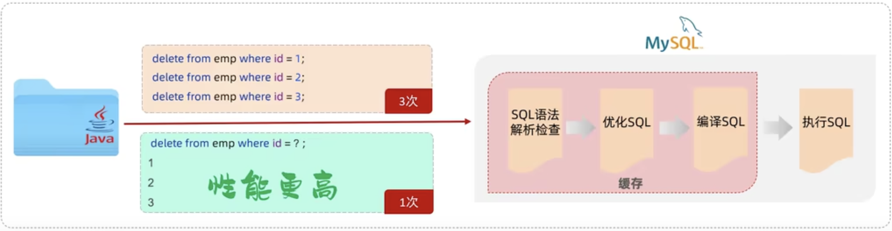
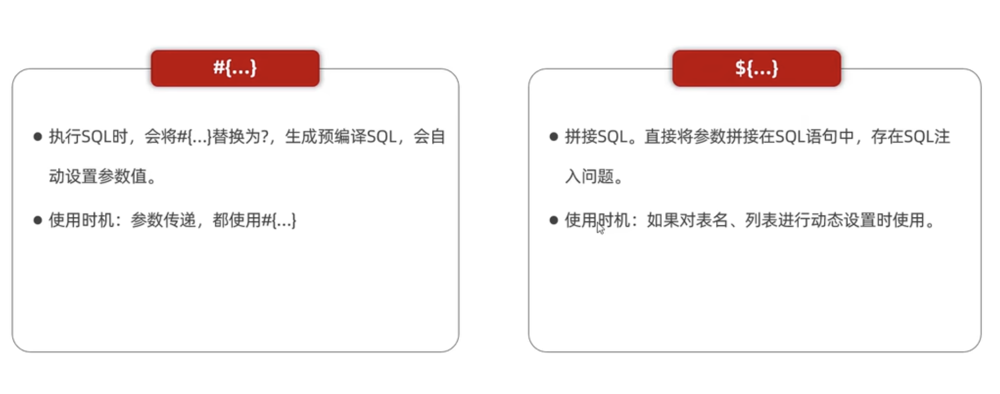
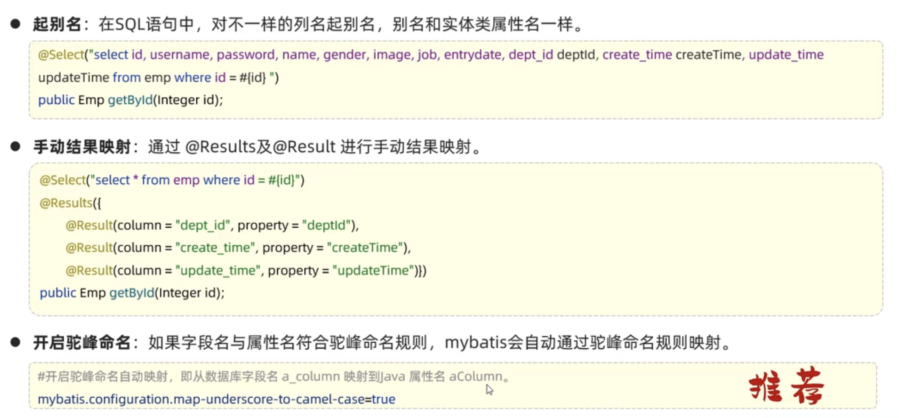
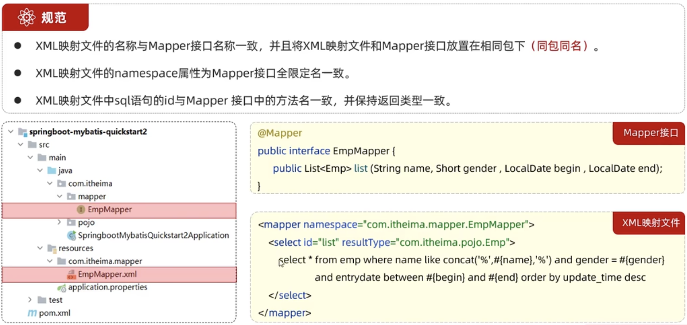

## 概述

Mybatis 是一款优秀的 **持久层** 框架，用于简化JDBC的开发。


## 快速入门

### 目标

使用Mybatis查询所有用户数据


### 准备

首先启动一个Mysql数据库服务，然后创建名为 mybatis 的数据库，再创建一张 user 表，并插入部分用户数据。为了快速完成准备工作，此处使用 docker 快速创建。

1. 拉起服务容器

    ```shell
    # 创建容器
    docker run -d --name mysql-mybatis --privileged=true -p 3307:3306 -e MYSQL_ROOT_USER=root -e MYSQL_ROOT_PASSWORD=mybatis123 mysql:8.0
    ```

2. 进入容器创建数据库

    ```mysql
    CREATE DATABASE IF NOT EXISTS mybatis DEFAULT CHARSET utf8 COLLATE utf8_general_ci;
    ```

3. 创建表并写入数据

    ```mysql
    create table if not exists user
    (
        id     int unsigned auto_increment comment '用户ID',
        name   varchar(30) not null comment '名字',
        age    tinyint     not null comment '年龄',
        gender tinyint default 1 comment '性别 1表示男；0表示女',
        phone  varchar(11) unique comment '电话号码',
        primary key (id)
    ) engine InnoDB
      charset utf8mb4
      collate utf8mb4_general_ci;
    
    insert into user(name, age, gender, phone)
    values ('金毛狮王', 52, 1, 18800334567),
           ('青翼蝠王', 46, 1, 18800334568),
           ('白眉鹰王', 58, 1, 18800334569),
           ('紫衫龙王', 39, 2, 18800334537),
           ('光明左使', 43, 1, 18800334532),
           ('光明右使', 51, 2, 18800334527);
    ```


### 编码

在准备好了数据后，下面开始编码，使用整合Mybatis的方式，查询出 user 信息。

1. 创建 springboot 工程

    框架整合myatis，在创建 spring工程时，需要添加 Mybatis Framework 和 MySQL Driver 两个依赖

2. 创建 实体类User。User 实体类，放在pojo目录下

    ```java
    package com.zhangjian.pojo;
    
    public class User {
        private int id;
        private String name;
        private byte age;
        private byte gender;
        private String phone;
        
        public User(){};
        
        public User(int id, String name, byte age, byte gender, String phone) {
            this.id = id;
            this.name = name;
            this.age = age;
            this.gender = gender;
            this.phone = phone;
        }
    
        public int getId() {
            return id;
        }
    
        public void setId(int id) {
            this.id = id;
        }
    
        public String getName() {
            return name;
        }
    
        public void setName(String name) {
            this.name = name;
        }
    
        public byte getAge() {
            return age;
        }
    
        public void setAge(byte age) {
            this.age = age;
        }
    
        public byte getGender() {
            return gender;
        }
    
        public void setGender(byte gender) {
            this.gender = gender;
        }
    
        public String getPhone() {
            return phone;
        }
    
        public void setPhone(String phone) {
            this.phone = phone;
        }
    
        @Override
        public String toString() {
            return "User{" +
                    "id=" + id +
                    ", name='" + name + '\'' +
                    ", age=" + age +
                    ", gender=" + gender +
                    ", phone='" + phone + '\'' +
                    '}';
        }
    }
    ```

3. 引入Mybatis相关依赖后，配置Mybatis（数据库连接信息）

    在springboot项目默认的配置文件(application.properties)，添加如下内容：

    ```properties
    # 配置数据库连接信息 - 四要素
    spring.datasource.driver-class-name=com.mysql.cj.jdbc.Driver
    spring.datasource.url=jdbc:mysql://172.16.20.64:3307/mybatis
    spring.datasource.username=root
    spring.datasource.password=mybatis123
    ```

    编写 UserMapper 接口，mapper 可以理解是 dao 实现的一种方式，使用 @Mapper 注解修饰。mapper接口在运行时，会自动生成实现类对象，并交给IOC容器管理，因此不需要手动编写mapper实现类：

    ```java
    package com.zhangjian.mapper;
    
    import com.zhangjian.pojo.User;
    import org.apache.ibatis.annotations.Mapper;
    import org.apache.ibatis.annotations.Select;
    
    import java.util.List;
    
    @Mapper
    public interface UserMapper {
    
        /**
         * 一个User表示一行user数据，也就表示一个user对象
         * @return
         */
        public List<User> listUser();
    }
    ```

4. 编写SQL语句，可以使用 注解 或 xml 来实现。在上一步骤中，mapper 接口中定义了 list 属性，但还没有提供资源获取的途径。在本阶段使用 注解 来获取实现SQL。

    ```java
    package com.zhangjian.mapper;
    
    import com.zhangjian.pojo.User;
    import org.apache.ibatis.annotations.Mapper;
    import org.apache.ibatis.annotations.Select;
    
    import java.util.List;
    
    @Mapper
    public interface UserMapper {
    
        /**
         * 一个User表示一行user数据，也就表示一个user对象
         * @return
         */
        @Select("select * from user;") // 自动转换时为以此生成对应的返回对象
        public List<User> listUser();
    }
    ```

5. 测试。前面提到 mapper接口在运行时，将自动把实现类对象给到IOC容器，那么测试时，在测试类中注入对应的mapper实例，即可获得Mybatis查询的结果。

    ```java
    package com.zhangjian;
    
    import com.zhangjian.pojo.User;
    import com.zhangjian.mapper.UserMapper;
    import org.junit.jupiter.api.Test;
    import org.springframework.beans.factory.annotation.Autowired;
    import org.springframework.boot.test.context.SpringBootTest;
    
    import java.util.List;
    
    @SpringBootTest // spring整合的测试类注解
    class SpringMybatisApplicationTests {
    
        @Autowired
        private UserMapper userMapper;
    
        @Test
        public void testListUser(){
            List<User> users = userMapper.listUser();
            // 使用遍历输出
            users.forEach(System.out::println);
        }
    }
    ```

    


### Lombok

Lombok是一个使用的Java类库，能通过注解的形式自动生成 构造器、getter、setter、equals、hashCode、toString 等方法，并可以自动生成 日志变量，简化开发，提高效率。

<table border='1'>
  <tr style="text-align: center">
    <th>注解</th>
    <th>作用</th>
  </tr>
  <tr>
    <td>@Getter/@Setter</td>
    <td>为所有的属性提供 get/set 方法</td>
  </tr>
  <tr>
    <td>@ToString</td>
    <td>为类自动重写易于阅读的 toString 方法</td>
  </tr>
  <tr>
    <td>@EqualsAndHashCode</td>
    <td>根据类所拥有的非静态字段自动重写 equals方法 和 hashCode方法</td>
  </tr>
  <tr>
    <td>@Data</td>
    <td>一个功能更强大注解。@Data = @Getter + @Setter + @toString + EqualsAndHashCode </td>
  </tr>
  <tr>
    <td>@NoArgsConstructor</td>
    <td>为实体类创建一个无参构造器。access 属性可指定构造器的访问权限</td>
  </tr>
  <tr>
    <td>@AllArgsConstructor</td>
    <td>为实体类创建一个除static修饰属性外，带有各参数的构造器。access 属性可指定构造器的访问权限</td>
  </tr>
    <tr>
    <td>@Builder</td>
    <td>使被标记的类支持构造者模式</td>
  </tr>
</table>


**注意：**

Lombok会在编译时，自动生成对应的Java代码。我们使用Lombok还需要安装一个lombok的插件（idea自带），同时在 pom.xml 中添加 lombok 的依赖。

```xml
        <!-- springboot 已经默认管理了lombok的版本，因此不需要显式指定lombok的版本号 -->
				<dependency>
            <groupId>org.projectlombok</groupId>
            <artifactId>lombok</artifactId>
        </dependency>
```


前面User 实体类中有很多可以通过 lombok 实现的代码，这里做一下优化。

```java
package com.zhangjian.pojo;

import lombok.*;

//@Getter
//@Setter
//@ToString
//@EqualsAndHashCode
@Data
@NoArgsConstructor // 这两个构造器默认访问修饰符为 public
@AllArgsConstructor
public class User {
    private int id;
    private String name;
    private byte age;
    private byte gender;
    private String phone;
}
```


这里演示一下使用@Builder创建支持构造者模式的类：

```java
package com.zhangjian.pojo;

import lombok.AccessLevel;
import lombok.AllArgsConstructor;
import lombok.Builder;

/**
 * 使用构造者模式，通常将外部类构造器私有化。是用户只能使用 builder 来创建实例
 */
@Builder
@AllArgsConstructor(access = AccessLevel.PRIVATE)
public class BuilderDemo {
    // 属性用 final 修饰一下，不允许在初始化完成后进行修改
    private final String name;
    private final int age;
    private final double salary;

    @Override
    public String toString() {
        return "BuilderDemo{" +
                "name='" + name + '\'' +
                ", age=" + age +
                ", salary=" + salary +
                '}';
    }
}
```


测试代码：

```java
    @Test
    public void testBuilderDemo(){
        BuilderDemo builderDemo = BuilderDemo.builder()
                .name("王爷")
                .age(32)
                .build();
        System.out.println(builderDemo);
    }
```


## 基础操作

使用mybatis实现对员工信息的增删改查操作


### 数据准备

创建部门表和员工信息表，并导入初始数据。

```mysql
create table if not exists dept
(
    id          int unsigned auto_increment comment '主键ID',
    name        varchar(10) not null unique comment '部门名称',
    create_time datetime    not null comment '创建时间',
    update_time datetime    not null comment '更新时间',
    primary key (`id`)
) comment '部门表' engine InnoDB
                charset utf8mb4
                COLLATE utf8mb4_general_ci;

insert into dept(id, name, create_time, update_time)
values (1, '学工部', now(), now()),
       (2, '教研部', now(), now()),
       (3, '咨询部', now(), now());

create table if not exists emp
(
    id          int unsigned auto_increment comment '员工ID',
    username    varchar(20)      not null unique comment '用户名',
    password    varchar(20) default '123456' comment '密码',
    name        varchar(10)      not null comment '姓名',
    gender      tinyint unsigned not null comment '性别 0 女 1 男',
    image       varchar(300) comment '头像',
    job         tinyint unsigned comment '职位：1 班主任，2 讲师，3 学工主管，4 教研主任，5 咨询师',
    entry_date  date comment '入职时间',
    dept_id     int unsigned comment '部门id',
    create_time datetime         not null comment '创建时间',
    update_time datetime         not null comment '更新时间',
    primary key (`id`)
) comment '员工表' engine InnoDB
                charset utf8mb4
                collate utf8mb4_general_ci;

insert into emp(id, username, password, name, gender, image, job, entry_date, dept_id, create_time, update_time)
values (1, 'seeker', '123456', '追逐者', 1, '1.jpg', 4, '2018-12-09', 1, now(), now()),
       (2, 'faker', '123456', '欺诈者', 0, '2.jpg', 1, '2015-08-12', 3, now(), now()),
       (3, 'fiona', '123456', '无双剑姬', 0, '3.jpg', 2, '2017-2-19', 2, now(), now()),
       (4, 'griff', '123456', '格里芬', 1, '4.jpg', 5, '2008-11-03', 1, now(), now()),
       (5, 'lucky', '123456', '赏金猎人', 0, '5.jpg', 3, '2020-06-12', 1, now(), now()),
       (6, 'xander', '123456', '胖子', 1, '6.jpg', 2, '2020-07-21', 1, now(), now()),
       (7, '段正淳', '123456', '瘸子', 1, '1.jpg', 4, '2018-12-09', 1, now(), now()),
       (8, '叶二娘', '123456', '女的', 0, '2.jpg', 1, '2015-08-12', 3, now(), now()),
       (9, '洪七公', '123456', '丐帮', 1, '3.jpg', 2, '2017-2-19', 2, now(), now()),
       (10, '乔峰', '123456', '降龙十八掌', 1, '4.jpg', 5, '2008-11-03', 1, now(), now()),
       (11, '慕容复', '123456', '小人', 1, '5.jpg', 3, '2020-06-12', 1, now(), now()),
       (12, '天山童姥', '123456', '老人', 0, '6.jpg', 2, '2020-07-21', 1, now(), now());
```


编写Emp实体类以及对应的mapper。

```java
// 实体类
package com.zhangjian.pojo;

import lombok.Data;
import lombok.NoArgsConstructor;
import lombok.AllArgsConstructor;

import java.time.LocalDate;
import java.time.LocalDateTime;

@Data
@NoArgsConstructor
@AllArgsConstructor
public class Emp {
    /**
     * 员工实体类
     */
    private int id;
    private String username;
    private String password;
    private String name;
    private byte gender;
    private String image;
    private byte job;
    private LocalDate entryDate;
    private int deptId;
    private LocalDateTime createTime;
    private LocalDateTime updateTime;
}
```

```java
package com.zhangjian.mapper;

import org.apache.ibatis.annotations.Mapper;

@Mapper
public interface EmpMapper {
}
```


### 删除操作

删除操作，使用 @Delete 注解。在mapper类中的删除方法上使用。

说明：

1. 增删改查操作的SQL语句，可以通过模板引用方法的形参，引用格式 #{形参名}
2. @Delete 标注的方法可以 接收一个 int 类型的返回值，表示本条 SQL 影响的语句行数


mapper实现：

```java
package com.zhangjian.mapper;

import org.apache.ibatis.annotations.Delete;
import org.apache.ibatis.annotations.Mapper;

@Mapper
public interface EmpMapper {
		
  	// 根据ID删除用户信息
    @Delete("delete from emp where id = #{id};") // 参数引用
    int delete(Integer id); // 返回一个 int 类型的受影响的行数。无果不需要，也可以直接使用 void
}
```


测试代码：

```java
package com.zhangjian;

import com.zhangjian.mapper.EmpMapper;
import org.junit.jupiter.api.Test;
import org.springframework.beans.factory.annotation.Autowired;
import org.springframework.boot.test.context.SpringBootTest;

@SpringBootTest
class SpringMybatisApplicationTests {

    @Autowired
    private EmpMapper empMapper;

    @Test
    public void testDeleteEmp(){
        int delete = empMapper.delete(12);
        System.out.println(delete); // 1  删除一条数据
    }
}
```


**扩展：**

1. 输出mybatis日志到控制台。在 application.properties 添加如下配置

    ```properties
    # mybatis 日志输出
    mybatis.configuration.log-impl=org.apache.ibatis.logging.stdout.StdOutImpl
    ```

    配置后，在控制台就可以看到如下信息：

    ```shell
    JDBC Connection [HikariProxyConnection@700171153 wrapping com.mysql.cj.jdbc.ConnectionImpl@3487442d] will not be managed by Spring
    ==>  Preparing: delete from emp where id = ?; # 预编译SQL
    ==> Parameters: 12(Integer)
    <==    Updates: 0
    Closing non transactional SqlSession [org.apache.ibatis.session.defaults.DefaultSqlSession@5eabff6b]
    ```

    

2. 预编译SQL

    预编译SQL具有两大优势：性能更高 、更安全（防止SQL注入）。

    - 性能更高

        预编译SQL 将变量先用占位符 ？占位，然后交由mysql解析优化并缓存，对于只有参数不同的SQL语句，只需要执行一次解析优化

        

    - 更安全

        > **SQL注入** 是通过操作输入的数据来修改事先定义好的SQl语句，以达到通过执行代码来进行攻击的方法。
        >
        > 例如：
        >
        > ```shell
        > # 后端登录代码实现如下
        > select count(*) from emp where username='用户输入' and password='用户输入';
        > 
        > # 在这种场景下。不管用户输入什么username，而把 password 输入为 ' or '1' = '1  ，就可以直接登录成功。
        > # 如下所示，通过用户的输入，直接改变了SQL的执行逻辑，跳过了用户验证。这就是典型的 SQL注入
        > select count(*) from emp where username='xxxxx' and password='' or '1' = '1';
        > ```

        预编译SQL使用 ？占位，在执行SQL时，才将 ' or '1' = '1  整个作为一个参数给到 password，不会形成上面的SQL注入。

    

3. 参数占位符

    

### 新增操作

新增操作。使用 @Insert 注解即可。

值得一提的是，新增数据往往有较多的参数，此时逐个在方法中定义形参会很麻烦，我们可以将多个参数收集到实体类中，在SQL语句的中直接 #{实体类属性名} 来引用对应的属性即可。

mapper 实现：

```java
package com.zhangjian.mapper;

import com.zhangjian.pojo.Emp;
import org.apache.ibatis.annotations.Delete;
import org.apache.ibatis.annotations.Insert;
import org.apache.ibatis.annotations.Mapper;

@Mapper
public interface EmpMapper {

    // 根据ID删除用户信息
    @Delete("delete from emp where id = #{id};") // 参数引用
    int delete(Integer id); // 返回一个 int 类型的受影响的行数。无果不需要，也可以直接使用 void

    // 添加用户数据
    @Insert("insert into emp (username, name, gender, job, entry_date, dept_id, create_time, update_time)" +
            "values (#{username}, #{name}, #{gender}, #{job}, #{entryDate}, #{deptId}, #{createTime}, #{updateTime});")
    void insert(Emp emp);
}
```

测试代码：

```java
package com.zhangjian;

import com.zhangjian.mapper.EmpMapper;
import com.zhangjian.pojo.Emp;
import org.junit.jupiter.api.Test;
import org.springframework.beans.factory.annotation.Autowired;
import org.springframework.boot.test.context.SpringBootTest;

import java.time.LocalDate;
import java.time.LocalDateTime;

@SpringBootTest
class SpringMybatisApplicationTests {

    @Autowired
    private EmpMapper empMapper;

    @Test
    public void testDeleteEmp(){
        int delete = empMapper.delete(12);
        System.out.println(delete); // 1  删除一条数据
    }

    @Test
    public void testInsertEmp(){
        Emp emp = new Emp();
        emp.setUsername("Tom");
        emp.setName("汤姆");
        emp.setGender((byte)1);
        emp.setJob((byte)2);
        emp.setEntryDate(LocalDate.of(2023, 10, 14)); // 创建 年月日的 日期对象
        emp.setDeptId(2);
        emp.setCreateTime(LocalDateTime.now());
        emp.setUpdateTime(LocalDateTime.now());

        empMapper.insert(emp);
    }
}
```

控制台输出：

```shell
JDBC Connection [HikariProxyConnection@154923232 wrapping com.mysql.cj.jdbc.ConnectionImpl@4981d95b] will not be managed by Spring
==>  Preparing: insert into emp (username, name, gender, job, entry_date, dept_id, create_time, update_time)values (?, ?, ?, ?, ?, ?, ?, ?); # 预编译SQL
==> Parameters: Tom(String), 汤姆(String), 1(Byte), 2(Byte), 2023-10-14(LocalDate), 2(Integer), 2023-10-31T23:32:44.187223(LocalDateTime), 2023-10-31T23:32:44.187330(LocalDateTime)
<==    Updates: 1
```


**扩展：**

1. 主键返回

    再添加数据成功后，有时需要获取插入到数据库数据的主键。

    在mapper方法上，增加`@Options(usegeneratedKeys=true,keyProperty="id")` 注解，它会自动将生成的主键值，赋值给方法的对应属性，如果是对象，就赋值给对象中同名的属性。

    mapper实现：

    ```java
    package com.zhangjian.mapper;
    
    import com.zhangjian.pojo.Emp;
    import org.apache.ibatis.annotations.Delete;
    import org.apache.ibatis.annotations.Insert;
    import org.apache.ibatis.annotations.Mapper;
    import org.apache.ibatis.annotations.Options;
    
    @Mapper
    public interface EmpMapper {
    
        // 根据ID删除用户信息
        @Delete("delete from emp where id = #{id};") // 参数引用
        int delete(Integer id); // 返回一个 int 类型的受影响的行数。无果不需要，也可以直接使用 void
    
        // 添加用户数据
        @Options(useGeneratedKeys = true,keyProperty = "id")
        @Insert("insert into emp (username, name, gender, job, entry_date, dept_id, create_time, update_time)" +
                "values (#{username}, #{name}, #{gender}, #{job}, #{entryDate}, #{deptId}, #{createTime}, #{updateTime});")
        void insert(Emp emp);
    }
    ```

    测试代码及输出：

    ```java
    package com.zhangjian;
    
    import com.zhangjian.mapper.EmpMapper;
    import com.zhangjian.pojo.Emp;
    import org.junit.jupiter.api.Test;
    import org.springframework.beans.factory.annotation.Autowired;
    import org.springframework.boot.test.context.SpringBootTest;
    
    import java.time.LocalDate;
    import java.time.LocalDateTime;
    
    @SpringBootTest
    class SpringMybatisApplicationTests {
    
        @Autowired
        private EmpMapper empMapper;
    
        @Test
        public void testDeleteEmp(){
            int delete = empMapper.delete(12);
            System.out.println(delete); // 1  删除一条数据
        }
    
        @Test
        public void testInsertEmp(){
            Emp emp = new Emp();
            emp.setUsername("Tom2");
            emp.setName("汤姆2");
            emp.setGender((byte)1);
            emp.setJob((byte)2);
            emp.setEntryDate(LocalDate.of(2023, 10, 14)); // 创建 年月日的 日期对象
            emp.setDeptId(2);
            emp.setCreateTime(LocalDateTime.now());
            emp.setUpdateTime(LocalDateTime.now());
    
            empMapper.insert(emp);
    
            System.out.println("新增数据成功，主键 id=" + emp.getId());
        }
    }
    
    /** console 输出
    
    JDBC Connection [HikariProxyConnection@73689328 wrapping com.mysql.cj.jdbc.ConnectionImpl@5f8f1712] will not be managed by Spring
    ==>  Preparing: insert into emp (username, name, gender, job, entry_date, dept_id, create_time, update_time)values (?, ?, ?, ?, ?, ?, ?, ?);
    ==> Parameters: Tom2(String), 汤姆2(String), 1(Byte), 2(Byte), 2023-10-14(LocalDate), 2(Integer), 2023-11-01T12:57:06.091056(LocalDateTime), 2023-11-01T12:57:06.091188(LocalDateTime)
    <==    Updates: 1
    Closing non transactional SqlSession [org.apache.ibatis.session.defaults.DefaultSqlSession@7945b206]
    新增数据成功，主键 id=14
    */
    ```

    


### 更新操作

更新使用 @Update 注解，用法与 @Insert 相似。

mapper实现：

```java
package com.zhangjian.mapper;

import com.zhangjian.pojo.Emp;
import org.apache.ibatis.annotations.*;

@Mapper
public interface EmpMapper {

    // 根据ID删除用户信息
    @Delete( "delete from emp where id = #{id};" )
    // 参数引用
    int delete(Integer id); // 返回一个 int 类型的受影响的行数。无果不需要，也可以直接使用 void

    // 添加用户数据
    @Options( useGeneratedKeys = true, keyProperty = "id" )
    @Insert( "insert into emp (username, name, gender, job, entry_date, dept_id, create_time, update_time)" +
            "values (#{username}, #{name}, #{gender}, #{job}, #{entryDate}, #{deptId}, #{createTime}, #{updateTime});" )
    void insert(Emp emp);

    // 修改数据
    @Update( "update emp set username = #{username}, name=#{name},gender=#{gender},image=#{image},job= #{job},dept_id=#{deptId},update_time=#{updateTime} where id=#{id};" )
    void update(Emp emp);
}
```

测试代码（新增部分）：

```java
    @Test
    public void testUpdateEmp(){
        Emp emp = new Emp();
        emp.setId(13);
        emp.setUsername("Tom1");
        emp.setName("汤姆1");
        emp.setImage("001.png");
        emp.setGender((byte)1);
        emp.setJob((byte)2);
        emp.setDeptId(2);
        emp.setUpdateTime(LocalDateTime.now());

        empMapper.update(emp);
    }
```


### 查询操作

#### 根据ID查询

根据id查询，返回的就是一行数据，我们可以直接使用一个实体对象来接收。

mapper实现：

```java
    // 根据ID查询
    @Select("select * from emp where id = #{id}")
    Emp selectById(Integer id);
```

测试代码：

```java
    @Test
    public void testSelectById(){
        Emp emp = empMapper.selectById(14);
        System.out.println(emp);
    }
```

打印结果：

```shell
JDBC Connection [HikariProxyConnection@697818620 wrapping com.mysql.cj.jdbc.ConnectionImpl@28ee882c] will not be managed by Spring
==>  Preparing: select * from emp where id = ?
==> Parameters: 14(Integer)
<==    Columns: id, username, password, name, gender, image, job, entry_date, dept_id, create_time, update_time
<==        Row: 14, Tom2, 123456, 汤姆2, 1, null, 2, 2023-10-14, 2, 2023-11-01 12:57:06, 2023-11-01 12:57:06
<==      Total: 1
Closing non transactional SqlSession [org.apache.ibatis.session.defaults.DefaultSqlSession@6ddee60f]
Emp(id=14, username=Tom2, password=123456, name=汤姆2, gender=1, image=null, job=2, entryDate=null, deptId=0, createTime=null, updateTime=null) # 从打印发现一个问题，有部分字段的值是 null，没有映射到 emp 对象中
2023-11-01 22:28:07.622  INFO 29151 --- [ionShutdownHook] com.zaxxer.hikari.HikariDataSource       : HikariPool-1 - Shutdown initiated...
```


**数据封装**

如果 实体类属性名 与数据库查询返回的字段名一致，则mybatis可以自动封装；如果不一致，则不能自动封装。

针对这个问题有三种解决方案：



根据上述解决方案，新增配置后，查询结果如下：

```shell
JDBC Connection [HikariProxyConnection@697818620 wrapping com.mysql.cj.jdbc.ConnectionImpl@28ee882c] will not be managed by Spring
==>  Preparing: select * from emp where id = ?
==> Parameters: 14(Integer)
<==    Columns: id, username, password, name, gender, image, job, entry_date, dept_id, create_time, update_time
<==        Row: 14, Tom2, 123456, 汤姆2, 1, null, 2, 2023-10-14, 2, 2023-11-01 12:57:06, 2023-11-01 12:57:06
<==      Total: 1
Closing non transactional SqlSession [org.apache.ibatis.session.defaults.DefaultSqlSession@6ddee60f]
Emp(id=14, username=Tom2, password=123456, name=汤姆2, gender=1, image=null, job=2, entryDate=2023-10-14, deptId=2, createTime=2023-11-01T12:57:06, updateTime=2023-11-01T12:57:06)

```


#### 条件查询

条件查询时，如果涉及到 like 模糊匹配，则不能直接像这样使用参数引用 `%#{}%` ，这里建议使用 concat 拼接我们的字段，将 % 拼接进来。

mapper实现：

```java
    // 根据条件查询
    @Select( "select * from emp where name like concat('%', #{name}, '%') and gender = #{gender} " +
            "and entry_date between #{begin} and #{end} order by update_time desc ;" )
    List<Emp> selectList(String name, byte gender, LocalDate begin, LocalDate end);
```

测试代码：

```java
    @Test
    public void testSelectList(){
        List<Emp> empList = empMapper.selectList("者", (byte) 1, LocalDate.of(2010, 1, 1), LocalDate.of(2025, 1, 1));
        System.out.println(empList);
    }
```

console输出：

```shell
JDBC Connection [HikariProxyConnection@2027371291 wrapping com.mysql.cj.jdbc.ConnectionImpl@238291d4] will not be managed by Spring
==>  Preparing: select * from emp where name like concat('%', ?, '%') and gender = ? and entry_date between ? and ? order by update_time desc ; # 使用concat拼接后，仍然使用了预编译SQL。如果直接使用 ${}，就不能使用
==> Parameters: 者(String), 1(Byte), 2010-01-01(LocalDate), 2025-01-01(LocalDate)
<==    Columns: id, username, password, name, gender, image, job, entry_date, dept_id, create_time, update_time
<==        Row: 1, seeker, 123456, 追逐者, 1, 1.jpg, 4, 2018-12-09, 1, 2023-10-31 03:06:32, 2023-10-31 03:06:32
<==      Total: 1
Closing non transactional SqlSession [org.apache.ibatis.session.defaults.DefaultSqlSession@4aa2877c]
[Emp(id=1, username=seeker, password=123456, name=追逐者, gender=1, image=1.jpg, job=4, entryDate=2018-12-09, deptId=1, createTime=2023-10-31T03:06:32, updateTime=2023-10-31T03:06:32)]

```


## XML 映射文件

在前面基础操作中，编写SQL时，都是通过相应的注解来实现方法和SQL的关联。而 XML配置文件，是另一种可以实现SQL配置的手段，在业务中有较为复杂的SQL时，往往更推荐使用XML配置。



​		

EmpMapper.xml 实现：

```xml
<?xml version="1.0" encoding="UTF-8" ?>
<!DOCTYPE mapper
        PUBLIC "-//mybatis.org//DTD Mapper 3.0//EN"
        "http://mybatis.org/dtd/mybatis-3-mapper.dtd">
<!-- namespace 和接口的全限定名一致 -->
<mapper namespace="com.zhangjian.mapper.EmpMapper">
    <select id="selectList" resultType="com.zhangjian.pojo.Emp">
        select *
        from emp
        where name like concat('%', #{name}, '%')
          and gender = #{gender}
          and entry_date between #{begin} and #{end}
        order by update_time desc;
    </select>
</mapper>
```


empMapper.java 修改方法：

```java
// 根据条件查询-xml配置sql
List<Emp> selectList(String name, byte gender, LocalDate begin, LocalDate end);
```

​		

**MybatisX 插件**

MybatisX是一款基于IDEA的快速开发的Mybatis的插件，为效率而生。


## 动态SQL

随着用户的输入或外部条件的变化而变化的SQL语句，称之为 动态SQL。

在前面的代码中，我们SQL中使用到的SQL除了参数，条件几乎都是固定的，这对于业务的使用就很有局限性，因此需要用到动态SQL。


### `<if>`

`<if>` 用于判断条件是否成立。使用test属性进行条件判断，如果条件为true，则拼接SQL。

修改xml文件：

```xml
<?xml version="1.0" encoding="UTF-8" ?>
<!DOCTYPE mapper
        PUBLIC "-//mybatis.org//DTD Mapper 3.0//EN"
        "http://mybatis.org/dtd/mybatis-3-mapper.dtd">
<!-- namespace 和接口的全限定名一致 -->
<mapper namespace="com.zhangjian.mapper.EmpMapper">
    <select id="selectList" resultType="com.zhangjian.pojo.Emp">
        select *
        from emp
        where
        <if test="name != null">
            name like concat('%', #{name}, '%')
        </if>
        <if test="gender != null">
            and gender = #{gender}
        </if>
        <if test="begin != null and end != null">
            and entry_date between #{begin} and #{end}
        </if>
        order by update_time desc;
    </select>
</mapper>
```

测试代码1：

```java
    @Test
    public void testSelectList(){
//        List<Emp> empList = empMapper.selectList("者", (byte) 1, LocalDate.of(2010, 1, 1), LocalDate.of(2025, 1, 1));
        List<Emp> empList = empMapper.selectList("者", (byte) 1, null, null);
        System.out.println(empList);
    }
```

console输出2：

```shell
JDBC Connection [HikariProxyConnection@1861536737 wrapping com.mysql.cj.jdbc.ConnectionImpl@207dd1b7] will not be managed by Spring
# 可以看到，预编译的SQL 仅生成了两个条件
==>  Preparing: select * from emp where name like concat('%', ?, '%') and gender = ? order by update_time desc;
==> Parameters: 者(String), 1(Byte)
<==    Columns: id, username, password, name, gender, image, job, entry_date, dept_id, create_time, update_time
<==        Row: 1, seeker, 123456, 追逐者, 1, 1.jpg, 4, 2018-12-09, 1, 2023-10-31 03:06:32, 2023-10-31 03:06:32
<==      Total: 1
```


### `<where>`

在`<if>`的示例中，有一个明显的问题，就是 当 name == null 时，那么就很可能在子句中拼接出有语法错误的SQL语句（... where and ...）

`<where>` 标签只会在子标签有内容的时候才会生成 where 子句，而且会自动去除子句开头的 AND 或 OR。

修改xml文件：

```xml
<?xml version="1.0" encoding="UTF-8" ?>
<!DOCTYPE mapper
        PUBLIC "-//mybatis.org//DTD Mapper 3.0//EN"
        "http://mybatis.org/dtd/mybatis-3-mapper.dtd">
<!-- namespace 和接口的全限定名一致 -->
<mapper namespace="com.zhangjian.mapper.EmpMapper">
    <select id="selectList" resultType="com.zhangjian.pojo.Emp">
        select *
        from emp
            
        <where>
            <if test="name != null">
                name like concat('%', #{name}, '%')
            </if>
            <if test="gender != null">
                and gender = #{gender}
            </if>
            <if test="begin != null and end != null">
                and entry_date between #{begin} and #{end}
            </if>
        </where>

        order by update_time desc;
    </select>
</mapper>
```

测试代码：

```java
    @Test
    public void testSelectList(){
//        List<Emp> empList = empMapper.selectList("者", (byte) 1, LocalDate.of(2010, 1, 1), LocalDate.of(2025, 1, 1));
//        List<Emp> empList = empMapper.selectList("者", (byte) 1, null, null);
        List<Emp> empList = empMapper.selectList(null, (byte) 1, null, null);
        System.out.println(empList);
    }
```

console输出：

```shell
JDBC Connection [HikariProxyConnection@1991010480 wrapping com.mysql.cj.jdbc.ConnectionImpl@f559c74] will not be managed by Spring
==>  Preparing: select * from emp WHERE gender = ? order by update_time desc;
==> Parameters: 1(Byte)
<==    Columns: id, username, password, name, gender, image, job, entry_date, dept_id, create_time, update_time
<==        Row: 13, Tom1, 123456, 汤姆1, 1, 001.png, 2, 2023-10-14, 2, 2023-10-31 23:32:44, 2023-11-01 22:11:25
<==        Row: 14, Tom2, 123456, 汤姆2, 1, null, 2, 2023-10-14, 2, 2023-11-01 12:57:06, 2023-11-01 12:57:06
<==        Row: 7, 段正淳, 123456, 瘸子, 1, 1.jpg, 4, 2018-12-09, 1, 2023-10-31 04:49:19, 2023-10-31 04:49:19
<==        Row: 9, 洪七公, 123456, 丐帮, 1, 3.jpg, 2, 2017-02-19, 2, 2023-10-31 04:49:19, 2023-10-31 04:49:19
<==        Row: 10, 乔峰, 123456, 降龙十八掌, 1, 4.jpg, 5, 2008-11-03, 1, 2023-10-31 04:49:19, 2023-10-31 04:49:19
<==        Row: 11, 慕容复, 123456, 小人, 1, 5.jpg, 3, 2020-06-12, 1, 2023-10-31 04:49:19, 2023-10-31 04:49:19
<==        Row: 1, seeker, 123456, 追逐者, 1, 1.jpg, 4, 2018-12-09, 1, 2023-10-31 03:06:32, 2023-10-31 03:06:32
<==        Row: 4, griff, 123456, 格里芬, 1, 4.jpg, 5, 2008-11-03, 1, 2023-10-31 03:06:32, 2023-10-31 03:06:32
<==        Row: 6, xander, 123456, 胖子, 1, 6.jpg, 2, 2020-07-21, 1, 2023-10-31 03:06:32, 2023-10-31 03:06:32
<==      Total: 9
```


### `<set>`

在前面的学习中，使用在 where 子句中使用 `<if>` 可能会出现多出 and/or 关键字的情况。同样，在update语句中，如果使用 `<if>` 标签来判断字段是否需要修改时，就可能出现多拼接 , 的情况出现。

基于此，就需要使用到 `<set>` 标签。

`<set>` 动态的在行首插入 set，并且会删掉额外的逗号（用在update语句中）。下面我们将更新用户信息的SQL，改为动态修改用户信息。

新增mapper方法：

```java
    // 动态修改数据
    void update2(Emp emp);
```

xml增加映射：

```xml
<?xml version="1.0" encoding="UTF-8" ?>
<!DOCTYPE mapper
        PUBLIC "-//mybatis.org//DTD Mapper 3.0//EN"
        "http://mybatis.org/dtd/mybatis-3-mapper.dtd">
<!-- namespace 和接口的全限定名一致 -->
<mapper namespace="com.zhangjian.mapper.EmpMapper">
    <update id="update2">
        update emp
        <set>
            <if test="username != null">
                username= #{username},
            </if>
            <if test="name != null">
                name=#{name},
            </if>
            <if test="gender != null">
                gender=#{gender},
            </if>
            <if test="image != null">
                image=#{image},
            </if>
            <if test="job != null">
                job= #{job},
            </if>
            <if test="deptId != null">
                dept_id=#{deptId},
            </if>
            <if test="updateTime != null">
                update_time=#{updateTime}
            </if>
        </set>
        where id = #{id}
    </update>

    <select id="selectList" resultType="com.zhangjian.pojo.Emp">
        select *
        from emp

        <where>
            <if test="name != null">
                name like concat('%', #{name}, '%')
            </if>
            <if test="gender != null">
                and gender = #{gender}
            </if>
            <if test="begin != null and end != null">
                and entry_date between #{begin} and #{end}
            </if>
        </where>

        order by update_time desc;
    </select>
</mapper>
```

测试代码：

```java
    @Test
    public void testUpdate2Emp(){ // 根据传入条件动态的修改员工信息
        Emp emp = new Emp();
        emp.setId(13);
        emp.setUsername("Tom101");
        emp.setName("汤姆101");
        emp.setUpdateTime(LocalDateTime.now());

        empMapper.update(emp);
    }
```


### `<foreach>`

`<foreach>` 用于遍历可迭代的对象，通常使用在拼接批量操作SQL的场景，它有以下五个属性：

- collection： 要遍历的集合名称
- item：遍历出来的元素
- separator：拼接每个item时使用的分隔符
- open：拼接文本的前缀
- close：拼接文本的后缀


下面使用`<foreach>` 标签为批量删除拼接SQL。

新增mapper方法：

```java
    // 批量删除员工
    int butchDelete(List<Integer> ids);
```

xml 新增映射：

```xml
    <delete id="butchDelete">
        delete
        from emp
        where id in
        <!-- foreach 包裹的内容就是每次遍历出来的 item -->
        <foreach collection="ids" item="id" separator="," open="(" close=")">
            #{id}
        </foreach>
        ;
    </delete>
```

测试代码：

```java
    @Test
    public void testBatchDelete(){
        List<Integer> list = Arrays.asList(13, 14);
        int butchDelete = empMapper.butchDelete(list);

        System.out.println("删除 " + butchDelete + " 条数据");
    }
```

console输出：

```shell
JDBC Connection [HikariProxyConnection@257268852 wrapping com.mysql.cj.jdbc.ConnectionImpl@63917fe1] will not be managed by Spring
==>  Preparing: delete from emp where id in ( ? , ? ) ;
==> Parameters: 13(Integer), 14(Integer)
<==    Updates: 2
Closing non transactional SqlSession [org.apache.ibatis.session.defaults.DefaultSqlSession@317890ea]
删除 2 条数据
```


### SQL 片段

和程序编码一样，mapper的XML映射文件中，同样可以抽取公共部分的 SQL 片段，以简化xml的编写。主要使用以下两个标签：

- `<sql>` ：定义可重用的sql片段。
- `<include>` ：通过 refid 属性，指定要使用的sql片段。

下面改造一下批量查询的方法。

修改xml批量查询的部分：

```xml
    <!--  定义公共的SQL片段  -->
    <sql id="commonSelect">
        select id, username, password, name, gender, image, job, entry_date, dept_id, create_time, update_time from emp
    </sql>

    <!--  通过 refid 使用事先定义好的SQL片段  -->
    <select id="selectList" resultType="com.zhangjian.pojo.Emp">
        <include refid="commonSelect"/> 
        <where>
            <if test="name != null">
                name like concat('%', #{name}, '%')
            </if>
            <if test="gender != null">
                and gender = #{gender}
            </if>
            <if test="begin != null and end != null">
                and entry_date between #{begin} and #{end}
            </if>
        </where>

        order by update_time desc;
    </select>
```

console输出：

```shell
==>  Preparing: select id, username, password, name, gender, image, job, entry_date, dept_id, create_time, update_time from emp WHERE gender = ? order by update_time desc;
==> Parameters: 1(Byte)
<==    Columns: id, username, password, name, gender, image, job, entry_date, dept_id, create_time, update_time
<==        Row: 7, 段正淳, 123456, 瘸子, 1, 1.jpg, 4, 2018-12-09, 1, 2023-10-31 04:49:19, 2023-10-31 04:49:19
<==        Row: 9, 洪七公, 123456, 丐帮, 1, 3.jpg, 2, 2017-02-19, 2, 2023-10-31 04:49:19, 2023-10-31 04:49:19
<==        Row: 10, 乔峰, 123456, 降龙十八掌, 1, 4.jpg, 5, 2008-11-03, 1, 2023-10-31 04:49:19, 2023-10-31 04:49:19
<==        Row: 11, 慕容复, 123456, 小人, 1, 5.jpg, 3, 2020-06-12, 1, 2023-10-31 04:49:19, 2023-10-31 04:49:19
<==        Row: 1, seeker, 123456, 追逐者, 1, 1.jpg, 4, 2018-12-09, 1, 2023-10-31 03:06:32, 2023-10-31 03:06:32
<==        Row: 4, griff, 123456, 格里芬, 1, 4.jpg, 5, 2008-11-03, 1, 2023-10-31 03:06:32, 2023-10-31 03:06:32
<==        Row: 6, xander, 123456, 胖子, 1, 6.jpg, 2, 2020-07-21, 1, 2023-10-31 03:06:32, 2023-10-31 03:06:32
<==      Total: 7
```


