## 三层架构

- **controller**

    控制层。接收前端发送的请求，对请求进行处理，并响应数据。

- **service**

    业务逻辑层。负责处理具体的业务逻辑实现

- **dao**

    数据访问层（Data Access Object），又叫 持久层，负责数据访问操作，包括对数据的 增、删、改、查。


使用三层架构将业务代码分层处理后，使得代码 复用性更强、更易于维护 且 更方便拓展。

在三层架构中，controller 层依赖 service层；service 层又依赖 dao层。因此在 实现 service 和 dao 层时，通常实现 service 和 dao 的方式会有很多，为了规范各层之间的调用，我们要使用到 **面向接口** 编程的思想。


**代码演示：**

> 将一个文本信息（诗）读取到之后，加上 作者信息 信息后，返回给前端

Dao层接口：

```java
package com.zhangjian.dao;

/**
 * 数据访问层接口
 */
public interface PoemDao {
    String read();
}
```

Dao层实现：

```java
package com.zhangjian.dao.impl;

import com.zhangjian.dao.PoemDao;

import java.io.BufferedReader;
import java.io.IOException;
import java.io.InputStream;
import java.io.InputStreamReader;
import java.util.Objects;

public class PoemDaoA implements PoemDao {

    @Override
    public String read() {
        InputStream resource = this.getClass().getResourceAsStream("/static/静夜诗.txt");
        BufferedReader reader = new BufferedReader(new InputStreamReader(Objects.requireNonNull(resource)));

        StringBuilder builder = new StringBuilder();
        String line;

        try {
            while ((line = reader.readLine()) != null){
                builder.append(line);
                builder.append("\n");
            }
        } catch (IOException e) {
            e.printStackTrace();
        }

        return builder.toString();
    }
}
```


Service层接口：

```java
package com.zhangjian.service;

/**
 * 业务实现层接口
 */
public interface PoemService {
    String addRight();
}
```

Service层实现：

```java
package com.zhangjian.service.impl;

import com.zhangjian.dao.PoemDao;
import com.zhangjian.dao.impl.PoemDaoA;
import com.zhangjian.service.PoemService;
import org.springframework.stereotype.Component;

@Component
public class PoemServiceA implements PoemService {

    private PoemDao poemDao = new PoemDaoA();

    @Override
    public String addRight() {
        String content = poemDao.read();

        return content + "\n\t\t\t\t 唐.李白";
    }
}
```


Controller层：

```java
package com.zhangjian.controller;

import com.zhangjian.service.PoemService;
import com.zhangjian.service.impl.PoemServiceA;
import org.springframework.web.bind.annotation.GetMapping;
import org.springframework.web.bind.annotation.RestController;

@RestController
public class PoemController {

    private PoemService poemService = new PoemServiceA();

    @GetMapping("getPoem")
    public String  getPoem(){
        String content = poemService.addRight();
        return content;
    }
}
```


## 分层解耦

> 内聚：软件中各个功能模块内部的功能联系。
>
> 耦合：衡量软件中各个 层/模块 之间的依赖、关联程度。

**软件设计原则：高内聚、低耦合**

在 三层架构 章节中的示例代码中，controller 中创建了 service 的实例，service 中又创建了 dao的实例。这样一来，几个模块间耦合度极高，一但 dao 或 service 中的增加了实现类，依赖的一方也必然要修改代码。这严重的违背了 软件设计原则。

为了解决这一问题，引入 容器 的概念，我们将 对象的创建 交给容器，同时 容器 为应用程序提供运行时所依赖的资源，这里有几个重要的概念：

- **控制反转**

    Inversion Of Control，简称 IOC。对象的创建控制权由程序自身转移到外部（容器），这种思想称为 控制反转。

- **依赖注入**

    Dependency Injection，简称 DI。容器为应用程序提供运行时所依赖的资源，称之为 依赖注入。

- **Bean对象**

    IOC容器中，创建并管理的对象，称之为 bean。


**代码演示：**

> 使用 IOC&DI 的方式，改造 三层架构中的代码。分为三步：
>
> 1. Service层 和 Dao层的实现类，交给 IOC容器管理。方式：使用 @Component 注解标记实现类
> 2. 为 Controller 和 Service 注入运行时依赖的对象。方式：使用 @Autowired 注解标记申明资源的属性
> 3. 运行测试

Dao层实现：

```java
package com.zhangjian.dao.impl;

import com.zhangjian.dao.PoemDao;
import org.springframework.stereotype.Component;

import java.io.BufferedReader;
import java.io.IOException;
import java.io.InputStream;
import java.io.InputStreamReader;
import java.util.Objects;

@Component
public class PoemDaoA implements PoemDao {

    @Override
    public String read() {
        InputStream resource = this.getClass().getResourceAsStream("/static/静夜诗.txt");
        BufferedReader reader = new BufferedReader(new InputStreamReader(Objects.requireNonNull(resource)));

        StringBuilder builder = new StringBuilder();
        String line;

        try {
            while ((line = reader.readLine()) != null){
                builder.append(line);
                builder.append("\n");
            }
        } catch (IOException e) {
            e.printStackTrace();
        }

        return builder.toString();
    }
}
```

Service层实现：

```java
package com.zhangjian.service.impl;

import com.zhangjian.dao.PoemDao;
import com.zhangjian.dao.impl.PoemDaoA;
import com.zhangjian.service.PoemService;
import org.springframework.beans.factory.annotation.Autowired;
import org.springframework.stereotype.Component;

@Component
public class PoemServiceA implements PoemService {

    @Autowired
    private PoemDao poemDao;

    @Override
    public String addRight() {
        String content = poemDao.read();

        return content + "\n\t\t\t\t 唐.李白";
    }
}
```

Controller层实现：

```java
package com.zhangjian.controller;

import com.zhangjian.service.PoemService;
import com.zhangjian.service.impl.PoemServiceA;
import org.springframework.beans.factory.annotation.Autowired;
import org.springframework.web.bind.annotation.GetMapping;
import org.springframework.web.bind.annotation.RestController;

@RestController
public class PoemController {

    @Autowired
    private PoemService poemService;

    @GetMapping("getPoem")
    public String getPoem() {
        String content = poemService.addRight();
        return content;
    }
}
```


## IOC 详解

**Bean的申明**

要把某个对象交给IOC容器管理，需要在对应的类上加上如下的注解之一。

<table border='1'>
  <tr style="text-align:center">
    <th>注解</th>
    <th>说明</th>
    <th>位置</th>
  </tr>
  <tr>
    <td>@Component</td>
    <td>声明bean的基础注解</td>
    <td>不属于以下三类时，用此注解。比如一些工具类</td>
  </tr>
  <tr>
    <td>@Controller</td>
    <td>@Component的衍生注解</td>
    <td>标注在控制器类上</td>
  </tr>
  <tr>
    <td>@Service</td>
    <td>@Component的衍生注解</td>
    <td>标注在业务类上</td>
  </tr>
  <tr>
    <td>@Repository</td>
    <td>@Component的衍生注解</td>
    <td>标注在数据访问类上（由于与mybatis整合，用得少）</td>
  </tr>
</table>

​	

**注意事项：**

1. 声明bean的时候，可以通过value属性指定bean的名字。如果没有指定，默认为 类名的首字母小写。
2. 使用以上4个注解都可以申明bean，但是在springboot继承web开发中，声明控制器bean只能用 @Controller。
3. 前面声明bean的四大注解，想要生效，还需要被组件扫描注解 @ComponentScan 扫描到。
4. @ComponentScan 扫描注解虽然没有显式配置，但实际上已经包含在了启动类声明注解 @SpringBootApplication 中，默认扫描范围是 启动类所在包及其子包。


## DI 详解

@Autowired 注解，默认是按照 **类型** 为目标程序注入bean。但如果在 IOC 容器中存在多个类型相同的bean，那么程序将报错。

针对这种情况，有如下三种处理方式：

1. @Primary 注解。在需要注入的某个实现类上，再标注上这个注解，告诉虚拟机，资源注入时，使用这个实现类型。

    ```java
    package com.zhangjian.dao.impl;
    
    import com.zhangjian.dao.PoemDao;
    import org.springframework.context.annotation.Primary;
    import org.springframework.stereotype.Repository;
    
    import java.io.BufferedReader;
    import java.io.IOException;
    import java.io.InputStream;
    import java.io.InputStreamReader;
    import java.util.Objects;
    
    @Primary
    @Repository
    public class PoemDaoB implements PoemDao {
    
        @Override
        public String read() {
            InputStream resource = this.getClass().getClassLoader().getResourceAsStream("static/清平调其一.txt");
            BufferedReader reader = new BufferedReader(new InputStreamReader(Objects.requireNonNull(resource)));
    
            StringBuilder builder = new StringBuilder();
            String line;
    
            try {
                while ((line = reader.readLine()) != null){
                    builder.append(line);
                    builder.append("\n");
                }
            } catch (IOException e) {
                e.printStackTrace();
            }
    
            return builder.toString();
        }
    }
    ```

2. @Qualifier 注解。在需要注入的程序上，使用这个注解，来指定注入哪个实现类的bean。

    ```java
    package com.zhangjian.service.impl;
    
    import com.zhangjian.dao.PoemDao;
    import com.zhangjian.dao.impl.PoemDaoA;
    import com.zhangjian.service.PoemService;
    import org.springframework.beans.factory.annotation.Autowired;
    import org.springframework.beans.factory.annotation.Qualifier;
    import org.springframework.stereotype.Component;
    import org.springframework.stereotype.Service;
    
    @Service
    public class PoemServiceA implements PoemService {
    
        @Qualifier("poemDaoB")
        @Autowired
        private PoemDao poemDao;
    
        @Override
        public String addRight() {
            String content = poemDao.read();
    
            return content + "\n\t\t\t\t 唐.李白";
        }
    }
    ```

3. @Resource 注解。使用该注解替代 @Autowired注解，@Resource 可以指定注入哪个实现类的bean。

    ```java
    package com.zhangjian.service.impl;
    
    import com.zhangjian.dao.PoemDao;
    import com.zhangjian.dao.impl.PoemDaoA;
    import com.zhangjian.service.PoemService;
    import org.springframework.beans.factory.annotation.Autowired;
    import org.springframework.beans.factory.annotation.Qualifier;
    import org.springframework.stereotype.Component;
    import org.springframework.stereotype.Service;
    
    import javax.annotation.Resource;
    
    @Service
    public class PoemServiceA implements PoemService {
    
        @Resource(name = "poemDaoA")
        private PoemDao poemDao;
    
        @Override
        public String addRight() {
            String content = poemDao.read();
    
            return content + "\n\t\t\t\t 唐.李白";
        }
    }
    ```


**@Resource 和 @Autowired 的区别：**

1. @Autowired 是Spring提供的注解；@Resource 是JDK提供的注解
2. @Autowired 注解按照 bean的类型注入；@Resource 注解按照给定的 bean的名称注入


## 常见术语

1. **PO（Persistent Object）- 持久化对象**

    PO是由ORM（对象关系映射）框架生成或手动创建的Java对象，它们通常具有与数据库中的表相同的字段和数据类型。在Java开发中，PO常常被用作DAO（数据访问对象）层的数据模型，以及和数据库交互的对象。PO对象中的字段与数据库中的列相对应，每一行数据对应一个PO对象，PO对象中的字段值就是对应列的值。

2. **VO（View Object）- 视图对象**

    主要对应界面显示的数据对象。它的作用是把某个指定页面（或组件）的所有数据封装起来。理解为业务层返回给前端页面的数据对象。

3. **BO（Business Object）- 业务对象**

    BO通常用于表示某个业务逻辑的实体或者模型。BO通常包含一些业务逻辑和方法，例如计算某些值、验证数据、调用其他服务等等。在Java开发中，BO对象通常由Service层或者Facade层来创建，并且它们通常包含一些业务逻辑的实现，以及对数据的操作。BO通常是针对具体的业务场景而设计的，它们是具有业务含义的实体。

4. **DTO（Data Transfer Object）- 数据传输对象**

    数据传输对象，主要用于远程调用等需要大量传输对象的地方。比如我们一张表有100个字段，那么对应的PO就有100个属性。但是我们界面上只要显示10个字段，客户端用WEB service来获取数据，没有必要把整个PO对象传递到客户端，这时我们就可以用只有这10个属性的DTO来传递结果到客户端，这样也不会暴露服务端表结构。到达客户端以后，如果用这个对象来对应界面显示，那此时它的身份就转为VO。在这里，我泛指用于展示层与服务层之间的数据传输对象。

5. **Entity（实体）**

    实体代表持久化对象，与数据库表相对应，包含与业务逻辑相关的数据和方法。用于与数据库交互，执行CRUD操作以及表示业务领域中的核心对象。

6. **DO（Domain Object）- 领域对象**

    领域对象，就是从现实世界中抽象出来的有形或无形的业务实体。它用来接收数据库对应的实体，是一种抽象化的数据状态，介于数据库与业务逻辑之间。一般在业务逻辑层（Service）对数据库（SQL） 进行访问时，用于接收数据。xxxDO，xxx即为数据表名。另外，DO与Entity的不同点就是DO是与数据库存在着某种映射关系的Entity，总的来说DO是Entity的一种。

7. **POJO（Plain Old Java Object）- 简单的Java对象**

    POJO是一种普通的Java对象，它不依赖于任何框架或技术。POJO通常只包含属性和对应的getter和setter方法，用于存储和获取数据。POJO的设计目标是保持代码的简洁和可读性，使得代码更易于理解和维护。

    POJO是最常见最多变的对象，是一个中间对象，也是我们最常打交道的对象。一个POJO持久化以后就是PO，直接用它传递、传递过程中就是DTO，直接用来对应表示层就是VO。（POJO、PO、DTO、VO都是处理流程中的名字，不是PO对应一个POJO，DTO对应一个POJO，VO对应一个POJO，在有些情况下PO、DTO、VO是指同一个POJO）


**当看到这里时，应该先完成 oa-backend 项目的学习，掌握了springboot的基本使用后，再继续阅读后面的内容。**


## 配置优先级

配置文件优先级，从高到低：

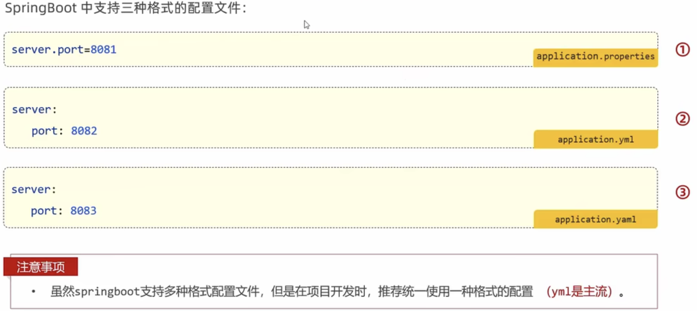

Java系统属性和命令行参数：

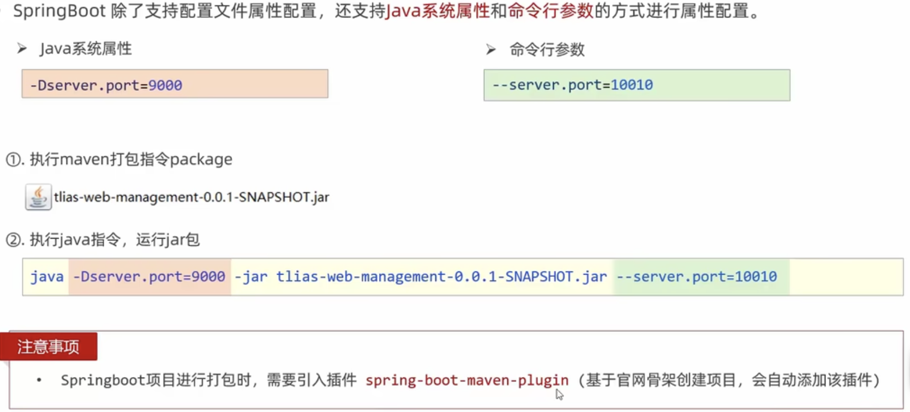


整体优先级：

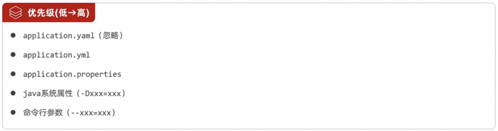


## bean管理

### 获取bean对象

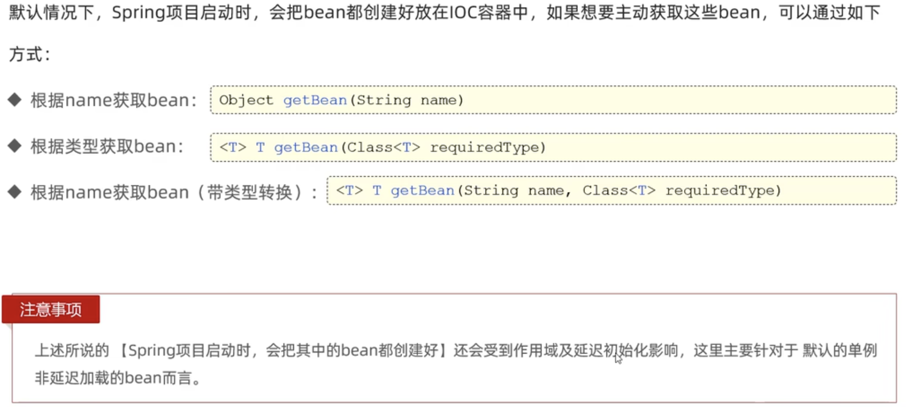


编写一个测试：

```java
package com.zhangjian.springquickstart;

import com.zhangjian.controller.PoemController;
import org.junit.jupiter.api.Test;
import org.springframework.beans.factory.annotation.Autowired;
import org.springframework.boot.test.context.SpringBootTest;
import org.springframework.context.ApplicationContext;

@SpringBootTest
class SpringQuickStartApplicationTests {

    @Autowired
    private ApplicationContext applicationContext; // IOC容器对象

    @Test
    void contextLoads() {
        // 根据 name 获取bean，返回类型默认是 Object
        PoemController bean1 = (PoemController) applicationContext.getBean("poemController");
        System.out.println(bean1);

        // 根据类型获取bean
        PoemController bean2 = applicationContext.getBean(PoemController.class);
        System.out.println(bean2);

        // 根据 name 获取bean，并指定转换类型
        PoemController bean3 = applicationContext.getBean("poemController", PoemController.class);
        System.out.println(bean3);
    }
}
```


Spring默认加载的bean对象都是单例对象，从下面单元测试的输出结果可以证明：

```shell
com.zhangjian.controller.PoemController@72443081
com.zhangjian.controller.PoemController@72443081
com.zhangjian.controller.PoemController@72443081
```


### bean作用域

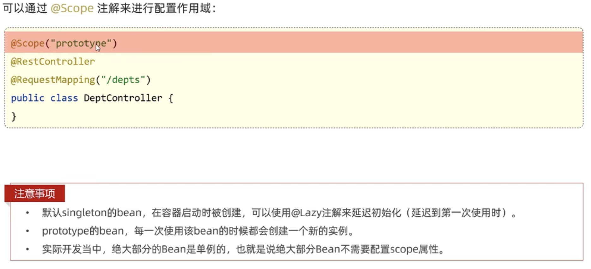

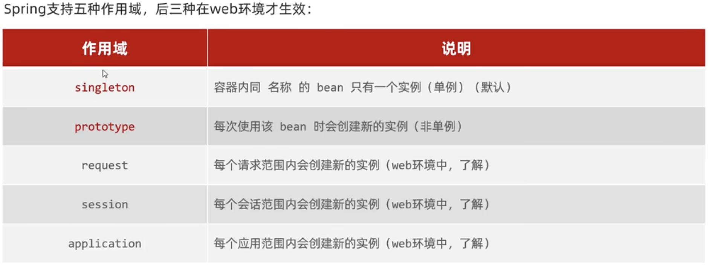


这里演示一下 prototype 作用域。

在controller上加上 @Scope("prototype")注解后，再次运行刚才的测试。

```java
// 增加注解
@Scope("prototype")
@RestController
public class PoemController { ...
  
  
// 单元测试输出
com.zhangjian.controller.PoemController@27fe059d
com.zhangjian.controller.PoemController@766a52f5
com.zhangjian.controller.PoemController@4342c13
```


### 第三方bean

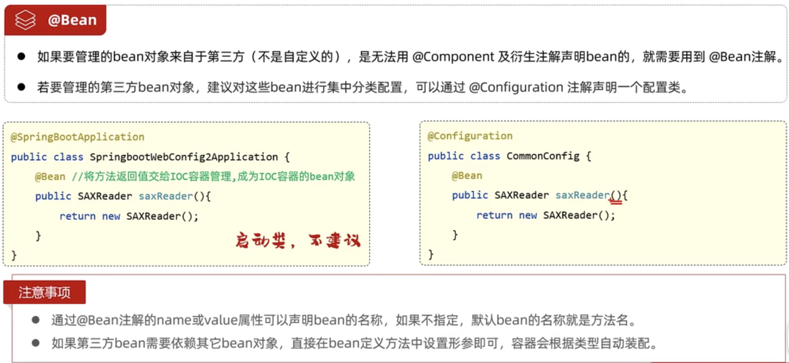

bean对象申明细节：

1. 如果实在项目中自定义的，那么就是用 @Component 及其衍生注解
2. 如果是引入的第三方的，就是用 @Bean 注解


下面通过引入 SaxReader 依赖（用于读取 xml 配置文件），来演示配置第三方bean。

1. 配置 pom.xml

    ```xml
            <!-- SaxReader 读取 xml 配置依赖 -->
            <dependency>
                <groupId>org.dom4j</groupId>
                <artifactId>dom4j</artifactId>
                <version>2.1.3</version>
            </dependency>
    ```

2. 创建配置类，并定义第三方bean

    ```java
    package com.zhangjian.config;
    
    import com.zhangjian.controller.PoemController;
    import org.dom4j.io.SAXReader;
    import org.springframework.context.annotation.Bean;
    import org.springframework.context.annotation.Configuration;
    
    @Configuration // 配置类
    public class CommonConfig {
    
        @Bean // 将第三方对象交给 IOC 容器管理
              // 通过@Bean的 name/value 属性可以指定bean的名称，如果没有指定 则默认就是方法名
        public SAXReader saxReader(PoemController poemController){ // 当引入第三方bean需要使用已有的bean对象时，直接在形参当中声明即可
            System.out.println(poemController);
            return new SAXReader();
        }
    }
    ```

3. 在测试类中使用DI（依赖注入）

    ```java
        @Autowired
        private SAXReader saxReader;
    ```

4. 编写测试方法

    ```java
        @Test
        public void testBean(){
            System.out.println(saxReader);
        }
    ```

5. 控制台依次输出实例信息

    ```shell
    com.zhangjian.controller.PoemController@5acc9fdf
    ...
    org.dom4j.io.SAXReader@322e49ee
    ```

    

## SpringBoot 原理

### 起步依赖

SpringBoot框架是对SpringFramework框架的简化。直接使用 SpringFramework 框架，需要手动配置很多依赖，且各依赖之间还要求版本要互相匹配才能使用。

SpringBoot 框架利用 maven **依赖传递** 的特性，将一些特定需求开发的依赖统一打包成新的依赖，使得依赖配置有了极大程度的简化。

比如 web 开发，就只需要引入 spring-boot-starter-web 这一个以来即可。


### 自动配置

SpringBoot 的自动配置就是spring容器启动后，一些配置类、bean对象就自动存入到了IOC容器中，不需要我们手动去申明，从而简化了开发，省去了繁琐的配置操作。


实现自动配置有两种方式。

**方案一**

使用 @ComponentScan 注解。

我们知道启动类上spring的启动注解 @SpringBootApplication 本身就被 @ComponentScan 所标记，因此我们可以在默认情况下，扫描到 当前包 及 子包 中的各种bean。

但是，如果我们想将第三方库中实现的bean交给当前项目的IOC容器管理，那就需要我们显示的配置 组件扫描的包了。

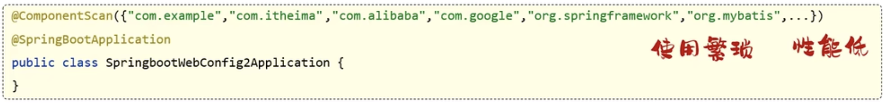


**方案二**

使用 @Import 注解。

使用 @Import 注解导入的类会被Spring加载到IOC容器当中，导入形式主要有几下几种：

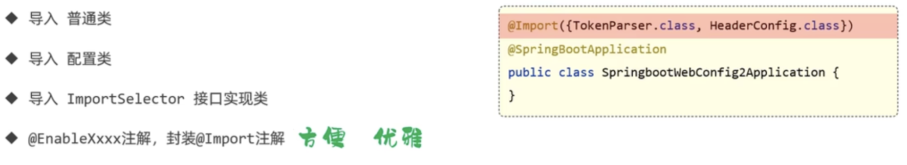


从启动类分析Spring的自动配置过程。

1. @SpringBootApplication 注解主要使用了以下三个注解。

    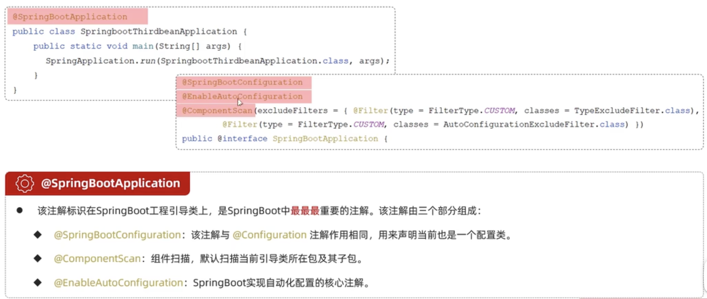

    @SpringBootConfigration 注解自身使用了 @Configration，因而 @SpringBootApplication 本身就是一个配置类。所以，在启动类内部，是可以直接通过 @Bean 注入第三方的类到IOC容器中的。

2. 三个注解中，@EnableAutoConfigration 注解 是实现自动配置的核心注解。

    1. @EnableAutoConfigration 源码如下

        ```java
        @Target({ElementType.TYPE})
        @Retention(RetentionPolicy.RUNTIME)
        @Documented
        @Inherited
        @AutoConfigurationPackage
        @Import({AutoConfigurationImportSelector.class}) // 这里导入了一个 ImportSelector 的实现类
        public @interface EnableAutoConfiguration {
            String ENABLED_OVERRIDE_PROPERTY = "spring.boot.enableautoconfiguration";
        
            Class<?>[] exclude() default {};
        
            String[] excludeName() default {};
        }
        ```

    2. AutoConfigurationImportSelector 是 ImportSelector 的实现类。实现了 selectImports 方法。

        ```java
        // DeferredImportSelector 是一个实现了 ImportSelector 的接口
        public class AutoConfigurationImportSelector implements DeferredImportSelector, BeanClassLoaderAware, ResourceLoaderAware, BeanFactoryAware, EnvironmentAware, Ordered {
            private static final AutoConfigurationImportSelector.AutoConfigurationEntry EMPTY_ENTRY = new AutoConfigurationImportSelector.AutoConfigurationEntry();
            private static final String[] NO_IMPORTS = new String[0];
            private static final Log logger = LogFactory.getLog(AutoConfigurationImportSelector.class);
            private static final String PROPERTY_NAME_AUTOCONFIGURE_EXCLUDE = "spring.autoconfigure.exclude";
            private ConfigurableListableBeanFactory beanFactory;
            private Environment environment;
            private ClassLoader beanClassLoader;
            private ResourceLoader resourceLoader;
            private AutoConfigurationImportSelector.ConfigurationClassFilter configurationClassFilter;
        
            public AutoConfigurationImportSelector() {
            }
        		
          	// 返回一个 String 数组，数组的每一项，就是要自动导入的类的 全类名
            public String[] selectImports(AnnotationMetadata annotationMetadata) { 
                if (!this.isEnabled(annotationMetadata)) {
                    return NO_IMPORTS;
                } else {
                    AutoConfigurationImportSelector.AutoConfigurationEntry autoConfigurationEntry = this.getAutoConfigurationEntry(annotationMetadata); // 这个方法在获取 配置实体
                    return StringUtils.toStringArray(autoConfigurationEntry.getConfigurations());
                }
            }
          ...
        ```

    3. getAutoConfigurationEntry 方法

        ```java
        // 从上下文可以看出，configurations 表示的是需要配置的类; exclusions 是要排除的配置类
        // 因此，继续追踪 getCandidateConfigurations
        protected AutoConfigurationImportSelector.AutoConfigurationEntry getAutoConfigurationEntry(AnnotationMetadata annotationMetadata) {
          if (!this.isEnabled(annotationMetadata)) {
            return EMPTY_ENTRY;
          } else {
            AnnotationAttributes attributes = this.getAttributes(annotationMetadata);
            List<String> configurations = this.getCandidateConfigurations(annotationMetadata, attributes);
            configurations = this.removeDuplicates(configurations);
            Set<String> exclusions = this.getExclusions(annotationMetadata, attributes);
            this.checkExcludedClasses(configurations, exclusions);
            configurations.removeAll(exclusions);
            configurations = this.getConfigurationClassFilter().filter(configurations);
            this.fireAutoConfigurationImportEvents(configurations, exclusions);
            return new AutoConfigurationImportSelector.AutoConfigurationEntry(configurations, exclusions); 
          }
        }
        ```

    4. getCandidateConfigurations 方法

        ```java
        protected List<String> getCandidateConfigurations(AnnotationMetadata metadata, AnnotationAttributes attributes) {
          List<String> configurations = SpringFactoriesLoader.loadFactoryNames(this.getSpringFactoriesLoaderFactoryClass(), this.getBeanClassLoader());
          Assert.notEmpty(configurations, "No auto configuration classes found in META-INF/spring.factories. If you are using a custom packaging, make sure that file is correct."); // 从这个报错信息可以看到默认要导入的配置都写在了 META-INF/spring.factories 文件中
          return configurations;
        }
        ```

    5. 上面报错信息的文件是 SpringBoot 2.7.x 使用的自动配置文件。在 3.0.x 版本及之后，将只使用 `org.springframework.boot.autoconfigure.AutoConfiguration.imports` 这个文件。版本号在这 二者之间时，会同时注册这两个文件中的类。下面看一下 `org.springframework.boot.autoconfigure.AutoConfiguration.imports` 中的文件部分内容。

        ```java
        // 都是 需要注册的类的 全类名
        
        ...
        org.springframework.boot.autoconfigure.graphql.rsocket.RSocketGraphQlClientAutoConfiguration
        org.springframework.boot.autoconfigure.graphql.security.GraphQlWebFluxSecurityAutoConfiguration
        org.springframework.boot.autoconfigure.graphql.security.GraphQlWebMvcSecurityAutoConfiguration
        org.springframework.boot.autoconfigure.graphql.servlet.GraphQlWebMvcAutoConfiguration
        org.springframework.boot.autoconfigure.groovy.template.GroovyTemplateAutoConfiguration
        org.springframework.boot.autoconfigure.gson.GsonAutoConfiguration
        org.springframework.boot.autoconfigure.h2.H2ConsoleAutoConfiguration
        org.springframework.boot.autoconfigure.hateoas.HypermediaAutoConfiguration
        ...
        
        ```

    6. 在 `META-INF/spring/org.springframework.boot.autoconfigure.AutoConfiguration.imports` 文件中的类，也不是全部都会配置到IOC容器中。这些类通常 都被 @Conditional 标记，表示有条件的注册，比如 GsonAutoConfiguration 这个配置类。

        ```java
        @Configuration(
            proxyBeanMethods = false
        )
        @ConditionalOnClass({Gson.class}) 
        @EnableConfigurationProperties({GsonProperties.class})
        public class GsonAutoConfiguration {
            public GsonAutoConfiguration() {
            }
        
            @Bean
            @ConditionalOnMissingBean
            public GsonBuilder gsonBuilder(List<GsonBuilderCustomizer> customizers) {
                GsonBuilder builder = new GsonBuilder();
                customizers.forEach((c) -> {
                    c.customize(builder);
                });
                return builder;
            }
        ...
        // 可以看到，配置类本身 和 方法 都是有条件的注册
        ```

    7.  @Conditional 有以下几个派生注解。

        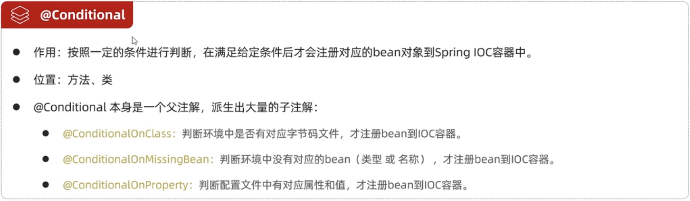

        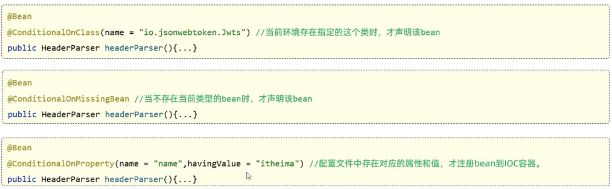


### 自定义 starter

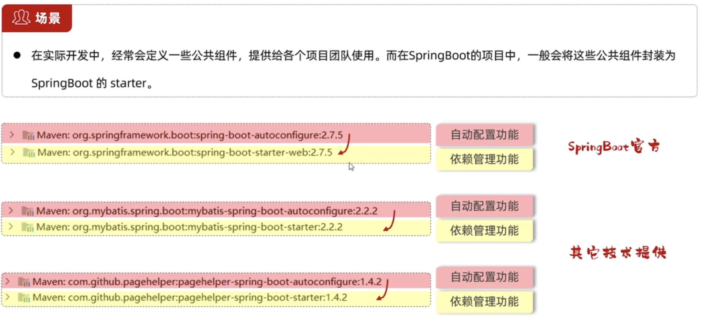

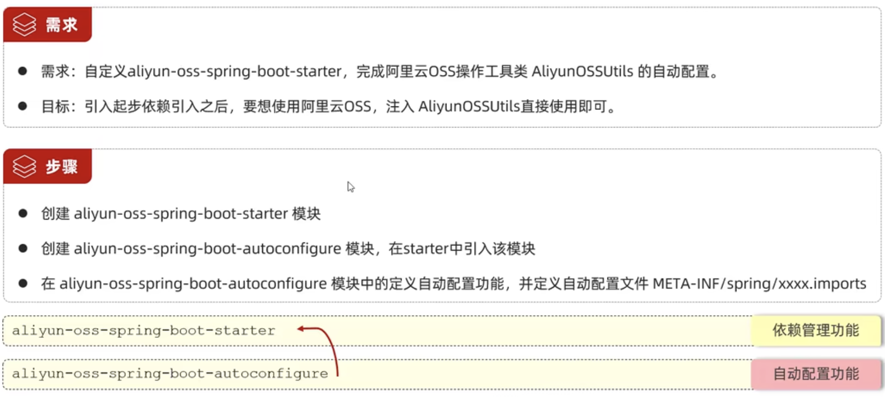


因为在本地演示，就不打包本地模块到中了。

1. 创建 aliyun-oss-spring-boot-starter 模块，进保留 pom.xml 引入 aliyun-oss-spring-boot-autoconfigure 模块

    ```xml
    <?xml version="1.0" encoding="UTF-8"?>
    <project xmlns="http://maven.apache.org/POM/4.0.0" xmlns:xsi="http://www.w3.org/2001/XMLSchema-instance"
             xsi:schemaLocation="http://maven.apache.org/POM/4.0.0 https://maven.apache.org/xsd/maven-4.0.0.xsd">
        <modelVersion>4.0.0</modelVersion>
        <parent>
            <groupId>org.springframework.boot</groupId>
            <artifactId>spring-boot-starter-parent</artifactId>
            <version>2.7.18-SNAPSHOT</version>
            <relativePath/> <!-- lookup parent from repository -->
        </parent>
        <groupId>com.aliyun.oss</groupId>
        <artifactId>aliyun-oss-spring-boot-starter</artifactId>
        <version>0.0.1-SNAPSHOT</version>
    
        <properties>
            <java.version>11</java.version>
        </properties>
        <dependencies>
            <dependency>
                <groupId>org.springframework.boot</groupId>
                <artifactId>spring-boot-starter</artifactId>
            </dependency>
            <!-- 引入自动配置 -->
            <dependency>
                <groupId>com.aliyun.oss</groupId>
                <artifactId>aliyun-oss-spring-boot-autoconfigure</artifactId>
                <version>0.0.1-SNAPSHOT</version>
            </dependency>
        </dependencies>
    </project>
    ```

    模块结构仅保留如下部分即可。

    

2.  创建 aliyun-oss-spring-boot-autoconfigure 模块，在 pom.xml 中添加aliyunOSS相关依赖

    ```xml
    <?xml version="1.0" encoding="UTF-8"?>
    <project xmlns="http://maven.apache.org/POM/4.0.0" xmlns:xsi="http://www.w3.org/2001/XMLSchema-instance"
             xsi:schemaLocation="http://maven.apache.org/POM/4.0.0 https://maven.apache.org/xsd/maven-4.0.0.xsd">
        <modelVersion>4.0.0</modelVersion>
        <parent>
            <groupId>org.springframework.boot</groupId>
            <artifactId>spring-boot-starter-parent</artifactId>
            <version>2.7.18-SNAPSHOT</version>
            <relativePath/> <!-- lookup parent from repository -->
        </parent>
        <groupId>com.aliyun.oss</groupId>
        <artifactId>aliyun-oss-spring-boot-autoconfigure</artifactId>
        <version>0.0.1-SNAPSHOT</version>
    
        <properties>
            <java.version>11</java.version>
        </properties>
        <dependencies>
            <dependency>
                <groupId>org.springframework.boot</groupId>
                <artifactId>spring-boot-starter</artifactId>
            </dependency>
    
            <dependency>
                <groupId>org.springframework.boot</groupId>
                <artifactId>spring-boot-starter-web</artifactId>
            </dependency>
    
            <!--  阿里云oss -->
            <dependency>
                <groupId>com.aliyun.oss</groupId>
                <artifactId>aliyun-sdk-oss</artifactId>
                <version>3.15.1</version>
            </dependency>
            <dependency>
                <groupId>javax.xml.bind</groupId>
                <artifactId>jaxb-api</artifactId>
                <version>2.3.1</version>
            </dependency>
            <dependency>
                <groupId>javax.activation</groupId>
                <artifactId>activation</artifactId>
                <version>1.1.1</version>
            </dependency>
            <!-- no more than 2.3.3-->
            <dependency>
                <groupId>org.glassfish.jaxb</groupId>
                <artifactId>jaxb-runtime</artifactId>
                <version>2.3.3</version>
            </dependency>
        </dependencies>
    </project>
    ```

    删除掉不需要的目录和文件后，项目结构如下：

    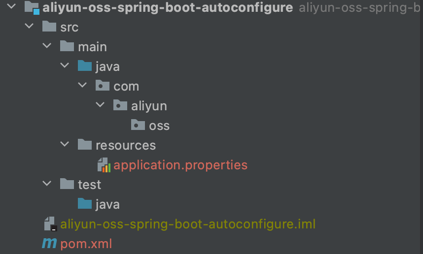

3. 定义 AliOSSProperties

    ```java
    package com.aliyun.oss;
    
    import org.springframework.boot.context.properties.ConfigurationProperties;
    
    
    @ConfigurationProperties(prefix = "ali.oss")
    public class AliOSSProperties { // 没有直接交给 IOC 容器管理
        private String endpoint;
        private String bucketName;
        private String accessKeyId;
        private String accessKeySecret;
    
        public String getEndpoint() {
            return endpoint;
        }
    
        public void setEndpoint(String endpoint) {
            this.endpoint = endpoint;
        }
    
        public String getBucketName() {
            return bucketName;
        }
    
        public void setBucketName(String bucketName) {
            this.bucketName = bucketName;
        }
    
        public String getAccessKeyId() {
            return accessKeyId;
        }
    
        public void setAccessKeyId(String accessKeyId) {
            this.accessKeyId = accessKeyId;
        }
    
        public String getAccessKeySecret() {
            return accessKeySecret;
        }
    
        public void setAccessKeySecret(String accessKeySecret) {
            this.accessKeySecret = accessKeySecret;
        }
    }
    ```

4. 定义 AliOSSUtils

    ```java
    package com.aliyun.oss;
    
    import com.aliyun.oss.ClientException;
    import com.aliyun.oss.OSS;
    import com.aliyun.oss.OSSClientBuilder;
    import com.aliyun.oss.OSSException;
    import org.springframework.web.multipart.MultipartFile;
    
    import java.io.IOException;
    import java.util.UUID;
    
    /**
     * 文件存储类
     */
    public class AliOSSUtils { // 没有直接交给 IOC 容器管理
    
        private AliOSSProperties aliOSSProperties;
    
        // AliOSSProperties 不能直接注入了，提供一个 set 方法
        public void setAliOSSProperties(AliOSSProperties aliOSSProperties) {
            this.aliOSSProperties = aliOSSProperties;
        }
    
        private OSS getOSS() {
            return new OSSClientBuilder().build(aliOSSProperties.getEndpoint(), aliOSSProperties.getAccessKeyId(), aliOSSProperties.getAccessKeySecret());
        }
    
        public boolean bucketIsExist(String bucketName) {
            OSS oss = getOSS();
            boolean exist = oss.doesBucketExist(bucketName);
            oss.shutdown();
    
            return exist;
        }
    
        public void createBucket(String bucketName) {
            OSS oss = getOSS();
    
            try {
                oss.createBucket(bucketName);
            } catch (OSSException | ClientException e) {
                e.printStackTrace();
            } finally {
                oss.shutdown();
            }
        }
    
        public String getBucketEndpoint() {
            StringBuilder builder = new StringBuilder(aliOSSProperties.getEndpoint());
    
            if (aliOSSProperties.getEndpoint().startsWith("http:")) {
                builder.insert(builder.indexOf("//") + 2, aliOSSProperties.getBucketName() + ".");
            }else {
                builder.insert(0, "http://" + aliOSSProperties.getBucketName() + ".");
            }
    
            return builder.toString();
        }
    
        public String upload(MultipartFile file) throws IOException {
            OSS oss = getOSS();
    
            String originalFilename = file.getOriginalFilename();
    
            String suffix = originalFilename.substring(originalFilename.lastIndexOf('.'));
    
            String newFilename = UUID.randomUUID() + suffix;
    
            try {
                oss.putObject(aliOSSProperties.getBucketName(), newFilename, file.getInputStream());
                return getBucketEndpoint() + "/" + newFilename;
            } catch (OSSException | ClientException e) {
                e.printStackTrace();
                return null;
            } finally {
                oss.shutdown();
            }
        }
    }
    ```

5. 定义 AliOSSAutoConfiguration

    ```java
    package com.aliyun.oss;
    
    import org.springframework.boot.context.properties.EnableConfigurationProperties;
    import org.springframework.context.annotation.Bean;
    import org.springframework.context.annotation.Configuration;
    
    @Configuration // 配置类
    @EnableConfigurationProperties({AliOSSProperties.class}) // 将 AliOSSProperties 交给 IOC 容器管理
    public class AliOSSAutoConfiguration {
    
        @Bean
        public AliOSSUtils aliOSSUtils(AliOSSProperties aliOSSProperties){ // 对于已经在 IOC 中的bean，直接申明参数使用即可
            AliOSSUtils aliOSSUtils = new AliOSSUtils();
            aliOSSUtils.setAliOSSProperties(aliOSSProperties);
            return aliOSSUtils;
        }
    }
    ```

6. 在 resource 文件夹中，创建自动导入配置的文件。将我们定义的 AliOSSAutoConfiguration 添加到其中

    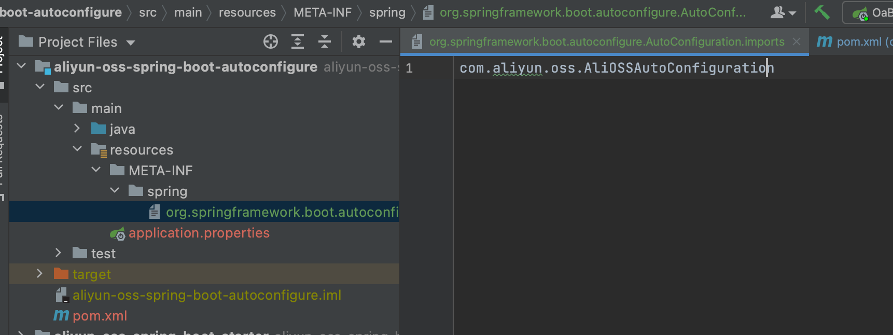

7. 在 oa-backend 项目中引入 aliyun-oss-spring-boot-starter 依赖。并改造上传的Controller直接使用上传工具。（因为 oa-backend 中，配置文件本身就有 aliyunOSS 相关的配置了，所以无需再添加）

    ```java
        @Autowired
        private AliOSSUtils aliOSSUtils;
    
    ...
      
          @PostMapping( "/upload/ali/oss" )
        public Result upload(MultipartFile file) throws IOException {
            log.info("上传文件到OSS");
    //        String url = fileStorage.upload(file);
            String url = aliOSSUtils.upload(file);
            log.info("文件上传成功，访问地址: {}", url);
            return Result.success(url);
        }
    ```

    测试接口 OK。

    


