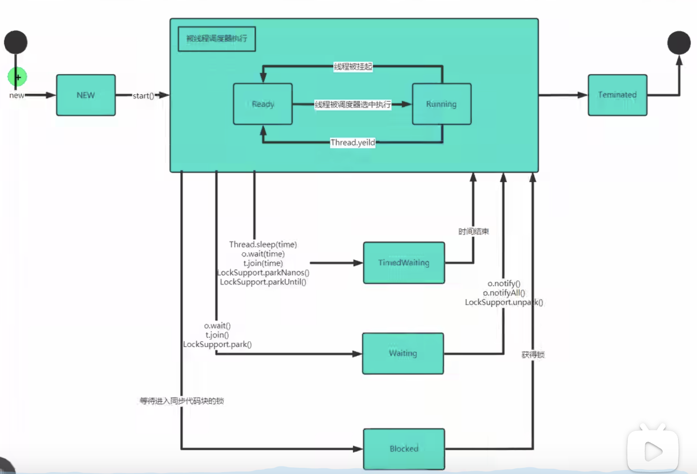
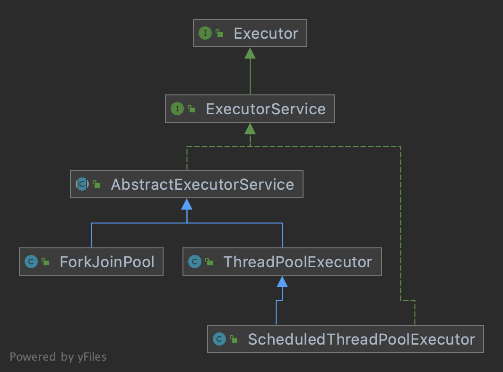
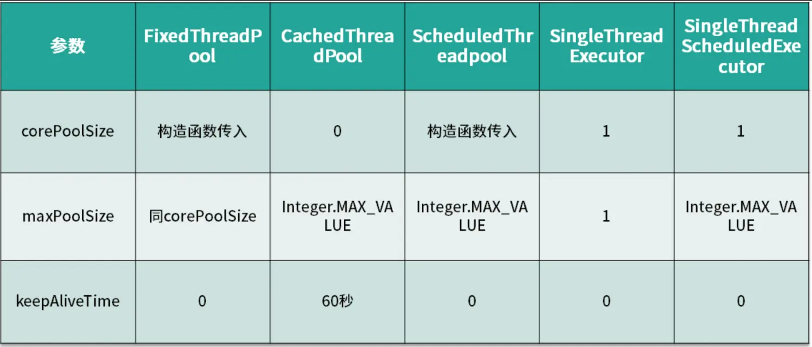

## 相关概念

- **进程：** 进程就是运行中的程序。
    - 需要占用计算机物理资源，程序启动时，由操作系统调度分配。
    - 是计算机中最小的资源分配单位。即想要分配计算机的物理资源，至少得是一个完整的进程。
    - 进程创建时都有一个唯一标识PID。
    - 进程之间可以共用CPU资源；但内存资源是严格区分并隔离，互不干扰。父子进程间亦是如此。
    - 父进程负责开启和回收子进程的资源。
- **线程：**是操作系统能够进行运算调度的最小单位。
    - 它被包含在进程之中，是进程中的实际运作单位。可以理解进程是CPU为程序分配了一间办公室，而线程才是办公室中真正干活的，所以线程之间是共享进程资源的。
    - 计算机具体执行编译后的计算机指令就是在线程中进行。
    - 一条线程指的是进程中一个单一顺序的控制流，一个进程中可以并发多个线程，每条线程并行执行不同的任务。一个进程中至少有一个线程。
- **并发：**
    - 在单一的CPU上，同时运行多个计算机程序。
    - 宏观上：多个程序是同时运行的。
    - 微观上：多个程序在CPU上按时间片的时间轮流执行，本质上是串行。
- **并行：**
    - 多个CPU同时运行多个程序，互不干扰。
- **单线程**
    - 同一时刻，只允许运行一个线程。在 Python 中，因为GIL锁的存在，即使计算机有多个CPU，在某一时刻，Python程序也只会使用其中一个，运行一个线程。除非手动开启多进程。
- **多进程**
    - 同一时刻，可以同时运行一个进程的多个线程。Java 就支持多线程，即进程在运行时，可以将多个线程调度到不同的CPU上同时运行。


## 基本使用

> java中获取CPU核心数：
>
> ```java
> package com.zhangjian.多线程;
> 
> public class MultiThread {
>     public static void main(String[] args) {
> 
>         Runtime runtime = Runtime.getRuntime();
>         int i = runtime.availableProcessors(); // 当前计算机上面的可用核心数
> 
>         System.out.println(i);
>     }
> }
> ```


在java中，开启线程主要有两种方式。一是 继承 Thread 类；二是 实现 Runnable 接口。


### 继承 Thread  

继承 Thread 类之后，子类要实现 run 方法，这个方法里面主要是自己的业务逻辑。然后通过实例调用 start 方法，程序救护开启新的线程来执行 run方法。

```java
package com.zhangjian.多线程;

public class MultiThread {
    public static void main(String[] args) throws InterruptedException {
        // 先打印下主线程的信息
        System.out.println(Thread.currentThread().getName());

        // 开启子线程运行程序，主线线程不会阻塞
        Son son = new Son();
        son.start();

        // son.join(); // join() 方法，表示等待子线程结束后才继续执行主线程。一旦调用就会阻塞主线程

        System.out.println("主线程执行完毕");
    }
}


class Son extends Thread {
    @Override
    public void run() {
        // 打印当前线程信息
        // 因为 继承了 Thread ，所以当前了可以直接查看 线程信息
        System.out.println(getName());

        int count = 0;
        while (true){
            System.out.println("计数器 --> " + count);
            count++;

            if (count == 5) break;

            try {
                Thread.sleep(1000);
            } catch (InterruptedException e) {
                e.printStackTrace();
            }
        }

    }
}
```


### 实现 Runnable

java 实现继承机制，在很多情况下，由于当前类已经继承其他父类，就没办法再继承Thread。这种情况下，就可以通过 实现 Runnable 接口 来实现业务逻辑，在使用 Thread 实例开启线程。步骤如下：

1. 实现 Runnable 接口，实现 run 方法逻辑
2. 创建 子类实例，用子类实例作为 Thread 实例的入参
3. 调用 Thread 实例 start 方法 开启线程


代码：

```java
package com.zhangjian.多线程;

public class MultiThread {
    public static void main(String[] args) throws InterruptedException {
        // 先打印下主线程的信息
        System.out.println(Thread.currentThread().getName());

        // 开启子线程运行程序
        Son son = new Son();

        // Runnable 中 只有一个 run 方法，是没办法开启线程执行的
        // 此时 还需要使用 Thread 类，我们需要将实现了 Runnable 接口的类的对象作为构造器参数传入
        Thread thread = new Thread(son);

        // 开启线程。其他使用方法 就和 继承 Thread 没有差异了
        thread.start();

        // thread.join(); // join() 方法，表示等待子线程结束后才继续执行主线程。一旦调用就会阻塞主线程

        System.out.println("主线程执行完毕");
    }
}


class Son implements Runnable {
    @Override
    public void run() {
        // 打印当前线程信息
        // 实现 接口就没法直接使用Thread方法了呢
        System.out.println(Thread.currentThread().getName());

        int count = 0;
        while (true){
            System.out.println("计数器 --> " + count);
            count++;

            if (count == 5) break;

            try {
                Thread.sleep(1000);
            } catch (InterruptedException e) {
                e.printStackTrace();
            }
        }

    }
}
```


### 差异分析

上面两种开启现成的方式，本质上是一样的。继承 Thread 实例化时 相当于调用无参构造器，实现 Runnable 的处理方案则是一个有参构造器。

1. 查看两个构造器，可以看到 这两个构造器内部，调用的同一个 重载的 另一个构造器

    ```java
    // 无参
    public Thread() {
      this(null, null, "Thread-" + nextThreadNum(), 0);
    }
    
    // Runnable 参数
    public Thread(Runnable target) {
      this(null, target, "Thread-" + nextThreadNum(), 0);
    }
    ```

2. 继续追踪，发现 传入的实例 被 Thread 的 target 属性维护起来了

    ```java
        private Thread(ThreadGroup g, Runnable target, String name,
                       long stackSize, AccessControlContext acc,
                       boolean inheritThreadLocals) {
    				
            ... 
              
            this.target = target;  // 无参时，这里 target 为null；带参时 target 就是 Runnable 实例
            setPriority(priority);
            if (inheritThreadLocals && parent.inheritableThreadLocals != null)
                this.inheritableThreadLocals =
                    ThreadLocal.createInheritedMap(parent.inheritableThreadLocals);
            /* Stash the specified stack size in case the VM cares */
            this.stackSize = stackSize;
    
            /* Set thread ID */
            this.tid = nextThreadID();
        }
    ```

3. 再看我们最终被调度的 run 方法，可以得到结论。

    ```java
    @Override
    public void run() {
      if (target != null) {
        target.run();
      }
    }
    
    /*
    结论：
     	1、当我们继承 Thread 时，直接就重写了 run 方法，所以被调度时，就是我们自己的逻辑；
     	2、通过实现 Runnable 则没有重写 Thread 的 run，而是实现类的实例给到了 target，当 Thread 的run方法被调用时，通过 target 调用到了 Runnable 的 run 方法。标准的 曲线救国
    */
    ```

    


## 常用方法

从前面知道，创建线程都依赖于 Thread 实例，这里介绍一些 Thread 中的常用方法。

1. setName  设置线程名称
2. getName  获取线程名称
3. start  启动一个新的线程，底层创建新线程后，执行 run 方法
4. run  通常不直接调用，其内部实现是业务逻辑
5. setPriority  设置线程的优先级。默认 优先级是 0，该值是被 CPU 调度的优先级
6. getPriority  获取线程的优先级
7. sleep  静态方法。接收一个 毫秒 参数，让当前线程休眠指定 毫秒数
8. interrupt   中断线程，调用该方法 会在 线程 内部抛出一个 中断异常（InterruptedException）
9. currentThread  静态方法。获取当前的线程对象
10. yield  静态方法。提示调度器当前线程愿意让出正在使用的处理器，但是调度器是可以忽略这个提示的。当有很多CPU任务在执行的时候，调用yield是比较有效的。
11. join  等待线程终止，调用该方法后，阻塞主线程。join 重载了三次。
    - 无参。表示一直等待线程执行，直到线程真正执行完毕
    - 一个参数（毫秒）。等待超时时间为 指定的 毫秒数，超时后主线程终止阻塞，继续执行
    - 两个参数（毫秒, 纳秒）。超时时间为 指定的 毫秒数 + 纳秒属，超时后主线程终止阻塞，继续执行
12. setDaemon  指定线程为 守护线程。守护线程 会在所有其他线程退出后才退出。
13. isDaemon  返回布尔值，线程是否为守护线程
14. isAlive  返回布尔值，线程是否还存活


演示：

```java
package com.zhangjian.多线程;

public class MultiThread {
    public static void main(String[] args) throws InterruptedException {
        Thread thread = new Thread(new Son());
        thread.setName("王老五");

        // 启动线程
        thread.start();

        // 打印线程名称
        System.out.println(thread.getName()); // "王老五"

        // 子线程 sleep 5s ，我们在 主线程 sleep 3s 后，给一个中断信号
        for (int i = 0; i < 3;) {
            Thread.sleep(1000);
            System.out.println("计时：" + (++i));
        }
        thread.interrupt();

        // 子线程再次 sleep 5s ，我们 使用 join 等待8s
        thread.join(8000);

        //  检查线程是否还存活
        System.out.println(thread.isAlive());  // true

        // 通过设置属性，终止线程
        Son.loop = false;

        System.out.println("主线程执行完毕");
    }
}


class Son implements Runnable {
    public static boolean loop = true;

    @Override
    public void run() {
        while (loop){
            System.out.println("累了，睡 5 秒钟...");

            try {
                // 在 sleep 中收到 中断信号，程序就会 抛出 InterruptedException
                Thread.sleep(5000);
            } catch (InterruptedException e) {
                System.out.println("我去，被强行开机了...");
                // e.printStackTrace();
            }
        }

    }
}
```


## 守护线程

1. 用户线程：也叫工作线程。当线程的任务执行完成 或者 被通知 的方式结束
2. 守护线程：一般是为 工作线程 服务的，比如：检查工作线程状态。守护线程 在所有的 工作线程 退出后 自动退出（即使 守护线程 是无限循环的，仍然会自动退出）
3. 常见的守护线程：垃圾回收


## 线程状态

线程状态本质上和进程状态类似的，当进程内部只有一个线程时，二者的状态可以说是一样的。

进程的状态：新建态、就绪态、运行态、阻塞态、终止态

在 Java 中，官方将线程状态氛围以下几种：

- [`NEW`]
    尚未启动的线程处于此状态。
- [`RUNNABLE`]
    在Java虚拟机中执行的线程处于此状态。
- [`BLOCKED`]
    被阻塞等待监视器锁定的线程处于此状态。
- [`WAITING`]
    正在等待另一个线程执行特定动作的线程处于此状态。
- [`TIMED_WAITING`]
    正在等待另一个线程执行动作达到指定等待时间的线程处于此状态。
- [`TERMINATED`]
    已退出的线程处于此状态。


可以看到：

- RUNNABLE 其实 表示了 就绪态 和 运行态，线程是否在运行取决于操作系统是否为其分配处理器，但前提是 线程处于 就绪态
- 另外。Java 中又将 阻塞态 细分成了三种状态，其实等待某个任务执行完成，本身也是阻塞。


下面看一张状态关系图：




## 线程同步

### 概念

> **线程同步：** 当有一个线程在对某一个内存进行操作时，其他线程都不可以对这个内存进行操作，直到当前线程操作结束之后，其他线程才可以继续去操作。这样可以保证线程间的数据安全

Java语言中，为了实现线程同步，引入了互斥锁的概念，来保证 共享数据 的完整性。同时 使用 `synchronized` 关键字 来与互斥锁联系，当某个对象被 `synchronized`  修饰时，就表示该对象在同一时刻，只能被一个线程访问。`synchronized` 关键字可以实现 同步代码块 和 同步方法，详细语法如下：

1. 同步代码块。默认锁对象是 当前实例(this)，当然也可以是其他实例

    ```java
    // 对象 是指当前的锁，是属于哪个对象的。
    // 1、线程运行时，从对象中获取锁，拿到锁的线程才能执行代码块
    // 2、没有拿到锁的线程，将等待。直到锁被上一个持有的线程释放后，再去争抢  
    synchronized (对象) {
      // 被同步的代码...
    }
    
    // 示例：放在非静态的代码块中
    class Son implements Runnable {
        private int ticketNum = 100;
        public static boolean loop = true;
    
        {
            synchronized (this){
                ticketNum++;
            }
        }
    }
    ```

2. 静态同步代码块。默认锁对象是 当前类.class

    ```java
    synchronized (类名.class) {
      // 被同步的代码...
    }
    
    // 示例：放在静态代码块中
    static {
      synchronized (Son.class){
        int num = 0;
      }
    }
    ```

3. 同步方法。默认锁对象是 当前实例(this)，那么不同实例之间将不能同步

    ```java
    访问修饰符 synchronized 返回类型 方法名(参数列表){
      // 被同步的代码...
    }
    
    // 示例：
    class Son implements Runnable {
        private int ticketNum = 100;
        public static boolean loop = true;
        
        
        private synchronized void sell(){
            String name = Thread.currentThread().getName();
    
            if (ticketNum >= 0) {
                System.out.println("售票员 " + name + " 卖出一张，余票还有： " + (--ticketNum));
            }
    
            try {
                Thread.sleep(100);
            } catch (InterruptedException e) {
                e.printStackTrace();
            }
        }
        
        @Override
        public  void run() {
            while (loop) {
                sell();
                if (ticketNum <= 0) break;
            }
        }
    }
    ```

4. 静态同步方法。默认锁对象是 当前类.class，因此 静态同步方法在 不同实例、不同类中使用时都能保证同步

    ```java
    访问修饰符 static synchronized 返回类型 方法名(参数列表){
      // 被同步的代码...
    }
    
    // 示例：
    class Son implements Runnable {
        private static int ticketNum = 100;
        public static boolean loop = true;
        
        private static synchronized void sell(){
            String name = Thread.currentThread().getName();
    
            if (ticketNum >= 0) {
                System.out.println("售票员 " + name + " 卖出一张，余票还有： " + (--ticketNum));
            }
    
            try {
                Thread.sleep(100);
            } catch (InterruptedException e) {
                e.printStackTrace();
            }
        }
    
        @Override
        public  void run() {
            while (loop) {
                sell();
                if (ticketNum <= 0) break;
            }
        }
    }
    ```

    

### 注意事项

1. 开启多线程时，传递给线程的对象必须是相同对象
2. 互斥锁能保证多个线程在访问同一个对象时，共享数据的安全性。但同时也牺牲了执行效率，同步 本质上就是让访问串行化，这又恰恰与多线程相违背
3. 可能的情况下，优先使用同步代码块，锁的粒度越小，那么牺牲的效率也就越少
4. 同步代码块不能直接定义在成员级别，只能放在 代码块 或 方法中


### 代码演示

使用 同步代码块 对部分代码加互斥锁，保证 售票 的数据安全。

```java
package com.zhangjian.多线程;

public class MultiThread {
    public static void main(String[] args) throws InterruptedException {
        // 开三个窗口买票
        // 但是只能是同一个票源
        Seller seller = new Seller();

        new Thread(seller).start();
        new Thread(seller).start();
        new Thread(seller).start();

        System.out.println("窗口开放完成");
    }
}


class Seller implements Runnable {
    private int ticketNum = 100;
    public static boolean loop = true;

    private void sell() {
        String name = Thread.currentThread().getName();

        // 在这段代码中。查询余票 和 修改剩余票数，在多线程场景下存在数据不安全的问题，因此对这部分加锁
        synchronized (this) {
            if (ticketNum > 0) {
                System.out.println("售票员 " + name + " 卖出一张，余票还有： " + (--ticketNum));
            }
        }

        try {
            Thread.sleep(50);
        } catch (InterruptedException e) {
            e.printStackTrace();
        }
    }

    @Override
    public void run() {
        while (loop) {
            sell();
            if (ticketNum <= 0) break;
        }
    }
}
```


## 死锁

当多个线程都占用了对方的锁资源，但是又互不相让，都在等待对方释放锁，就会导致 死锁。

死锁 带来的直接影响就是两个线程一直处于等待状态，无法正常工作。

代码演示：

```java
package com.zhangjian.多线程;

public class MultiThread {
    public static void main(String[] args) throws InterruptedException {
        // 模拟死锁
        Thread thread = new Thread(new DeadLock(true));
        Thread thread2 = new Thread(new DeadLock(false));

        thread.start();
        thread2.start();

        thread.join(2000);

        // 查看状态。两个线程都处于阻塞状态
        System.out.println(thread.getState()); // BLOCKED
        System.out.println(thread2.getState()); // BLOCKED

    }
}


class DeadLock implements Runnable {
    static Object o1 = new Object();
    static Object o2 = new Object();

    private boolean flag;

    public DeadLock(boolean flag) {
        this.flag = flag;
    }

    @Override
    public void run() {
        if (flag) {
            synchronized (o1) {
                System.out.println(Thread.currentThread().getName() + " 获得 o1 的锁...");
                synchronized (o2) {
                    System.out.println(Thread.currentThread().getName() + " 获得 o2 的锁...");
                }
            }
        } else {
            synchronized (o2) {
                System.out.println(Thread.currentThread().getName() + " 获得 o2 的锁...");
                synchronized (o1) {
                    System.out.println(Thread.currentThread().getName() + " 获得 o1 的锁...");
                }
            }
        }
    }
}
```


## 释放锁

下面的操作会释放锁：

1. 当前线程的同步方法、同步代码块执行结束，会自动释放锁
2. 当前线程的同步方法、同步代码块中遇到 break、return 会释放锁
3. 当前线程的同步方法、同步代码块中出现了未处理的Error或Exception，导致程序异常结束时会释放锁
4. 当前线程的同步方法、同步代码块中执行了线程对象的 wait() 方法，会暂停当前线程而释放锁


**注意** 以下操作不会释放锁：

1. 线程执行同步代码块或同步方法时，程序调用 Thread.sleep() 、 Thread.yield() 方法，暂停当前线程的执行，不会释放锁
2. 线程执行同步代码块或同步方法时，其他线程调用了该线程的 suspend() 方法将该线程挂起，该线程不会释放锁


## CAS 无锁

CAS，全称Compare And Swap（比较与交换），解决多线程并行情况下使用锁造成性能损耗的一种机制。 CAS 具有以下优势：

1. CAS 采⽤⽆锁的乐观策略，由于其⾮阻塞性，它对死锁问题天⽣免疫，并且，线程间的相互影响也远远⽐基于锁的⽅式要⼩得多。
2. 使⽤⽆ 锁的⽅式完全没有锁竞争带来的系统开销，也没有线程间频繁调度带来的开销。


**在 java.util.concurrent.atomic 包中，提供了很多高级工具类，让程序员可以很方便的在多线程场景下操作数据。**


### Unsafe类

Unsafe类，在sun.misc包下，不属于Java标准。Unsafe类提供一系列增加Java语言能力的操作，如内存管理、操作类/对象/变量、多线程同步等。

Unsafe类是JDK内部专属的类，程序无法直接使用。但是它实现了一些列CAS相关的方法，在 java.util.concurrent  中和CAS相关的类底层都是用到Unsafe的方法，主要有如下几个：

```java
//var1为CAS操作的对象，offset为var1某个属性的地址偏移值，expected为期望值，var2为要设置的值，利用JNI来完成CPU指令的操作
public final native boolean compareAndSwapObject(Object var1, long offset, Object expected, Object var2);
public final native boolean compareAndSwapInt(Object var1, long offset, int expected, int var2);
public final native boolean compareAndSwapLong(Object var1, long offset, long expected, long var2);
```


### AtomicInteger 类

通过使⽤AtomicInteger，得益于CAS等CPU指令，保证Integer操作的原⼦性。

**示例：**

```java
package com.zhangjian.多线程;

import java.util.concurrent.atomic.AtomicInteger;

public class MultiThread {
    /**
     * 无锁的线程安全整数AtomicInteger
     */

    static AtomicInteger atomicInteger = new AtomicInteger(2);
    static Demo demo = new Demo();

    public static void main(String[] args) throws InterruptedException {
        // 开100个线程同时操作数据
        for (int i = 0; i < 100; i++) {
            // Runnable 是函数式接口，可以直接使用lambda函数实现
            new Thread(() -> {
                for (int j = 0; j < 1000; j++) {
                    // AtomicInteger 自增 1
                    atomicInteger.getAndIncrement();

                    // demo 的score也自增，这里将体现线程数据的不安全
                    demo.score ++;
                }
            }).start();
        }
				
        System.out.println("atomicInteger= " + atomicInteger); // 100002
        System.out.println("demo.score= " + demo.score); // 94864
    }
}


class Demo {
    volatile int score = 0;
}
```


### AtomicReference 类

AtomicReference和AtomicInteger⾮常类似，只是AtomicReference对应普通的对象引⽤。

**示例：**

```java
package com.zhangjian.多线程;

import java.util.concurrent.atomic.AtomicReference;

public class MultiThread {
    /**
     * 无锁的线程安全对象 AtomicReference
     */

    static AtomicReference<Demo> atomicReference = new AtomicReference<>(new Demo(0));

    public static void main(String[] args) throws InterruptedException {
        // 开100个线程同时操作数据
        for (int i = 0; i < 100; i++) {
            // Runnable 是函数式接口，可以直接使用lambda函数实现
            new Thread(() -> {
                for (int j = 0; j < 1000; j++) {
                    // 操作 demo 中的score
                    while (true){
                        Demo demo = atomicReference.get();

                        // 如果设置新的对象成功，就 break
                        if(atomicReference.compareAndSet(demo, new Demo(demo.score + 1))) break;
                    }
                }
            }).start();
        }

        // 等待子线程执行
        Thread.sleep(1000);
        System.out.println("demo.score= " + atomicReference.get().score); // 100000
    }
}


class Demo {
    volatile int score;

    public Demo(int score) {
        this.score = score;
    }
}
```


###  AtomicStampedReference 类

AtomicInteger 和 AtomicReference 存在一个共同的问题，就是 ABA 问题。

> ABA问题。当第一个线程执行CAS操作，尚未修改为新值之前，内存中的值已经被其他线程连续修改了两次，使得变量值经历 A -> B -> A的过程。

解决方案：添加版本号作为标识，每次修改变量值时，对应增加版本号； 做CAS操作前需要校验版本号。JDK1.5之后，新增AtomicStampedReference类来处理这种情况。

**示例：**

```java
package com.zhangjian.多线程;

import java.util.concurrent.atomic.AtomicReference;
import java.util.concurrent.atomic.AtomicStampedReference;

public class MultiThread {
    /**
     * 无锁的线程安全对象 AtomicStampedReference
     */

    static AtomicStampedReference<Integer> atomicStampedReference = new AtomicStampedReference<>(5, 0);

    public static void main(String[] args) throws InterruptedException {
        A a = new A();
        a.start();

        B b = new B();
        b.start();

        b.join();

        // 因为 stamp 的原因，很快就会结束
        System.out.println(atomicStampedReference.getReference());
    }

    // A线程加1
    public static class A extends Thread{
        @Override
        public void run() {
            while (true){
                Integer reference = atomicStampedReference.getReference();
                int stamp = atomicStampedReference.getStamp();

                if (reference == 10000) break;

                if (!atomicStampedReference.compareAndSet(reference, reference + 1, stamp, stamp + 1)) break;
            }

            System.out.println(getName() + " 结束~~");
        }
    }

    // B线程减1
    public static class B extends Thread{
        @Override
        public void run() {
            while (true){
                Integer reference = atomicStampedReference.getReference();
                int stamp = atomicStampedReference.getStamp();

                if (reference == 10000) break;

                if (!atomicStampedReference.compareAndSet(reference, reference - 1, stamp, stamp + 1)) break;
            }

            System.out.println(getName() + " 结束~~");
        }
    }
}
```


### AtomicIntegerArray 类

除了基本数据类型之外，JDK还为我们提供了数组这种复合类型结构。当前可⽤的原⼦数组 AtomicIntegerArray、AtomicLongArray和AtomicReferenceArray。它们本质都是对数组类型进⾏封装，使⽤Unsafe类通过CAS的⽅式控制数组在多线程下的安全性。


### AtomicIntegerFieldUpdater 类

它的作⽤是，让普通变量也能享受原⼦操作，并且在不改动或极少改动原有代码的基础上，让普通的变量也能享受CAS操作带来的线程安全性。 

根据数据类型不同，这个Updater有三种。分别是AtomicIntegerFieldUpdater、AtomicLongFieldUpdater、AtomicReferenceFieldUpdater，顾名思义，它们分别可以对int、long和Object进⾏CAS修改。


## volatile 关键字

volatile 是 Java 中的关键字，是一个变量修饰符，被用来修饰会被不同线程访问和修改的变量。有以下三个作用：

- **可见性**

    可见性是指多个线程访问同一个变量时，其中一个线程修改了该变量的值，其它线程能够立即看到修改的值。

    在 Java 内存模型中，所有的变量都存储在主存中，同时每个线程都拥有自己的工作内存，用于提高访问速度。线程会从主存中拷贝变量值到自己的工作内存中，然后在自己的工作线程中操作变量，而不是直接操作主存中的变量，由于每个线程在自己的内存中都有一个变量的拷贝，就会造成变量值不一致的问题。

    使用 volatile 关键字可以解决这个问题，使用 volatile 修饰的变量确保了线程不会将该变量拷贝到自己的工作线程中，所有线程对该变量的操作都是在主存中进行的，所以 volatile 修饰的变量对所有线程可见。
    
    ```java
    package com.zhangjian.多线程;
    
    public class MultiThread {
    
        public static void main(String... args) {
            VolatileTestObj obj = new VolatileTestObj();
    
            new Thread(() -> {
                while (true) {
                    System.out.println(obj.get());
                }
            }).start();
    
            new Thread(() -> {
                while (true) {
                    obj.put("time：" + System.currentTimeMillis());
                }
            }).start();
        }
    
    }
    
    class VolatileTestObj {
    
        private String value = null;
        // private boolean hasNewValue = true;
      	// 如果 hasNewValue 没有 volatile 修饰，那么两个线程内很容易因为数据没有同步而卡死
      	private volatile boolean hasNewValue = true;
    
        public void put(String value) {
            while (hasNewValue) {
                // 等待，防止重复赋值
            }
            this.value = value;
            hasNewValue = true;
        }
    
        public String get() {
            while (!hasNewValue) {
                // 等待，防止获取到旧值
            }
            String value = this.value;
            hasNewValue = false;
            return value;
        }
    }
    ```
    
- **原子性**

    volatile 只保证单次读/写操作的原子性，对于多步操作，volatile 不能保证原子性。

    **所以，vloatile 并不能解决所有同步的问题**

- **有序性**

    在 Java 内存模型中，允许编译器和处理器对指令进行重排序，重排序过程不会影响到单线程程序的执行，但是会影响到多线程并发执行的正确性。

    volatile 关键字可以禁止指令重新排序，可以保证一定的有序性。

    volatile 修饰的变量的有序性有两层含义：

    1. 所有在 volatile 修饰的变量写操作之前的写操作，将会对随后该 volatile 修饰的变量读操作之后的语句可见。
    2. 禁止 JVM 重排序：volatile 修饰的变量的读写指令不能和其前后的任何指令重排序，其前后的其他指令可能会被重排序。

    

## 线程池

> 之前我们在使用多线程都是用Thread的start()来创建启动一个线程，但是在实际开发中，如果每个请求到达就创建一个新线程，开销是相当大的。服务器在创建和销毁线程上花费的时间和消耗的系统资源都相当大，甚至可能要比在处理实际的用请求的时间和资源要多的多。除了创建和销毁线程的开销之外，活动的线程也需要消耗系统资源。如果在一个jvm里创建太多的线程，可能会使系统由于过度消耗内存或“切换过度”而导致系统资源不足。这就引入了线程池概念。

线程池的原理其实就是对多线程的一个管理，为了实现异步机制的一种方法，其实就是多个线程执行多个任务，最终这些线程通过线程池进行管理。

在java.util.concurrent包下，提供了一系列与线程池相关的类。合理的使用线程池，可以带来多个好处：

1. **降低资源消耗**。通过重复利用已创建的线程降低线程创建和销毁造成的消耗；
1. **提高响应速度**。当任务到达时，任务可以不需要等到线程创建就能立即执行；
1. **提高线程的可管理性**。线程是稀缺资源，如果无限制的创建，不仅会消耗系统资源，还会降低系统的稳定性，使用线程池可以进行统一的分配，调优和监控。

线程池可以应对突然大爆发量的访问，通过有限个固定线程为大量的操作服务，减少创建和销毁线程所需的时间。

使用线程池：

1. 创建线程池
1. 创建任务
1. 执行任务
1. 关闭线程池


类关系图：




### ThreadPoolExecutor

ThreadPoolExecutor 类，用于创建一个线程对象。

```java
// 构造器，一共四个
public ThreadPoolExecutor(int corePoolSize,
                          int maximumPoolSize,
                          long keepAliveTime,
                          TimeUnit unit,
                          BlockingQueue<Runnable> workQueue) {...}

public ThreadPoolExecutor(int corePoolSize,
                          int maximumPoolSize,
                          long keepAliveTime,
                          TimeUnit unit,
                          BlockingQueue<Runnable> workQueue,
                          ThreadFactory threadFactory) {...}

public ThreadPoolExecutor(int corePoolSize,
                          int maximumPoolSize,
                          long keepAliveTime,
                          TimeUnit unit,
                          BlockingQueue<Runnable> workQueue,
                          RejectedExecutionHandler handler) {...}

public ThreadPoolExecutor(int corePoolSize,
                          int maximumPoolSize,
                          long keepAliveTime,
                          TimeUnit unit,
                          BlockingQueue<Runnable> workQueue,
                          ThreadFactory threadFactory,
                          RejectedExecutionHandler handler) {...}
```


#### 构造器参数

1. `int corePoolSize` 

    基本线程（又叫 核心线程）数。当提交一个任务到线程池时，线程池会创建一个线程来执行任务，即使其他空闲的 基本线程（又叫 核心线程） 能够执行新任务也会创建线程，等到需要执行的任务数大于线程池基本大小时就不再创建。如果调用了线程池的prestartAllCoreThreads方法，线程池会提前创建并启动所有基本线程。

2. `int maximumPoolSize` 

    线程池允许创建的最大线程数。如果队列满了，并且已创建的线程数小于最大线程数，则线程池会再创建新的线程执行任务。值得注意的是如果使用了无界的任务队列这个参数就没什么效果。

3. `long keepAliveTime`

    线程活动保持时间。线程池的工作线程空闲后，保持存活的时间。所以如果任务很多，并且每个任务执行的时间比较短，可以调大这个时间，提高线程的利用率。

4. `TimeUnit unit`

    线程活动保持时间的单位。可选的单位有天（DAYS），小时（HOURS），分钟（MINUTES），毫秒(MILLISECONDS)，微秒(MICROSECONDS, 千分之一毫秒)和毫微秒(NANOSECONDS, 千分之一微秒)。

5. `BlockingQueue<Runnable> workQueue`

    BlockingQueue 是一个实现了 Runnable 的接口，用于保存等待执行的任务的阻塞队列。可以选择以下实现类作为阻塞队列：

    - **ArrayBlockingQueue**  一个基于数组结构的有界阻塞队列，此队列按 FIFO（先进先出）原则对元素进行排序。
    - **LinkedBlockingQueue**  一个基于链表结构的阻塞队列，此队列按FIFO （先进先出） 排序元素，吞吐量通常要高于ArrayBlockingQueue。静态工厂方法 Executors.newFixedThreadPool 使用了这个队列。
    - **SynchronousQueue**  一个不存储元素的阻塞队列。每个插入操作必须等到另一个线程调用移除操作，否则插入操作一直处于阻塞状态，吞吐量通常要高于LinkedBlockingQueue，静态工厂方法 Executors.newCachedThreadPool 使用了这个队列。
    - **PriorityBlockingQueue**  一个具有优先级得无限阻塞队列。

6. `ThreadFactory threadFactory`

    用于设置创建线程的工厂，可以通过线程工厂给每个创建出来的线程设置更有意义的名字，Debug和定位问题时非常又帮助。

7. `RejectedExecutionHandler handler`

    拒绝执行策略。当队列和线程池都满了，说明线程池处于饱和状态，那么必须采取一种策略处理提交的新任务。这个策略默认情况下是AbortPolicy，表示无法处理新任务时抛出异常。

    一共有四种可选择的策略，他们是 ThreadPoolExecutor 的四个静态内部类：

    - **AbortPolicy** 当任务添加到线程池中被拒绝时，它将抛出 RejectedExecutionException 异常。
    - **CallerRunsPolicy**   当任务添加到线程池中被拒绝时，会在线程池当前正在运行的Thread线程池中处理被拒绝的任务。
    - **DiscardOldestPolicy**  当任务添加到线程池中被拒绝时，线程池会放弃等待队列中最旧的未处理任务，然后将被拒绝的任务添加到等待队列中。
    - **DiscardPolicy**  当任务添加到线程池中被拒绝时，线程池将丢弃被拒绝的任务。

    

#### 创建任务

任务分为两种:

1. 一种是有返回值的（ **Callable** ）。有返回值的任务是一个实现了callable接口的类，使用call方法。
2. 一种是没有返回值的（ **Runnable** ）。无返回值的任务就是一个实现了runnable接口的类，使用run方法。

Callable与 Future 两功能是Java在后续版本中为了适应多并法才加入的。

Callable是类似于Runnable的一个接口，实现Callable接口的类和实现Runnable的类都是可被其他线程执行的任务。


**Callable和Runnable的区别如下：**

- Callable定义的方法是call，而Runnable定义的方法是run。
- Callable的call方法可以有返回值，而Runnable的run方法不能有返回值。
- Callable的call方法可抛出异常，而Runnable的run方法不能抛出异常。


**Future 介绍**

Future表示异步计算的结果，它提供了检查计算是否完成的方法，以等待计算的完成，并检索计算的结果。

**示例：**

```java
package com.zhangjian.多线程;

import java.util.ArrayList;
import java.util.concurrent.*;

public class MultiThread {

    public static void main(String... args) throws InterruptedException, ExecutionException {
        // 定义线程池
        ThreadPoolExecutor threadPoolExecutor = new ThreadPoolExecutor(4, 6, 10,
                TimeUnit.SECONDS, new LinkedBlockingQueue<>(10), new ThreadPoolExecutor.AbortPolicy());

        // 执行任务
        ArrayList<Future> futures = new ArrayList<>();

        Future future = threadPoolExecutor.submit(new Task("第一任务"));
        futures.add(future);

        futures.add(threadPoolExecutor.submit(new Task("第二任务")));
        futures.add(threadPoolExecutor.submit(new Task("第三任务")));

        // 获取结果
        for (Future future1 : futures) {
            // 结束任务，但允许执行完。返回布尔值，表示是否立即取消了任务
            // boolean cancel = future1.cancel(false);
            // System.out.println(cancel);

            // 检查任务是否完成。get 方法会阻塞直到任务执行完成返回结果
            System.out.println(future1.isDone());
            System.out.println(future1.get());
        }

        // 关闭线程池
        threadPoolExecutor.shutdownNow();
    }
}

class Task implements Callable {
    private String taskName;

    public Task(String taskName) {
        this.taskName = taskName;
    }

    @Override
    public String call() throws Exception {
        Thread.sleep(2000);
        return taskName;
    }
}
```


#### 执行任务

通过java.util.concurrent.ExecutorService接口对象来执行任务，该对象有两个方法可以执行任务execute和submit。

1. execute 这种方式提交没有返回值，也就不能判断是否执行成功。
2. submit 这种方式它会返回一个Future对象，通过future的get方法来获取返回值，get方法会阻塞住直到任务完成。


execute与submit区别：

- 接收的参数不一样。execute 只能接受 Runnale 接口实现类实例；submit 可以接收 Runnale 或 Callable 两个接口的子类实例
- submit 有返回值，而 execute 没有
- submit方便Exception处理
- execute是Executor接口中唯一定义的方法；submit是ExecutorService（该接口继承Executor）中定义的方法


#### 关闭任务

1. shutdown

    shutdown并不是直接关闭线程池，而是不再接受新的任务。如果线程池内有任务，那么把这些任务执行完毕后，再关闭线程池。

2. shutdownNow

    这个方法表示不再接受新的任务，并把任务队列中的任务直接移出掉，如果有正在执行的，尝试进行停止。返回一个列表，包含阻塞队列中还在等待被执行的任务


#### 综合案例

```java
package com.zhangjian.多线程;

import java.util.ArrayList;
import java.util.concurrent.*;

public class MultiThread {

    public static void main(String... args) throws InterruptedException, ExecutionException {

        // 定义线程池
        ThreadPoolExecutor threadPoolExecutor = new ThreadPoolExecutor(2, 2, 10,
                TimeUnit.SECONDS, new LinkedBlockingQueue<>(3), new ThreadPoolExecutor.DiscardPolicy());

        // 执行任务
        ArrayList<Future> futures = new ArrayList<>();

        // 无返回值的任务，即 Runnable 的子类，用 execute
        threadPoolExecutor.execute(new Task1());

        // 添加 有返回值的任务，由于 队列长度只有 3，那么 再添加 4 个任务，线程和队列都将占满。继续添加再当前策略下，索引为 4、5 的任务将被丢弃
        for (int i = 0; i < 6; i++) {
            futures.add(threadPoolExecutor.submit(new Task("任务编号：" + i)));
        }

        // 获取结果
        for (Future future1 : futures) {
            // !!! 注意：被丢弃的任务，通过 Future 拿不到状态信息，get 不设置超时时间会死等
            // 检查任务是否完成。get 方法会阻塞直到任务执行完成返回结果
            try {
                System.out.println(future1.get(3, TimeUnit.SECONDS));
            } catch (TimeoutException e) {
                continue;
            }
        }

        // 关闭线程池。这里要等到 Task1 执行完才关闭线程池
        threadPoolExecutor.shutdown();
    }
}

class Task implements Callable {
    private String taskName;

    public Task(String taskName) {
        this.taskName = taskName;
    }

    @Override
    public String call() throws Exception {
        Thread.sleep(2000);
        return taskName;
    }
}

class Task1 implements Runnable{
    @Override
    public void run() {
        int count = 0;
        for (int i = 0; i < 1000; i++) {
            count += i;
            try {
                Thread.sleep(10);
            } catch (InterruptedException e) {
                e.printStackTrace();
            }
        }
        System.out.println(count);
    }
}
```


### FixedThreadPool

有限线程数的线程池，基于 ThreadPoolExecutor 实现，使用 AbortPolicy 决绝策略。

FixedThreadPool线程池的特点是他的核心线程数和最大线程数是一样的，你可以把它看作成是一个固定线程数的线程池，因为他不会去将超出线程数的线程缓存到队列中，如果超出线程数了，就会按线程拒绝策略来执行。

```java
package com.zhangjian.多线程;

import java.util.concurrent.ExecutorService;
import java.util.concurrent.Executors;
import java.util.concurrent.TimeUnit;

public class MultiThread {

    public static void main(String... args) {
				// 10 个线程，20个任务；分两批执行完毕。工作线程数始终是 10 个
        ExecutorService executorService = Executors.newFixedThreadPool(10);
        for (int i = 0; i < 20; i++) {
            executorService.execute(() -> {
                try {
                    TimeUnit.SECONDS.sleep(1);
                } catch (InterruptedException e) {
                    e.printStackTrace();
                }
                System.out.println(Thread.currentThread().getName() + " 执行了~");
            });
        }

        executorService.shutdown();
    }
}
```


### CachedThreadPool

无限线程数的线程池，基于 ThreadPoolExecutor 实现。

这是一个可以缓存线程任务的线程池，并且直接执行，他的特点就是可以无限的缓存线程任务，最大可以达到Integer.MAX_VALUE，为 2^31-1，反正很大。


构造器源码：

```java
public static ExecutorService newCachedThreadPool() {
  return new ThreadPoolExecutor(0, Integer.MAX_VALUE,
                                60L, TimeUnit.SECONDS,
                                new SynchronousQueue<Runnable>());
}
```


源码分析：

可以看到，这个线程池的默认核心线程数为0，最大线程数为Integer.MAX_VALUE，同时还设置了空闲线程等待时间60秒，并且用SynchronousQueue队列来缓存线程任务的数据。

这里值得说一下，SynchronousQueue队列其实并不缓存线程任务的数据，把它说成是线程的中转站梗符合他一点，因为在线程的设置中，线程的最大数已经设置成Integer.MAX_VALUE，其实在这里，队列再去缓存线程已经没有多大意义了，而SynchronousQueue的好处就是他去中转和传递线程任务时，效率比较高。
这个我们还看到设置了60秒的线程空闲时间，其实这个就很大程度的保持了线程池中线程数的活跃性，当没有一个线程执行的时候，线程将不会有一个线程在维护，如果有任务进来了，那么我就立马创建一个线程去使用，当使用完成之后，如果60秒后没有任务在进来，那么这个线程将会被销毁。如果有，就继续接着用，这样就最大限度了保证了线程池的灵活性。


### ScheduledThreadPool

定时线程池，继承 ThreadPoolExecutor ，专为定时任务而生。**要注意的是，定时任务通常不需要返回值，因此调度方法中，大多数时候只接受 Runnable 类型实例**

ScheduledThreadPool除了继承父类执行任务的方法外，有三个本类实现的比较重要的方法：

1. **schedule**

    在指定延迟时间后，执行一次task，然后结束

2. **scheduleAtFixedRate**

    在首次延迟结束后，周期性的执行任务。下一次任务的开始时间，从上一次任务的开始时间开始计算

3. **scheduleWithFixedDelay**

    在首次延迟结束后，周期性的执行任务。下一次任务的开始时间，从上一次任务的完成时间开始计算


代码示例：

```java
package com.zhangjian.多线程;

import java.util.concurrent.*;

public class MultiThread {

    public static void main(String... args) throws InterruptedException, ExecutionException {

        ScheduledExecutorService scheduledThreadPool = Executors.newScheduledThreadPool(2);

        // 就干调一下，延迟 3s 执行
        scheduledThreadPool.schedule(new Task(), 3, TimeUnit.SECONDS);

        // 周期执行。首次等待 5s，周期间隔 4s
        scheduledThreadPool.scheduleWithFixedDelay(new Task(), 1, 4, TimeUnit.SECONDS);

        Thread.sleep(10000);

        scheduledThreadPool.shutdown();
        System.out.println("结束咯~");
    }
}

class Task implements Runnable{
    @Override
    public void run() {
        System.out.println(Thread.currentThread().getName() + " 执行了一下子~");
    }
}
```


### SingleThreadExecutor

单一线程。这个线程很适用于需要按照提交顺序去执行线程的场景，因为在他的线程池中，只有一个线程可以执行，他的原理其实跟FixedThreadPool有点相像，只不过他的核心线程数和最大线程数都是1，这样当提交者去提交线程的时候,就必须先让线程池中的线程执行完成之后才会去执行接下来的线程。这样就保证了线程的顺序性，而这种顺序性，前面几种线程的机制是做不到的。


### SingleThreadScheduledExecutor

这个线程池像是SingleThreadExecutor和ScheduledThreadPool生的娃，他有SingleThreadExecutor单一线程池的特性，一次只能执行一个线程，又可以完成ScheduledThreadPool线程池的定时功能。如果你能理解这个线程服务的能力，你就能理解这个线程的能力。


### 五种内置线程总结




### ForkJoinPool

ForkJoinPool 线程池和其他线程池很多地方都是一样的，但重点区别在于它每个线程都有一个自己的双端队列来存储分裂出来的子任务。ForkJoinPool 非常适合用于递归的场景，例如树的遍历、最优路径搜索等场景。

示例：

```java
public class ForkJoinPoolDemo extends RecursiveAction {
    /**
     *  每个"小任务"最多只打印20个数
     */
    private static final int MAX = 20;

    private int start;
    private int end;

    public ForkJoinPoolDemo(int start, int end) {
        this.start = start;
        this.end = end;
    }

    @Override
    protected void compute() {
        //当end-start的值小于MAX时，开始打印
        if((end-start) < MAX) {
            for(int i= start; i<end;i++) {
                System.out.println(Thread.currentThread().getName()+"的值"+i);
            }
        }else {
            // 将大任务分解成两个小任务
            int middle = (start + end) / 2;
            ForkJoinPoolDemo left = new ForkJoinPoolDemo(start, middle);
            ForkJoinPoolDemo right = new ForkJoinPoolDemo(middle, end);
            left.fork();
            right.fork();
        }
    }

    public static void main(String[] args) throws InterruptedException {
        // 创建包含Runtime.getRuntime().availableProcessors()返回值作为个数的并行线程的ForkJoinPool
        ForkJoinPool forkJoinPool = new ForkJoinPool();

        // 提交可分解的PrintTask任务
        forkJoinPool.submit(new ForkJoinPoolDemo(0, 1000));

        //阻塞当前线程直到 ForkJoinPool 中所有的任务都执行结束
        forkJoinPool.awaitTermination(2, TimeUnit.SECONDS);

        // 关闭线程池
        forkJoinPool.shutdown();
    }
}
```

