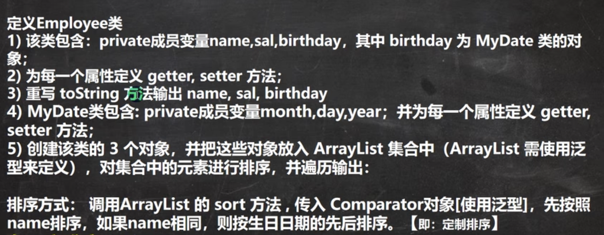
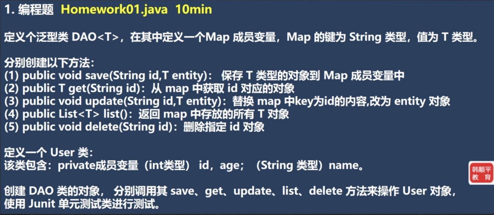

## 背景

在说泛型以前，先说一下没有泛型时，我们定义一个类的操作。看示例：

```java
class Cat{ // 申明一个类
  private String name;  // 属性的类型是写死的
  private int age;
  
  public Cat(String name, int age){
    this.name = name;
    this.age = age;
  }
  
  public int getAge(){ // 返回值的类型是写死的
    return age;
  }
  
  public void sing(String song){ // 形参的类型是写死的
   System.out.print(name + "在唱歌~" + song); 
  }
}
```

从上面看得出来，我们类中的很多属性都写死了。

如果我们出现一个需求，我们有一个方法要获取某个对象的类型信息，在此之前不知道对象的类型，那方法入参的参数类型就只能是 Object，但是直接写Object，也就相当于没有限制，容易引发出一些安全问题。

这时就需要一个东西 可以表示部分我们希望的某些类型 的类型，就是说希望有一个类型 可以表示很多歌其他类型，这时候就需要使用到 泛型。


## 概念

**泛型**

可以直译为 泛化的类型。即 在类的定义过程中，泛型只是一个符号，不表示任何具体的类型。当我们神明对象时，再将泛型具体化，由于对象使用过程中对类型的限制。

语法：

```java
class 类名<泛型标识1,泛型标识2,...>{}

interface 接口名<泛型标识1,泛型标识2,...>{}

/**
说明：
1、泛型标识任意字母都可以，常用 T ，意为Type
2、泛型只能代表引用类型，不能是基础数据类型
*/
```


说明：

1. 泛型 又称为 类型的参数化，是JDK5.0的新特性，旨在解决 数据类型 的安全性问题
2. 泛型 类申明定义时可选的内容，非必须。申明了 泛型，类体中也可以不用
3. 泛型 是在类声明的同时，申明一个的标识。用这个 标识 可以表示 某个属性的类型、某个方法的返回类型、某个形参的类型
4. 泛型 被定义后，在对象实例化时，指定好需要具体类型即可。


示例：

```java
package com.zhangjian.泛型;

import java.util.HashMap;

public class GenericType {
    public static void main(String[] args) {
        // 实例化指定 泛型为 具体类型
        Cat<String, Integer, HashMap> cat = new Cat<String, Integer, HashMap>("Tom", 18);
        System.out.println(cat.getName());
        
        // 调用方法，此时 指定泛型 A 为 String
        // 那么方法的入参就必须是 String 类型的
        cat.sing("Jack");
//        cat.sing(18);

    }
}

class Cat<A, B, DD>{ // 定义了三个泛型，只用了前两个
    // 泛型修饰属性
    private A name;
    private B age;

    // 泛型修饰形参
    public Cat(A name, B age) {
        this.name = name;
        this.age = age;
    }

    // 泛型作为返回类型
    public A getName(){
        return name;
    }

    public void sing(A name){
        System.out.println(name + "在唱歌...");
    }
}
```


### 练习一下

创建一个Student类，然后分必然添加 三个 学生 到 HashSet 和 HashMap 中，并遍历输出。

```java
package com.zhangjian.泛型;

import java.util.*;

public class GenericType {
    public static void main(String[] args) {
        // 指定泛型 为 Student
        System.out.println("======HashSet======");
        HashSet<Student> students = new HashSet<>();
        students.add(new Student("tom", 98));
        students.add(new Student("linda", 99));
        students.add(new Student("polo", 45.88));

        // 具体化类型后，遍历出来的结果就不再是 Object，而是我们真实的类型
        for (Student student : students) {
            System.out.println(student);
        }

        System.out.println("======HashMap======");
        HashMap<String, Student> map = new HashMap<>();
        map.put("joey", new Student("joey", 88));
        map.put("willian", new Student("willian", 88));
        map.put("king", new Student("king", 88));

        // 使用迭代器遍历，可以看到 具体化类型后，返回类型也都具体化了
        // 当然，这也是 HashMap 的作者在编写源码时，充分使用了泛型的原因
        Set<Map.Entry<String, Student>> entrySet = map.entrySet();
        Iterator<Map.Entry<String, Student>> iterator = entrySet.iterator();

        while (iterator.hasNext()) {
            Map.Entry<String, Student> next =  iterator.next();
            System.out.println(next.getKey() + "-" + next.getValue());
        }
    }
}

class Student{
    private String name;
    private double score;

    public Student(String name, double score) {
        this.name = name;
        this.score = score;
    }

    @Override
    public String toString() {
        return "Student{" +
                "name='" + name + '\'' +
                ", score=" + score +
                '}';
    }
}
```


## 使用细节

1. 给 泛型 指定具体的数据类型时，只能是 引用类型，不能是 基础数据类型

    ```java
    ArrayList<String> list = new ArrayList<>(); // 正确
    ArrayList<int> list1 = new ArrayList<>(); // 错误
    ```

2. 在指定泛型具体类型后，可以传入 该类型 或 其子类类型

3. 泛型的使用形式

    ```java
    ArrayList<String> list = new ArrayList<String>();  // 默认形式
    
    ArrayList<String> list = new ArrayList<>(); // 推荐形式
    
    // 说明：
    //    编译器会根据 编译类型中的泛型类型，进行类型推断，因此 运行类型 这里可以不写
    ```

4. 如果 类在定义时申明了泛型，但在实例化时又没有指定泛型的具体类型，那么这个泛型将默认指定为 Object

    ```java
    ArrayList list = new ArrayList();
    
    // 等价于
    ArrayList<Object> list = new ArrayList<>();
    ```


### 练习一下

题目：




代码：

```java
package com.zhangjian.泛型;

import org.jetbrains.annotations.NotNull;

import java.util.*;

public class GenericType {
    @SuppressWarnings({"all"})
    public static void main(String[] args) {
        ArrayList<Employee> employees = new ArrayList<>();

        // 添加 Employee 根据返回的布尔值判断是否添加成功
        employees.add(new Employee("王强", 5688.00, new MyDate(1995, 8, 12)));
        employees.add(new Employee("何军", 7688.00, new MyDate(1992, 11, 9)));
        employees.add(new Employee("王强", 5688.00, new MyDate(1994, 8, 11)));
        employees.add(new Employee("何军", 7688.00, new MyDate(1992, 11, 10)));

        employees.sort(new Comparator<Employee>() {
            @Override
            public int compare(Employee o1, Employee o2) {
                // 比较名字
                int i = o1.getName().compareTo(o2.getName());

                if (i != 0) {
                    return i;
                }

                // 名字统统比较年龄
                return o1.getBirthday().compareTo(o2.getBirthday());
            }
        });

        for (Employee employee : employees) {
            System.out.println(employee);
        }
    }
}

class Employee {
    private String name;
    private double salary;
    private MyDate birthday;

    public Employee(String name, double salary, MyDate birthday) {
        this.name = name;
        this.salary = salary;
        this.birthday = birthday;
    }

    public String getName() {
        return name;
    }

    public MyDate getBirthday() {
        return birthday;
    }

    @Override
    public String toString() {
        MyDate date = getBirthday();
        return "Employee{" +
                "name='" + name + '\'' +
                ", salary=" + salary +
                ", birthday=" + date.getYear() + "-" + date.getMonth() + "-" + date.getDay() +
                '}';
    }
}


// 日期类实现比较方法
class MyDate implements Comparable<MyDate> {
    private int year;
    private int month;
    private int day;

    public MyDate(int year, int month, int day) {
        this.year = year;
        this.month = month;
        this.day = day;
    }

    public int getYear() {
        return year;
    }

    public int getMonth() {
        return month;
    }

    public int getDay() {
        return day;
    }

    @Override
    public int compareTo(@NotNull MyDate o) {
        int yearDiff = getYear() - o.getYear();

        if (yearDiff != 0) {
            return yearDiff;
        }

        int monthDiff = getMonth() - o.getMonth();

        if (monthDiff != 0) {
            return monthDiff;
        }

        return getDay() - o.getDay();
    }
}
```


## 自定义泛型类

在概念章节里面，其实已经说了自定义泛型类。下面再说一些细节。

语法：

```java
class 类名<T,R,E,...>{}
```


注意事项：

1. 普通成员（方法、属性、代码块）和 构造器 都可以使用泛型

2. 使用泛型的数组，可以定义，但是不能在定义时初始化

    ```java
    class A<T>{
        T[] ts;
        // T[] ts = new T[3]; // 错误
        
        // 只能通过构造器或代码块实例化，代码块中也不行
        // 就是说数组对象只能外部传入，不能再定义时 new 泛型
        public A(T[] ts) {
            this.ts = ts;
        }
    }
    ```

3. 静态成员（静态方法、静态属性、静态代码块）中不能使用泛型。泛型是在实例化（创建对象）的时候指定的具体类型，而静态成员在类加载时就一起加载了，因此不能使用

4. 如果创建对象时，泛型没有指定具体类型，那么泛型默认是 Object


## 自定义泛型接口

语法：

```java
interface 接口名<T,R,...>{}
```


注意事项：

1. 接口中静态成员不能使用泛型。接口所有属性都是 final static 的，因此接口中的属性，都不能使用泛型
2. 泛型接口的类型，在 继承接口 或 实现接口 的时候确定
3. 如果没有指定，则默认泛型为 Object类型。一般来说，就算没有约束，也手动写上 Object，显得很专业


演示：

```java
interface A<T, R>{
    // 属性是不能用泛型的
    // T name;
    String name = "阿九";

    // 当然静态方法也不能使用
    // static void sing(T song){}
    static void sing(String song){}

    // 抽象方法和默认方法可以使用
    T say(R n);

    void hi(T s);

    default R get(R s){
        System.out.println("good luck");
        return s;
    }
}

// 1、接口继承时确定泛型
interface B extends A<String, Integer>{}

// 1.1、在继承时确定了泛型，实现类直接实现
class IB implements B{
    @Override
    public String say(Integer n) {return "hello";}

    @Override
    public void hi(String s) {}
}

// 2、实现时确定。可以看到泛型都已被指定的类型替换
class IA implements A<Double, Boolean>{
    @Override
    public Double say(Boolean n) {return 0.0;}

    @Override
    public void hi(Double s) {}

    @Override
    public Boolean get(Boolean s) {return A.super.get(s);}
}
```


## 自定义泛型方法

语法：

```java
访问修饰符 <T,R...> 返回类型 方法名(参数列表){}
```


注意事项：

1. 泛型方法，可以定义在普通类中，也可以定义在泛型类中
2. 泛型方法被调用时，根据实参的实际类型，来确定泛型的具体类型。就是说，泛型方法中申明的泛型，尽量在形参中都使用一次，这样才能通过调用时传递的参数确定类型，否则这个泛型无意义
3. 在泛型方法中，既可以使用泛型类申明的泛型，也可以用泛型方法申明的泛型


演示：

```java
public class GenericType {
    @SuppressWarnings({"all"})
    public static void main(String[] args) {
        A a = new A();
        a.useRun(); // Integer
        a.useWork(); // String String String String 99.8

        B<String> b = new B<>();
        b.say("你好"); // String
        b.say("吃了吗", 100); // String Integer

    }
}

// 1、普通类中定义泛型方法
class A {
    public void sing(){}

    // 1.1、这里的T没有作为形参类型，将无法确定具体类型
    public <T, R> T run(R r){
        System.out.println(r.getClass().getSimpleName()); // Integer
        return (T) r;
    }

    // 1.2、调用run时，确定了R的类型是 Integer （泛型只接收 引用类型，底层会自动装箱）
    public void useRun(){
        run(100);

        // 1.3、由于 T 没有指定，这里 println 将因为不能确定调用哪个重载方法而报错
        // System.out.println(run(100));
    }

    public <T, R> T work(R r, T t){
        System.out.println(r.getClass().getSimpleName()); // String
        System.out.println(t.getClass().getSimpleName()); // Double
        return t;
    }

    // 1.4 当 T 的类型确定后，返回类型也就确定了，因此可以正常打印
    public void useWork(){
        work("hellowrld", 99.8);
        System.out.println(work("hellowrld", 99.8));
    }
}


// 2.泛型类中使用泛型
class B<T>{
    public void ok(){}

    public void say(T t){
        System.out.println(t.getClass().getSimpleName());
    }

    public <M, N> T say(M m, N n){
        System.out.println(m.getClass().getSimpleName());
        System.out.println(n.getClass().getSimpleName());
        return null;
    }
}
```


## 泛型的继承和通配

1. 泛型不具备继承性

    ```java
    // 类型可以继承；但是像下面这样写泛型是不允许的
    // 泛型 两边必须一致！！！
    List<Object> employees = new ArrayList<String>();
    ```

2. `<?> `支持任意泛型类型。就是说 使用时，任意指定一个 引用类型 就可以

3. `<? extends A>` 支持A类以及A类的子类（不限于直接子类），限制了泛型的上限

4. `<? super A>` 支持A类以及A类的父类（不限于直接父类），限制了泛型的下限


## 练习一下

题目：




演示：

```java
package com.zhangjian.泛型;

import org.junit.jupiter.api.Test;

import java.util.*;

public class GenericType {
    @SuppressWarnings({"all"})
    public static void main(String[] args) {
    }

    // 使用Junit 进行测试，静态方法不能使用
    @Test
    public void testDAO(){
        DAO<User> dao = new DAO<>();

        dao.save("001", new User(1, 18, "Jack"));
        dao.save("002", new User(2, 28, "Tom"));
        dao.save("003", new User(3, 38, "Smith"));
        dao.save("004", new User(4, 48, "Queen"));
        
        System.out.println(dao.get("002"));

        dao.update("003", new User(3, 43, "Robot"));
        dao.delete("004");

        List<User> list = dao.list();
        System.out.println(list);
    }
}


class DAO<T>{
    private Map<String, T> map = new HashMap<>();

    public void save(String id, T entity){
        map.put(id, entity);
    }

    public T get(String id){
        return map.get(id);
    }

    public void update(String id, T entity){
        map.put(id, entity);
    }

    public void delete(String id){
        map.remove(id);
    }

    public List<T> list(){
        // 取出map中的T放入 list中
        List<T> ts = new ArrayList<>(map.values());

        return ts;
    }
}

class User{
    // 想通访问权限和类型，可以这样定义多个变量
    private int id, age;
    private String name;

    public User(int id, int age, String name) {
        this.id = id;
        this.age = age;
        this.name = name;
    }

    @Override
    public String toString() {
        return "User{" +
                "id=" + id +
                ", age=" + age +
                ", name='" + name + '\'' +
                '}';
    }
}
```

